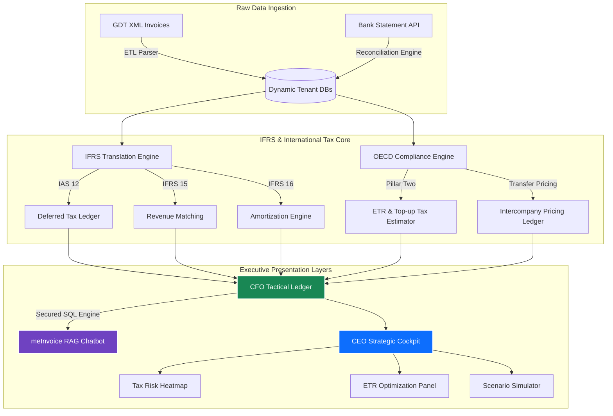

# GDT Invoice Hub — Enterprise IFRS & International Tax Architecture
## Strategic Consultation & Engineering Blueprint for CEO & CFO
**Version**: 1.0.0-ADVISORY  
**Target Audience**: Chief Executive Officer (CEO), Chief Financial Officer (CFO), and Enterprise Lead Architects  

---

## Executive Summary
To transition the **GDT Invoice Hub** from a localized tax-filing automation tool to an international-standard corporate financial ecosystem, we must establish a core architectural bridge between **Vietnamese Tax Regulations (VAS)** and **International Financial Reporting Standards (IFRS)**. 

This document serves as an architectural blueprint for building the **IFRS & International Tax Engine**. It is divided into three key sections:
1. **The CEO Cockpit**: A strategic dashboard focused on corporate risk management, brand reputation, global tax health, and AI scenario planning.
2. **The CFO Tax Ledger**: A highly precise, compliant financial engine automating calculations for **IAS 12 (Deferred Taxes)**, **IFRS 15 (Revenue Recognition)**, **IFRS 16 (Leases)**, **OECD Pillar Two (Global Minimum Tax)**, and **Transfer Pricing**.
3. **The Engineering Architecture**: A production-grade system blueprint detailing how to implement this technically on top of the existing SQLite dynamic multi-tenant database router.



---

## Part 1: The CEO Strategic Cockpit (High-Level Tax Governance)

For the **Chief Executive Officer (CEO)**, tax is not a bookkeeping exercise—it is a **risk vector**, a **brand reputation driver**, and a **strategic capital allocation variable**. The CEO Cockpit focuses on high-level clarity, predictive analytics, and defensive financial posture.

### 1.1 The Corporate Tax Risk Heatmap & Scorecard
*   **Purpose**: Protect the corporation from audits, regulatory penalties, and negative publicity.
*   **Key KPIs**:
    *   **Audit Risk Rating (ARR)**: A dynamic compliance score (0-100) calculated by analyzing supplier health, invoice delay logs, cash transactions, and historical tax discrepancies.
    *   **Blacklisted / High-Risk Partner Alerts**: Real-time warnings when a subsidiary transacts with a business designated as "unhealthy" or "under investigation" by tax authorities.
    *   **Signing Latency Penalty Forecast**: Calculates potential regulatory fines resulting from suppliers who delay digitally signing invoices.

### 1.2 Global Effective Tax Rate (ETR) Cockpit
*   **Purpose**: Provide a single view of tax exposure across all subsidiaries, domestic and international.
*   **Visualizations**:
    *   A **Bento-Grid map** representing each Tax Profile (MST) color-coded by ETR:
        *   <span style="color:#d9534f">**Red (ETR < 15%)**</span>: Triggers OECD Pillar Two Top-up tax warning.
        *   <span style="color:#f0ad4e">**Yellow (ETR 15% - 20%)**</span>: Sub-optimal tax structuring.
        *   <span style="color:#5cb85c">**Green (ETR 20% - 25%)**</span>: Compliant, optimized zone.

### 1.3 Tax Scenario & Capital Expansion Simulator
*   **Purpose**: Enable strategic decision-making for mergers, acquisitions, and new market entries.
*   **Features**:
    *   **"What-If" Expansion Simulator**: Allows the CEO to simulate setting up a new factory or subsidiary in another country (e.g., Singapore, EU, US) and estimates the consolidated tax impact under OECD Pillar Two guidelines.
    *   **FDI & Incentive Tracking**: Models the impact of tax holidays and corporate tax incentives against potential Pillar Two undertaxed payments rules (UTPR).

---

## Part 2: The CFO Tactical Tax Ledger (Financial Precision & Compliance)

For the **Chief Financial Officer (CFO)**, precision, auditability, double-entry reconciliation, and adherence to international auditing bodies (IFRS/IAS) are non-negotiable. The CFO Ledger automates standard calculations to ensure effortless external audits.

### 2.1 IAS 12 — Deferred Tax Automation Ledger
Under **IAS 12**, differences between the tax base of an asset/liability and its carrying amount in the IFRS balance sheet result in deferred tax assets (DTA) or deferred tax liabilities (DTL).

*   **Temporary Difference Engine**:
    *   Automatically compares **Asset Depreciation under VAS (Tax Base)** vs. **Asset Depreciation under IFRS (Carrying Amount)**.
    *   Computes deferred tax balances instantly based on the expected recovery corporate rate.
*   **Tax Loss Carry-Forward Evaluator**:
    *   Dynamically assesses whether future taxable profit will be available against which unused tax losses can be utilized, validating the recognition of Deferred Tax Assets on the balance sheet.

### 2.2 IFRS 15 — Revenue from Contracts with Customers
*   **Trigger Matching**:
    *   Matches GDT sales invoices with customer contract metadata and milestone progress.
    *   Calculates **Transaction Price Allocation** when invoices bundle products, services, and multi-year warranties.
    *   Flags invoices that represent advance payments, ensuring they are correctly held in **Deferred Revenue** under IFRS 15, rather than recognized immediately as income.

### 2.3 IFRS 16 — Lease Amortization Matcher
*   **System Capabilities**:
    *   Ingests monthly office or equipment rental invoices.
    *   Generates the **Right-of-Use (ROU) Asset** ledger and **Lease Liability** amortization schedule.
    *   Separates invoice values into interest expense (finance costs) and principal repayment (reduction of liability), keeping the balance sheet perfectly IFRS 16 compliant.

### 2.4 OECD Pillar Two (Global Minimum Tax - 15%)
*   **GloBE ETR Calculation**:
    *   Consolidates financial statements across all tenant databases (`tenant_<mst>.db`).
    *   Calculates **GloBE Income/Loss** and **Covered Taxes** per jurisdiction.
    *   Applies substance-based income exclusion (SBIE) based on localized payroll costs and tangible asset values.
    *   Computes **Top-Up Tax percentage** and allocates top-up tax liabilities to the ultimate parent entity.

### 2.5 Transfer Pricing & Intercompany Pricing Engine
*   **Arm's-Length Monitoring**:
    *   Identifies cross-tenant (intercompany) invoices automatically.
    *   Benchmarks pricing against historical third-party transactional records.
    *   Generates automated audit documentation logs to prove transfer pricing policy compliance to tax inspectors.

---

## Part 3: System Architecture & Technical Specifications

To implement this without breaking the existing high-performance local SQLite environment, we will deploy a **Modular Decoupled Ledger Architecture**. 

### 3.1 Extended Database Schema (Global & Tenant Levels)

We will introduce a shared schema for consolidated analytics and extended columns in individual tenant databases.

```sql
-- Shared database: data/invoices.db (or data/consolidation.db)
-- Holds IFRS translation mappings, global tax rates, and intercompany definitions

CREATE TABLE IF NOT EXISTS global_ifrs_rules (
    rule_id TEXT PRIMARY KEY,
    rule_type TEXT NOT NULL, -- 'IAS_12', 'IFRS_15', 'IFRS_16', 'PILLAR_TWO'
    vas_code TEXT,
    ifrs_treatment TEXT NOT NULL,
    config_json TEXT -- Flexible JSON configurations
);

CREATE TABLE IF NOT EXISTS intercompany_entities (
    id TEXT PRIMARY KEY,
    parent_mst TEXT NOT NULL,
    subsidiary_mst TEXT NOT NULL,
    relationship_type TEXT NOT NULL, -- 'subsidiary', 'associate', 'joint_venture'
    ownership_percentage REAL NOT NULL,
    transfer_pricing_method TEXT DEFAULT 'TNMM' -- Transactional Net Margin Method
);

CREATE TABLE IF NOT EXISTS oecd_globe_rates (
    country_code TEXT PRIMARY KEY,
    statutory_tax_rate REAL NOT NULL,
    minimum_tax_rate REAL DEFAULT 0.15,
    sbie_payroll_rate REAL DEFAULT 0.05,
    sbie_assets_rate REAL DEFAULT 0.05
);
```

```sql
-- Inside tenant databases: data/tenant_<mst>.db
-- Added tables for IFRS adjustment logs and lease liability schedules

CREATE TABLE IF NOT EXISTS ifrs_deferred_tax_ledger (
    id INTEGER PRIMARY KEY AUTOINCREMENT,
    fiscal_year INTEGER NOT NULL,
    fiscal_period INTEGER NOT NULL,
    balance_sheet_item TEXT NOT NULL, -- e.g., 'Fixed Assets', 'Accrued Liabilities'
    carrying_amount_ifrs REAL NOT NULL,
    tax_base_vas REAL NOT NULL,
    temporary_difference REAL GENERATED ALWAYS AS (carrying_amount_ifrs - tax_base_vas) VIRTUAL,
    tax_rate REAL NOT NULL,
    deferred_tax_asset REAL,
    deferred_tax_liability REAL,
    created_at TIMESTAMP DEFAULT CURRENT_TIMESTAMP
);

CREATE TABLE IF NOT EXISTS lease_amortization_schedule (
    lease_id TEXT PRIMARY KEY,
    supplier_mst TEXT NOT NULL,
    commencement_date DATE NOT NULL,
    lease_term_months INTEGER NOT NULL,
    monthly_payment REAL NOT NULL,
    discount_rate REAL NOT NULL,
    present_value_rou REAL NOT NULL,
    interest_expense_ytd REAL DEFAULT 0.0,
    liability_balance REAL NOT NULL,
    active_status BOOLEAN DEFAULT 1
);
```

### 3.2 Dynamic IFRS Translation Engine (Python Middleware)
The dynamic mapping translation layer operates as a decorator or service that intercepts standard GDT invoice queries and returns converted IFRS values.

```python
# File: invoices/ifrs_engine.py
from datetime import datetime
import json
import sqlite3
from typing import Dict, Any, List

class IFRSTranslationService:
    def __init__(self, global_db_path: str = "data/invoices.db"):
        self.global_db_path = global_db_path

    def get_tenant_connection(self, mst: str) -> sqlite3.Connection:
        conn = sqlite3.connect(f"data/tenant_{mst}.db")
        conn.text_factory = lambda x: x.decode('utf-8', errors='replace') if isinstance(x, bytes) else x
        return conn

    def calculate_ias12_deferred_tax(self, mst: str, year: int) -> List[Dict[str, Any]]:
        """Calculates temporary differences and deferred taxes for a given MST and year."""
        tenant_conn = self.get_tenant_connection(mst)
        cur = tenant_conn.cursor()
        
        # Ingest asset logs & tax bases
        cur.execute("""
            SELECT balance_sheet_item, carrying_amount_ifrs, tax_base_vas, tax_rate 
            FROM ifrs_deferred_tax_ledger 
            WHERE fiscal_year = ?
        """, (year,))
        
        records = []
        for item, carrying, tax_base, rate in cur.fetchall():
            diff = carrying - tax_base
            dta = 0.0
            dtl = 0.0
            
            # Temporary difference treatment
            if diff > 0:
                # Carrying amount of asset is greater than tax base -> Deferred Tax Liability
                dtl = abs(diff) * rate
            elif diff < 0:
                # Tax base is greater than carrying amount -> Deferred Tax Asset
                dta = abs(diff) * rate
                
            records.append({
                "item": item,
                "carrying_amount_ifrs": carrying,
                "tax_base_vas": tax_base,
                "temporary_difference": diff,
                "tax_rate": rate,
                "deferred_tax_asset": dta,
                "deferred_tax_liability": dtl
            })
            
        tenant_conn.close()
        return records

    def estimate_pillar_two_topup(self, parent_mst: str, group_msts: List[str], year: int) -> Dict[str, Any]:
        """Estimates consolidated effective tax rate and GloBE top-up taxes."""
        consolidated_income = 0.0
        consolidated_taxes = 0.0
        
        for mst in group_msts:
            conn = self.get_tenant_connection(mst)
            cur = conn.cursor()
            # Dynamic calculation of net income and taxes paid
            cur.execute("""
                SELECT SUM(total_amount_before_tax), SUM(total_tax_amount) 
                FROM invoices 
                WHERE strftime('%Y', invoice_date) = ?
            """, (str(year),))
            income, taxes = cur.fetchone()
            consolidated_income += (income or 0.0)
            consolidated_taxes += (taxes or 0.0)
            conn.close()
            
        etr = consolidated_taxes / consolidated_income if consolidated_income > 0 else 0.0
        topup_rate = max(0.0, 0.15 - etr)
        topup_tax = consolidated_income * topup_rate if topup_rate > 0 else 0.0
        
        return {
            "parent_mst": parent_mst,
            "year": year,
            "consolidated_income": consolidated_income,
            "consolidated_taxes": consolidated_taxes,
            "effective_tax_rate": etr,
            "topup_tax_rate": topup_rate,
            "estimated_topup_tax": topup_tax
        }
```

---

## Part 4: Interactive Interface Design & UI Prototypes

To wow the **CEO** and **CFO**, the frontend layout combines extreme data density with premium aesthetics: custom SVG charts, glassmorphism cards, and interactive sliders.

### 4.1 UI Design Tokens (Wise-styled Glassmorphism)
*   **Colors**:
    *   Background: Dark Glassmorphic Canvas (`hsl(222, 47%, 4%)`) with neon dynamic highlights.
    *   Accent Premium: Violet Royal (`hsl(263, 70%, 50%)`) & Emerald Success (`hsl(142, 70%, 45%)`).
*   **Visual Elements**:
    *   Interactive sliders for scenario analysis (e.g., adjust "Global Minimum Tax rate" to see real-time chart shifts).
    *   Bento Grid containing card-sized compliance dials.

### 4.2 Interactive meInvoice RAG AI Assistant
The chat assistant includes an advanced **Executive Query Routing Engine**:
*   *Query*: "Cho tôi biết rủi ro thuế lớn nhất hiện tại ở chi nhánh Hà Nội?"
*   *Action*: Conversational agent triggers local SQLite analytics, parses signing delay logs and blacklisted suppliers, and returns:
    > **[meInvoice AI Executive Summary]**  
    > Chi nhánh Hà Nội (MST: `0102030405`) hiện có **2 hóa đơn mua vào** từ Nhà cung cấp X (nằm trong danh sách cảnh báo ngưng hoạt động của cơ quan thuế từ ngày 15/05/2026).  
    > **Khuyến nghị**: CFO cần thực hiện kiểm tra thực tế giao dịch để tránh rủi ro loại trừ chi phí hợp lệ khi quyết toán thuế TNDN.

---

## Part 5: Implementation Roadmap & Execution Plan

To execute this transition smoothly, we split the project into 4 strategic phases, matching the existing operational model.

```
┌──────────────────────────────────────────────────────────┐
│ PHASE 1: Data Model Enrichment & IFRS Ledger             │
│ - Deploy global_ifrs_rules and local tenant tables      │
│ - Integrate IFRSTranslationService in backend            │
└────────────────────────────┬─────────────────────────────┘
                             │
                             ▼
┌──────────────────────────────────────────────────────────┐
│ PHASE 2: CFO Compliance Engine (IAS 12 & IFRS 15/16)    │
│ - Auto-generate ROU Amortization schedules from leases   │
│ - Implement deferred tax calculation engines             │
└────────────────────────────┬─────────────────────────────┘
                             │
                             ▼
┌──────────────────────────────────────────────────────────┐
│ PHASE 3: Global Minimum Tax & OECD Pillar Two Console   │
│ - Consolidate multitenant databases via routing session  │
│ - Develop GloBE ETR calculators and SBIE exclusions      │
└────────────────────────────┬─────────────────────────────┘
                             │
                             ▼
┌──────────────────────────────────────────────────────────┐
│ PHASE 4: Executive CEO Strategic Cockpit UI              │
│ - Build premium bento-grid dashboard with custom SVGs   │
│ - Train meInvoice AI with IFRS rules & Text-to-SQL       │
└──────────────────────────────────────────────────────────┘
```

### Phase 1: Data Model Enrichment (Sprint 28-29)
*   Run SQLite migrations on all isolated `tenant_<mst>.db` databases.
*   Implement `invoices/ifrs_engine.py` middleware for dynamic calculations.
*   Add basic unit tests covering temporary tax differences under `tests/test_ifrs_engine.py`.

### Phase 2: The Compliance Engine (Sprint 30-31)
*   Deliver automated amortization schedule outputs for lease agreements.
*   Incorporate automated transfer pricing intercompany contract audits.
*   Establish strict verification routines matching bank transactions directly to VAT outputs.

### Phase 3: The Global Minimum Tax Module (Sprint 32)
*   Deploy the multi-jurisdiction consolidation pipeline.
*   Establish safe permission checks to ensure tax staff in single MSTs cannot query consolidated group financials, maintaining strict segregation of duties (SoD).

### Phase 4: CEO Dashboard & AI integration (Sprint 33)
*   Add the visual bento grid templates to the Flask frontend.
*   Extend the meInvoice RAG agent context with IAS/IFRS definitions.
*   Achieve final Harness green light across all automated suites.

---

## Part 6: Architectural Decision Records (ADRs)

### ADR-011: Dedicated Decoupled IFRS Translation Layer
*   **Status**: Proposed.
*   **Context**: Converting standard Vietnamese Accounting Standards (VAS) directly in primary invoice schemas would lead to database bloating, slow query performance, and redundant state sync bugs.
*   **Decision**: We implement IFRS adjustments as a **decoupled translation layer** reading transactional data dynamically and writing adjustments to dedicated isolated tables (`ifrs_deferred_tax_ledger`, `lease_amortization_schedule`).
*   **Rationale**: Ensures standard tax operations remain lightning fast, while audit-season IFRS compliance reporting runs via clean, isolated middleware without mutating invoice source records.
*   **Trade-offs Accepted**: Slightly higher complexity in reporting queries, mitigated by comprehensive data models and automated unit tests.
*   **Mitigation**: Use SQL indexes on `fiscal_year` and `balance_sheet_item` to optimize cross-tenant joins during consolidation checks.
