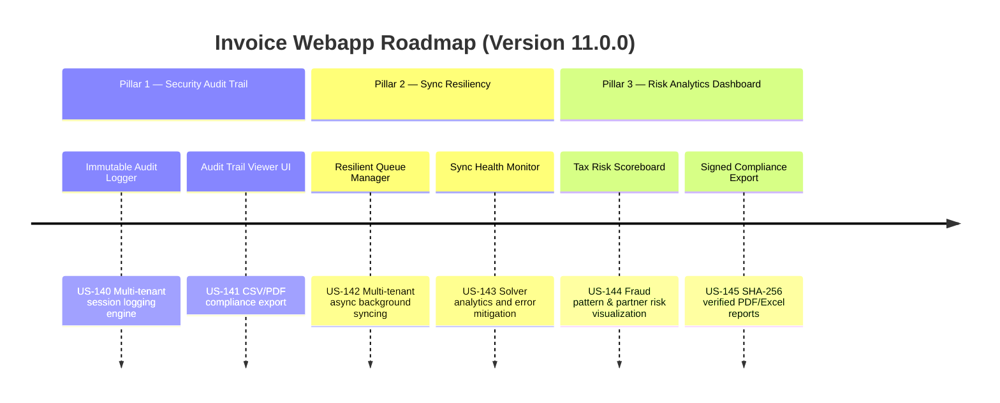

# Next-Gen Webapp XML: Version 11.0.0 Product Roadmap & Goals

This document outlines the three strategic pillars delivered in **Version 11.0.0 (Enterprise Security Audit Ledger, GDT Portal Sync Resiliency & Tax Risk Analytics)** of the GDT Invoice Hub. It details the platform's enhancement in security auditing, portal crawler reliability, and advanced compliance analytics.

---

## 🗺️ Product Roadmap Overview

---

## 📋 Milestone 11.0.0 Pillar 1: Enterprise Security Audit Ledger (US-140, US-141)
*Focus: Traceability, security compliance, and activity auditing across tenants.*

### 🎯 Goal 11.0.1: Immutable Audit Logger (US-140)
- **Problem**: In a multi-tenant corporate environment, compliance officers cannot verify who performed sensitive database actions (e.g. taxpayer profile switcher, data repairs, configuration updates, manual invoice deletions).
- **Solution**: A secure audit logging engine capturing all critical session events and user actions in an isolated logging database.
- **Acceptance Criteria**:
  - Automatically records timestamp, username, tax code, event category (AUTH, PROFILE, REPAIR, UPDATE, DELETE), ip address, and event description.
  - Prevents modification or deletion of log entries by standard users.

### 🎯 Goal 11.0.2: Audit Trail Viewer UI & CSV/PDF Export (US-141)
- **Problem**: Admin auditors need to review logs quickly without direct database access.
- **Solution**: A modern Glassmorphism-style UI panel displaying user logs with advanced filtering options.
- **Acceptance Criteria**:
  - Filters by event type, tax code, dates, and search keyword.
  - Exporter generates downloadable CSV and PDF audit summary files for external auditing compliance.

---

## 📸 Milestone 11.0.0 Pillar 2: GDT Portal Sync Resiliency & Solver Analytics (US-142, US-143)
*Focus: Reliable background crawl automation and solver health diagnostics.*

### 🎯 Goal 11.0.3: Resilient Sync Queue Manager (US-142)
- **Problem**: Crawling GDT for multiple taxpayer profiles sequentially is slow and crashes if a single tenant's portal login times out.
- **Solution**: An asynchronous scheduler worker running tenant synchronization jobs concurrently using isolated workers and queue management.
- **Acceptance Criteria**:
  - Runs in background using parallel tasks for each registered taxpayer profile.
  - Implements grace limits preventing individual portal timeouts from blocking other taxpayer syncs.

### 🎯 Goal 11.0.4: CAPTCHA Solver Analytics & Health Dashboard (US-143)
- **Problem**: Administrators cannot tell when the local CAPTCHA solver is deteriorating due to GDT layout variations or local OCR failures.
- **Solution**: A live health monitoring engine and diagnostic UI dashboard.
- **Acceptance Criteria**:
  - Displays solver statistics (solve count, failure rate, average response latency).
  - Triggers automatic fallback/retry controls and notifies user on UI when solve failure rate exceeds 30%.

---

## 📊 Milestone 11.0.0 Pillar 3: Advanced Tax Risk Analytics & Signed Compliance Reports (US-145, US-146)
*Focus: Visualizing risk distribution and issuing tamper-proof compliance summaries.*

### 🎯 Goal 11.0.5: Tax Risk Scoreboard (US-144)
- **Problem**: Compliance managers need to see macro-level risk trends (e.g. which sellers trigger the most audit warnings, total VAT value at risk) at a glance.
- **Solution**: An advanced analytics dashboard aggregating audit warning results (blacklist hits, signature verification errors, high cash-payment thresholds).
- **Acceptance Criteria**:
  - Visualizes warnings distribution using interactive CSS-stylized charts.
  - Ranks suppliers by risk categories and totals potential liability amounts.

### 🎯 Goal 11.0.6: Signed Compliance Report Exporter (US-145)
- **Problem**: Financial teams need to export verified invoice lists to banks or external auditors with proof that the XML files have not been modified post-audit.
- **Solution**: An export engine compiling a compliance summary and signing it with a SHA-256 checksum and a cryptographic integrity manifest.
- **Acceptance Criteria**:
  - Generates PDF/Excel summaries containing lists of audited invoices, their T-scores, and verification hashes.
  - Embedding a tamper-evident SHA-256 signature block in the report.

---

## 📋 Epic & Story Mapping

| Epic ID | Epic Title | Story ID | Story Title | Status |
| :--- | :--- | :--- | :--- | :--- |
| **E64** | Security Audit Ledger | **US-140** | Immutable Audit Logger | ✅ Implemented |
| **E64** | Security Audit Ledger | **US-141** | Audit Trail Viewer UI & Export | ✅ Implemented |
| **E65** | Sync Resiliency | **US-142** | Resilient Sync Queue Manager | ✅ Implemented |
| **E65** | Sync Resiliency | **US-143** | CAPTCHA Solver Analytics Dashboard | ✅ Implemented |
| **E66** | Risk Analytics & PDF | **US-144** | Tax Risk Scoreboard Dashboard | ✅ Implemented |
| **E66** | Risk Analytics & PDF | **US-145** | Signed Compliance Report Exporter | ✅ Implemented |
