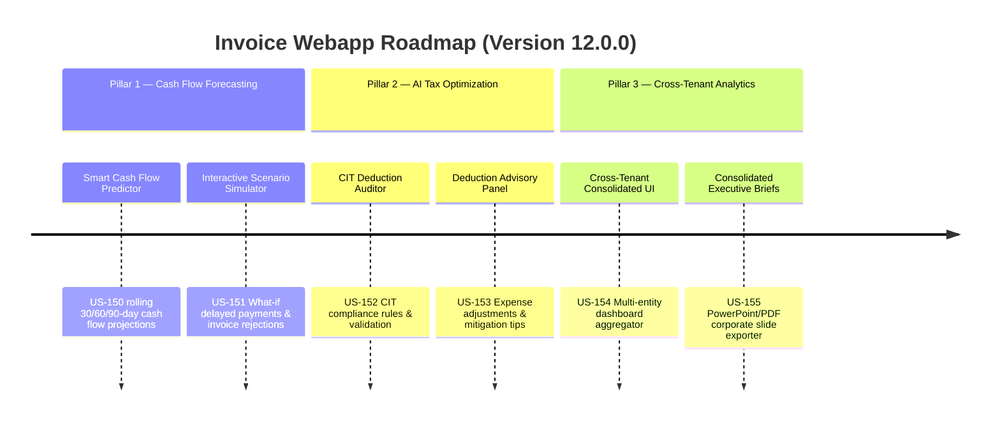

# Next-Gen Webapp XML: Version 12.0.0 Product Roadmap & Goals

This document outlines the three strategic pillars delivered in **Version 12.0.0 (Smart Cash Flow Forecasting, AI Tax Optimization & Cross-Tenant Consolidated Analytics)** of the GDT Invoice Hub. It details the system's extension into corporate financial planning, Corporate Income Tax (CIT) auditing, and multi-entity consolidation.

---

## 🗺️ Product Roadmap Overview

---

## 📋 Milestone 12.0.0 Pillar 1: Smart Cash Flow & Scenario Simulation (US-150, US-151)
*Focus: Liquidity forecasting, cash flow modeling, and financial risk mitigation.*

### 🎯 Goal 12.0.1: Smart Cash Flow Predictor (US-150)
- **Problem**: Businesses struggle to estimate short-term cash flow because tax liabilities (VAT payable) and outstanding invoice aging are calculated separately from liquid cash metrics.
- **Solution**: A cash flow calculation engine projecting rolling 30/60/90-day cash availability by combining pending invoice receivables, payables, and projected tax obligations.
- **Acceptance Criteria**:
  - Automatically aggregates invoice due dates and projects receivables/payables.
  - Factors in forecasted monthly/quarterly VAT liabilities.
  - Exposes an API endpoint `GET /api/finance/cashflow` returning projection datasets.

### 🎯 Goal 12.0.2: Interactive Scenario Simulator (US-151)
- **Problem**: Financial controllers need to stress-test their liquidity under negative scenarios, such as client payment delays or GDT audit rejections.
- **Solution**: A simulation interface allowing users to adjust payment terms and invoice status parameters on-the-fly to visualize cash flow variations.
- **Acceptance Criteria**:
  - Interactive sliders and toggles for delayed invoice payments (+15, +30, +60 days).
  - Simulates the cash-flow impact of GDT invoice audit rejections (forfeiting input VAT).
  - Dynamically updates charts using dynamic SVG projections.

---

## 📸 Milestone 12.0.0 Pillar 2: AI CIT Optimization & Deduction Auditing (US-152, US-153)
*Focus: Automating Corporate Income Tax (CIT) deduction compliance and audit preparation.*

### 🎯 Goal 12.0.3: CIT Deduction Auditor Engine (US-152)
- **Problem**: Manually auditing invoices for corporate tax deductions is error-prone (e.g. failing to flag passenger cars costing >1.6B VND, missing lack of non-cash payment vouchers for invoices >20M VND).
- **Solution**: A compliance rule engine analyzing line-items and invoice attributes against CIT law rules.
- **Acceptance Criteria**:
  - Flags invoices with values >= 20M VND paid in cash as non-deductible.
  - Detects asset purchases exceeding statutory depreciation caps (e.g. luxury passenger vehicles).
  - Flags invoices missing required enterprise fields (e.g., matching business lines or valid address formats).

### 🎯 Goal 12.0.4: CIT Deduction Advisory Panel (US-153)
- **Problem**: Users need actionable advice on how to resolve flagged CIT non-deductible items before corporate filing.
- **Solution**: An AI-powered CIT Advisory UI panel providing legally grounded adjustment suggestions and mitigation letters.
- **Acceptance Criteria**:
  - Displays list of flagged items with citation of relevant tax circulars (e.g., Circular 96/2015/TT-BTC).
  - Generates recommended adjustments (e.g., reclassifying as welfare expenses or requesting payment term amendments).
  - Provides a one-click copy/download action for recommended notes.

---

## 📊 Milestone 12.0.0 Pillar 3: Cross-Tenant Consolidated Dashboard & Executive Briefs (US-154, US-155)
*Focus: Group-level compliance monitoring, multi-entity consolidation, and executive reporting.*

### 🎯 Goal 12.0.5: Cross-Tenant Consolidated Dashboard (US-154)
- **Problem**: Conglomerates and accounting firms managing multiple entities (MSTs) cannot see total tax liabilities and risk scores across the entire group in a single view.
- **Solution**: A parent-tenant consolidation dashboard aggregating financial statistics and risk metrics across all authorized taxpayer profiles.
- **Acceptance Criteria**:
  - Implements group-wide view aggregating invoice totals, VAT input/output, and average T-scores.
  - Allows filtering and comparison by entity/MST name.
  - Enforces strict role-based access to ensure parent entities can only view authorized sub-entities.

### 🎯 Goal 12.0.6: Consolidated Executive Slide Exporter (US-155)
- **Problem**: Finance directors spend hours manually drafting slides for group-level compliance meetings.
- **Solution**: An automated presentation generator exporting consolidated multi-entity performance metrics and risk heatmaps.
- **Acceptance Criteria**:
  - Generates executive briefings containing group summaries, risk heatmaps, and tax projections.
  - Export formats support standards compatible with presentation slides or printable PDF portfolios.
  - Embeds cryptographic validation blocks mapping back to original tenant database states.

---

## 📋 Epic & Story Mapping

| Epic ID | Epic Title | Story ID | Story Title | Status |
| :--- | :--- | :--- | :--- | :--- |
| **E67** | Cash Flow Forecasting | **US-150** | Smart Cash Flow Predictor | ✅ Implemented |
| **E67** | Cash Flow Forecasting | **US-151** | Interactive Scenario Simulator | ✅ Implemented |
| **E68** | AI CIT Deduction Auditor | **US-152** | CIT Deduction Auditor Engine | ✅ Implemented |
| **E68** | AI CIT Deduction Auditor | **US-153** | CIT Deduction Advisory Panel | ✅ Implemented |
| **E69** | Cross-Tenant Aggregation | **US-154** | Cross-Tenant Consolidated Dashboard | ✅ Implemented |
| **E69** | Cross-Tenant Aggregation | **US-155** | Consolidated Executive Slide Exporter | ✅ Implemented |
