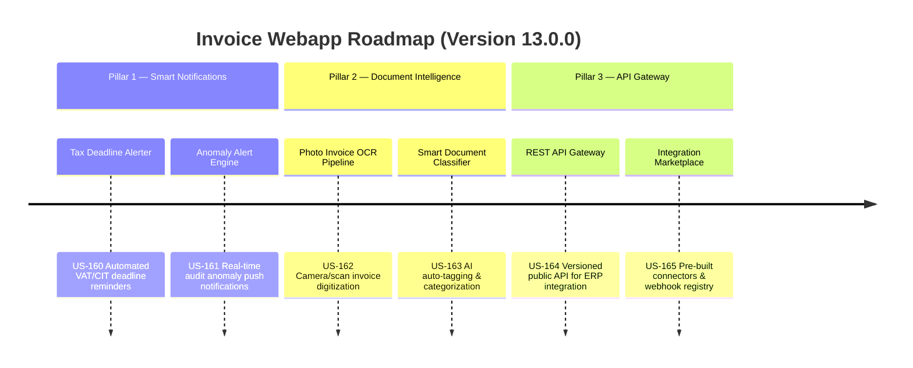

# Next-Gen Webapp XML: Version 13.0.0 Product Roadmap & Goals

This document outlines the three strategic pillars delivered in **Version 13.0.0 (Smart Notification Engine, Advanced Document Intelligence & API Gateway Integration Hub)** of the GDT Invoice Hub. It details the platform's evolution into an intelligent alerting, document processing, and open-integration enterprise platform.

---

## 🗺️ Product Roadmap Overview

---

## 📋 Milestone 13.0.0 Pillar 1: Smart Notification & Tax Deadline Engine (US-160, US-161)
*Focus: Proactive compliance alerts, deadline tracking, and anomaly detection notifications.*

### 🎯 Goal 13.0.1: Tax Deadline Alerter (US-160)
- **Problem**: Accountants miss quarterly VAT filing deadlines (ngày 30 tháng kế tiếp quý) and annual CIT deadlines because the system has no proactive reminder mechanism. Late filing incurs penalties under Nghị định 125/2020/NĐ-CP.
- **Solution**: A calendar-aware notification engine that calculates upcoming tax deadlines based on the Vietnamese fiscal calendar and displays countdown alerts on the dashboard with configurable advance-warning periods.
- **Acceptance Criteria**:
  - Calculates quarterly VAT filing deadlines and annual CIT deadlines automatically.
  - Displays countdown badges on the dashboard (30-day, 15-day, 7-day, overdue).
  - Exposes API endpoint `GET /api/notifications/deadlines` returning upcoming deadlines.
  - Supports configurable advance-warning thresholds via SystemConfig.

### 🎯 Goal 13.0.2: Anomaly Alert Engine (US-161)
- **Problem**: High-risk invoices (blacklisted sellers, signature mismatches, unusual amounts) are only discovered when users manually run audits. There is no push-notification mechanism to alert users in real-time.
- **Solution**: A background anomaly scanner that monitors newly imported invoices and generates alerts when predefined risk thresholds are breached.
- **Acceptance Criteria**:
  - Scans new invoices on import and generates alerts for T-Score below configurable threshold.
  - Creates persistent alert records with severity levels (INFO, WARNING, CRITICAL).
  - Displays an alert bell icon with unread count on the navigation bar.
  - Exposes API `GET /api/notifications/alerts` with pagination and severity filtering.

---

## 📸 Milestone 13.0.0 Pillar 2: Advanced Document Intelligence & OCR Pipeline (US-162, US-163)
*Focus: Digitizing physical invoices and intelligent document classification.*

### 🎯 Goal 13.0.3: Photo Invoice OCR Pipeline (US-162)
- **Problem**: Many Vietnamese businesses still receive paper invoices or invoice photos via Zalo/email. These must be manually retyped into the system.
- **Solution**: An OCR ingestion pipeline accepting uploaded images (JPEG, PNG, PDF scans) and extracting structured invoice data fields using the existing ddddocr engine enhanced with layout-aware parsing.
- **Acceptance Criteria**:
  - Accepts image uploads via `POST /api/invoices/ocr-upload` (JPEG, PNG, PDF).
  - Extracts key fields: seller name, MST, invoice number, date, line items, VAT amount.
  - Displays extraction preview with editable fields for user verification before saving.
  - Achieves >80% field extraction accuracy on standard Vietnamese invoice templates.

### 🎯 Goal 13.0.4: Smart Document Classifier (US-163)
- **Problem**: Imported invoices lack consistent categorization. Users must manually tag invoices by expense type (raw materials, services, assets, welfare, etc.).
- **Solution**: An AI classifier that auto-tags invoices by analyzing seller name patterns, line-item descriptions, and historical classification data.
- **Acceptance Criteria**:
  - Classifies invoices into predefined expense categories using keyword matching and historical pattern analysis.
  - Displays suggested tags with confidence scores on the invoice detail view.
  - Allows users to confirm, reject, or override suggested classifications.
  - Learns from user corrections to improve future classification accuracy.

---

## 📊 Milestone 13.0.0 Pillar 3: REST API Gateway & Integration Marketplace (US-164, US-165)
*Focus: Opening the platform to external ERP systems, accounting software, and third-party integrations.*

### 🎯 Goal 13.0.5: Versioned REST API Gateway (US-164)
- **Problem**: External systems (MISA, SAP, Fast Accounting) cannot programmatically query invoice data or trigger audits without direct database access.
- **Solution**: A versioned public REST API gateway (`/api/v1/`) with API key authentication, rate limiting, and comprehensive OpenAPI documentation.
- **Acceptance Criteria**:
  - Implements `/api/v1/invoices`, `/api/v1/audits`, `/api/v1/reports` resource endpoints.
  - Enforces API key authentication with per-key rate limiting.
  - Auto-generates OpenAPI 3.0 specification accessible at `/api/v1/docs`.
  - Supports JSON response format with standard pagination and error envelopes.

### 🎯 Goal 13.0.6: Integration Marketplace & Webhook Registry (US-165)
- **Problem**: Each new integration requires custom development. There is no registry for managing outbound webhook subscriptions or pre-built connector configurations.
- **Solution**: A self-service integration management panel where administrators can register webhook endpoints, configure event subscriptions, and browse pre-built connector templates.
- **Acceptance Criteria**:
  - Provides a UI panel for managing webhook subscriptions (URL, events, secret key).
  - Supports event types: `invoice.created`, `invoice.audited`, `alert.triggered`, `report.generated`.
  - Includes pre-built connector templates for MISA, Fast Accounting, and generic ERP.
  - Logs all webhook delivery attempts with status codes and retry history.

---

## 📋 Epic & Story Mapping

| Epic ID | Epic Title | Story ID | Story Title | Status |
| :--- | :--- | :--- | :--- | :--- |
| **E70** | Smart Notifications | **US-160** | Tax Deadline Alerter | 📅 Planned |
| **E70** | Smart Notifications | **US-161** | Anomaly Alert Engine | 📅 Planned |
| **E71** | Document Intelligence | **US-162** | Photo Invoice OCR Pipeline | 📅 Planned |
| **E71** | Document Intelligence | **US-163** | Smart Document Classifier | 📅 Planned |
| **E72** | API Gateway Hub | **US-164** | Versioned REST API Gateway | 📅 Planned |
| **E72** | API Gateway Hub | **US-165** | Integration Marketplace & Webhook Registry | 📅 Planned |
