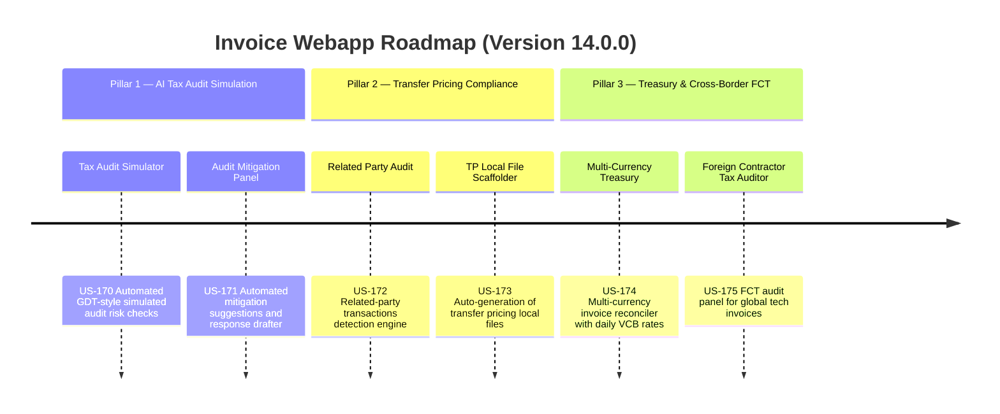

# Next-Gen Webapp XML: Version 14.0.0 Product Roadmap & Goals

This document outlines the three strategic pillars delivered in **Version 14.0.0 (AI Tax Audit Simulation, Automated Transfer Pricing Compliance & Multi-Currency Treasury Management Hub)** of the GDT Invoice Hub. It details the platform's evolution into a professional tax compliance and audit-ready enterprise platform.

---

## 🗺️ Product Roadmap Overview

---

## 📋 Milestone 14.0.0 Pillar 1: AI Tax Audit Simulation & Scenario Modeler (US-170, US-171)
*Focus: Simulating government tax audits, detecting high-risk MSTs, and drafting mitigation responses.*

### 🎯 Goal 14.0.1: Tax Audit Simulator (US-170)
- **Problem**: Companies are caught off guard during GDT tax audits due to unrecognized risks such as invoices from blacklisted/suspended suppliers, mismatching invoice serials, or irregular timing.
- **Solution**: An audit simulation engine that runs a comprehensive suite of compliance audits mimicking GDT inspector checklists, yielding a simulated Tax Audit Score (T-Score) and flagging high-risk transactions.
- **Acceptance Criteria**:
  - Performs 6 core simulated checks: Blacklisted/Suspended MST status, invoice signing lag (sign date vs issue date > 10 days), cash payments >= 20M VND, invoice sequence gaps, mismatched serials/templates, and suspicious VAT rates (e.g. invalid tax exemptions).
  - Calculates a consolidated Tax Audit Risk Score (0-100) where low score indicates high risk.
  - Exposes API `POST /api/audit/simulate` to trigger manual run.
  - Renders risk classification flags (Low, Medium, High) in the invoice list and details view.

### 🎯 Goal 14.0.2: Audit Mitigation Adviser & Response Drafter (US-171)
- **Problem**: When a risk is identified, accountants spend hours researching Vietnamese tax circulars to draft explanation letters (công văn giải trình) to tax authorities.
- **Solution**: An AI-powered advisory panel that provides specific legal citations (e.g., Circular 96/2015/TT-BTC, Nghị định 125/2020/NĐ-CP) and auto-generates customized explanation letter drafts.
- **Acceptance Criteria**:
  - Provides a sidebar panel on the simulated audit screen with legal references tailored to each warning.
  - Includes a "Draft Explanation Letter" (Soạn công văn giải trình) button that generates a standard Vietnamese tax form template populated with transaction details.
  - Supports exporting the explanation letter to DOCX or PDF format.
  - Allows the user to select the audit scenario (e.g., standard inspection, explanation request).

---

## 📂 Milestone 14.0.0 Pillar 2: Automated Transfer Pricing Compliance Engine (US-172, US-173)
*Focus: Detecting related-party transactions and generating documentation according to Nghị định 132/2020/NĐ-CP.*

### 🎯 Goal 14.0.3: Related Party Transaction Detector (US-172)
- **Problem**: Related-party transactions (giao dịch liên kết) are subject to strict scrutiny under Vietnamese law. Businesses fail to identify these transactions, leading to CIT deduction exclusions and penalty risks.
- **Solution**: A profile linkage engine that detects transactions between the company (current MST profile) and related partners (based on equity share, common directors, or transaction volume thresholds defined in Nghị định 132/2020/NĐ-CP).
- **Acceptance Criteria**:
  - Detects related-party transactions based on supplier configuration flags in the Partner Directory.
  - Checks if total value of related-party transactions exceeds statutory reporting thresholds.
  - Displays a warning badge on related-party invoices indicating specialized audit rules apply.
  - Exposes API `GET /api/transfer-pricing/transactions` returning aggregated transactional values.

### 🎯 Goal 14.0.4: Transfer Pricing Local File Scaffolder (US-173)
- **Problem**: Companies with related-party transactions are required to prepare a Transfer Pricing Local File (Hồ sơ quốc gia). Creating this document manually is complex and expensive.
- **Solution**: An automated documentation wizard that scaffolds the Local File report, compiling transaction tables, pricing comparison methods, and company profile data into a compliant structure.
- **Acceptance Criteria**:
  - Guides the user through a multi-step setup wizard (Company details, Related parties, Pricing method selection).
  - Populates transaction data tables automatically from the invoice database.
  - Scaffolds a Word document (.docx) aligned with standard Ministry of Finance templates.
  - Generates Appendix I (Mẫu số 01) under Nghị định 132/2020/NĐ-CP.

---

## 💱 Milestone 14.0.0 Pillar 3: Multi-Currency Treasury & Cross-Border FCT Hub (US-174, US-175)
*Focus: Multi-currency billing, daily exchange rate reconciliation, and foreign contractor tax compliance.*

### 🎯 Goal 14.0.5: Multi-Currency Invoice Reconciliation Engine (US-174)
- **Problem**: Transactions with international suppliers (USD, EUR) are recorded at arbitrary exchange rates, causing differences during tax audits due to incorrect exchange rate applications.
- **Solution**: A treasury reconciler that fetches daily Vietcombank (VCB) exchange rates programmatically and maps them to foreign currency invoices to compute correct statutory VND conversion values.
- **Acceptance Criteria**:
  - Dynamically fetches VCB exchange rates (Buy/Sell/Transfer) for the transaction date.
  - Converts USD, EUR, and other major currencies to VND using the statutory VCB rate.
  - Displays the exchange rate used and the calculated VND value on the invoice detail view.
  - Exposes API `GET /api/treasury/exchange-rates` returning historical exchange rates.
  - Integrates the existing VCB exchange rate scraper task into the reconciliation background worker.

### 🎯 Goal 14.0.6: Foreign Contractor Tax (FCT) Compliance Auditor (US-175)
- **Problem**: Invoices from foreign contractors (such as Google, Meta, AWS, Netflix) are subject to Foreign Contractor Tax (Thuế nhà thầu nước ngoài - FCT). Mismatches in FCT declaration lead to heavy tax penalties.
- **Solution**: An FCT compliance panel that audits international service invoices, calculates FCT liabilities (VAT and CIT portions), and flags missing declarations.
- **Acceptance Criteria**:
  - Audits cross-border service invoices based on provider profile flags (e.g. Google, Meta).
  - Calculates FCT VAT and CIT portions according to Circular 103/2014/TT-BTC.
  - Displays FCT calculations and tax withholding due dates.
  - Generates FCT Declaration worksheets exportable to Excel.
  - Logs missing FCT payments as medium-severity warnings in the dashboard.

---

## 📋 Epic & Story Mapping

| Epic ID | Epic Title | Story ID | Story Title | Status |
| :--- | :--- | :--- | :--- | :--- |
| **E73** | AI Tax Audit | **US-170** | Tax Audit Simulation Engine | 📅 Planned |
| **E73** | AI Tax Audit | **US-171** | Audit Mitigation Adviser | 📅 Planned |
| **E74** | Transfer Pricing | **US-172** | Related Party Transaction Detector | 📅 Planned |
| **E74** | Transfer Pricing | **US-173** | Transfer Pricing Local File Scaffolder | 📅 Planned |
| **E75** | Multi-Currency Treasury | **US-174** | Multi-Currency Treasury Reconciler | 📅 Planned |
| **E75** | Multi-Currency Treasury | **US-175** | Foreign Contractor Tax Compliance Auditor | 📅 Planned |
