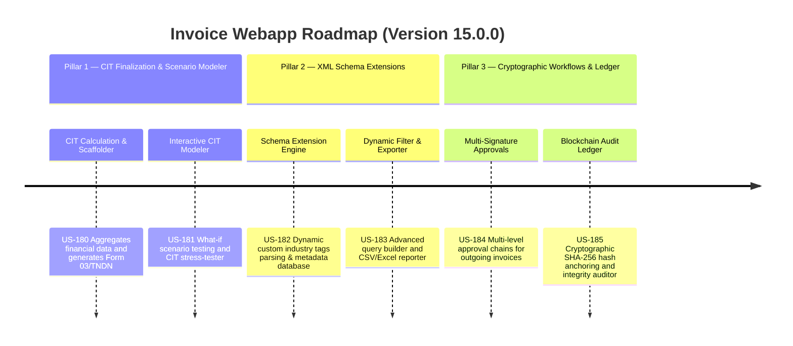

# Next-Gen Webapp XML: Version 15.0.0 Product Roadmap & Goals

This document outlines the three strategic pillars delivered in **Version 15.0.0 (Automated Corporate Income Tax (CIT) Finalization, Visual Scenario Modeler & Intelligent XML Schema Expansion)** of the GDT Invoice Hub. It details the platform's evolution into a enterprise-grade tax compliance platform with integrated mathematical modeling and cryptographic audit ledger.

---

## 🗺️ Product Roadmap Overview

---

## 📋 Milestone 15.0.0 Pillar 1: Automated CIT Finalization & Visual Scenario Modeler (US-180, US-181)
*Focus: Automating the annual CIT finalization and modeling what-if financial planning scenarios.*

### 🎯 Goal 15.1.1: CIT Calculation & Form 03/TNDN Scaffolder (US-180)
- **Problem**: Preparing the annual Corporate Income Tax finalization (Quyết toán thuế TNDN) is labor-intensive and error-prone. Calculating tax-deductible vs. non-deductible expenses (e.g., related-party interest caps, foreign contractor tax adjustments) manually takes weeks.
- **Solution**: An automation engine that automatically aggregates revenue, deductible expenses, non-deductible expenses, and related-party adjustments from the local database, calculates CIT liability, and scaffolds the statutory Form 03/TNDN (Tờ khai quyết toán thuế TNDN) in XML/Excel format.
- **Acceptance Criteria**:
  - Aggregates business financial data (revenue, cost of goods sold, deductible/non-deductible expenses) from invoices and taxpayer profiles.
  - Computes net tax-deductible interest expense based on the 30% EBITDA cap under Decree 132/2020/NĐ-CP.
  - Supports manual adjustments for non-deductible costs (e.g., advertising, welfare exceedances).
  - Scaffolds statutory Form 03/TNDN in XML/Excel format compatible with GDT's HTKK software.
  - Exposes endpoint `POST /api/cit/finalize` to trigger aggregation and report generation.

### 🎯 Goal 15.1.2: CIT Scenario Modeler & Stress-Tester (US-181)
- **Problem**: CFOs and tax managers need to evaluate different operational scenarios (e.g., changing transfer pricing methods, increasing salary structures, or adjusting R&D investment) to optimize their CIT liability before finalizing their declarations.
- **Solution**: An interactive what-if simulation panel that allows users to adjust financial variables and instantly see the simulated impact on their CIT liability, effective tax rate, and audit risk score.
- **Acceptance Criteria**:
  - Displays an interactive dashboard with slider controls for variables: revenue forecast, salary structures, interest costs, and R&D credits.
  - Instantly recalculates CIT and effective tax rate upon slider movements.
  - Triggers warnings when simulation variables breach statutory limits (e.g., related party interest caps).
  - Allows saving and comparing multiple simulation scenarios (e.g., "Conservative", "Aggressive").
  - Exposes API `POST /api/cit/simulate-scenario` to process and return simulated results.

---

## 📂 Milestone 15.0.0 Pillar 2: XML Schema Extensions & Dynamic Metadata Filtering (US-182, US-183)
*Focus: Supporting custom industry-specific tags and querying dynamically extracted attributes.*

### 🎯 Goal 15.2.1: Schema Extension Engine for Custom Industry Fields (US-182)
- **Problem**: Different industries (e.g., retail, logistics, manufacturing) require tracking industry-specific invoice metadata that is not part of the standard GDT XML schema, leading to disjointed data stores.
- **Solution**: A flexible schema extension engine that allows defining custom dynamic XML tags, parsing them on incoming invoices, and persisting them in the database without altering the static schema.
- **Acceptance Criteria**:
  - Enables defining custom tags (e.g., ProjectID, ContractNumber, VehicleNumber, ShippingRoute) via frontend schema builder.
  - Parsers dynamically extract custom tags from uploaded XML invoice files.
  - Persists dynamic tags into a JSON metadata field in the invoice database.
  - Exposes API `POST /api/schema/extensions` to register new custom fields.

### 🎯 Goal 15.2.2: Dynamic Metadata Filter & Report Generator (US-183)
- **Problem**: Once custom industry metadata is stored, users cannot query or generate reports based on these fields, limiting their analytical value.
- **Solution**: An advanced query builder and exporter that lets users filter, group, and export invoices based on dynamic schema extension tags.
- **Acceptance Criteria**:
  - Provides a search UI that displays custom extension fields as filter criteria (e.g., filter by ShippingRoute).
  - Enables grouping invoice total amounts by dynamic tags (e.g., sum amount grouped by ProjectID).
  - Supports exporting the filtered dynamic reports to CSV/Excel formats.
  - Exposes API `GET /api/schema/reports` to fetch aggregated dynamic analytics.

---

## 🔒 Milestone 15.0.0 Pillar 3: Multi-Signature E-Invoice Approvals & Blockchain Audit Ledger (US-184, US-185)
*Focus: Securing organizational approval chains and establishing immutable cryptographic audit logs.*

### 🎯 Goal 15.3.1: Multi-Signature Approval Workflows (US-184)
- **Problem**: Large organizations need multiple approval levels (e.g., Accountant -> Chief Accountant -> Director) before digitally signing and submitting outgoing e-invoices, but the standard app has single-user flows.
- **Solution**: A robust multi-signature workflow system that routes outgoing invoices through a customizable chain of approvers, validating digital signatures at each stage.
- **Acceptance Criteria**:
  - Supports creating approval templates with sequential or parallel approvers.
  - Allows approvers to digitally sign their approval stamp onto the invoice draft.
  - Prevents invoice digital signing and portal submission until all approvals are secured.
  - Exposes API `POST /api/approval/workflows` to configure and track approval routing.

### 🎯 Goal 15.3.2: Blockchain-Based Invoice Integrity Audit Ledger (US-185)
- **Problem**: During tax inspections, proving that invoice history, audit results, and security logs have not been retroactively altered is difficult.
- **Solution**: A permissioned distributed ledger (blockchain integration or local cryptographic hashing chain) that anchors invoice hash state blocks to provide verifiable proof of non-repudiation and audit trail integrity.
- **Acceptance Criteria**:
  - Generates a SHA-256 hash of each invoice (including approval history and audit states).
  - Anchors these hashes sequentially in a local cryptographic ledger (hash-chain or blockchain mock adapter).
  - Exposes a validation panel where auditors can upload an XML file to verify its cryptographic proof and confirm that it has not been altered since being logged.
  - Exposes API `GET /api/blockchain/verify` to validate ledger integrity.

---

## 📋 Epic & Story Mapping

| Epic ID | Epic Title | Story ID | Story Title | Status |
| :--- | :--- | :--- | :--- | :--- |
| **E76** | CIT Finalization | **US-180** | CIT Calculation & Form 03/TNDN Scaffolder | 📅 Planned |
| **E76** | CIT Finalization | **US-181** | CIT Scenario Modeler & Stress-Tester | 📅 Planned |
| **E77** | Schema Extension | **US-182** | Schema Extension Engine for Custom Fields | 📅 Planned |
| **E77** | Schema Extension | **US-183** | Dynamic Metadata Filter & Report Generator | 📅 Planned |
| **E78** | Cryptographic Trust | **US-184** | Multi-Signature Approval Workflows | 📅 Planned |
| **E78** | Cryptographic Trust | **US-185** | Blockchain-Based Invoice Integrity Ledger | 📅 Planned |
