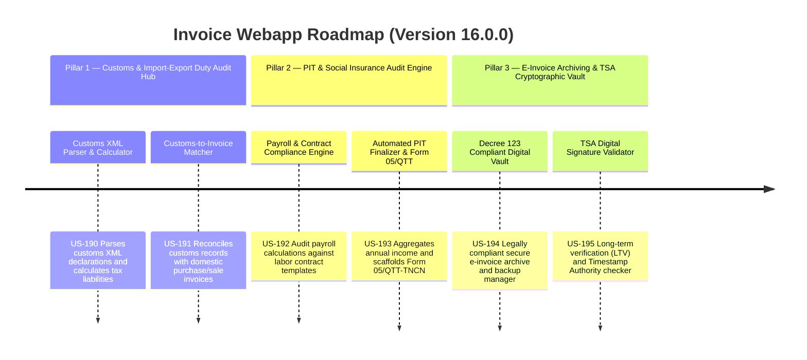

# Next-Gen Webapp XML: Version 16.0.0 Product Roadmap & Goals

This document outlines the three strategic pillars delivered in **Version 16.0.0 (Vietnamese E-Invoice Customs & Import-Export Duty Audit Hub, PIT & Social Insurance Audit Engine, and Secure E-Invoice Archiving & TSA Cryptographic Vault)** of the GDT Invoice Hub. It details the platform's evolution into an end-to-end statutory financial compliance and long-term verification platform.

---

## 🗺️ Product Roadmap Overview

---

## 📋 Milestone 16.0.0 Pillar 1: Customs & Import-Export Duty Audit Hub (US-190, US-191)
*Focus: Automatically checking import-export tax compliance and reconciling customs declarations.*

### 🎯 Goal 16.1.1: Customs XML Parser & Import-Export Duty Calculator (US-190)
- **Problem**: Import-export companies must declare import duties, export duties, environmental protection taxes, and import VAT based on Customs Declarations (Tờ khai hải quan). Reviewing these customs XML files and manual calculation of these taxes is highly complex.
- **Solution**: An automation parser that reads Vietnam Customs XML declaration files (from VNACCS/VCIS), extracts import-export metrics (value, currency, tariff rates, exchange rates), and recalculates the respective tax liabilities to detect discrepancies.
- **Acceptance Criteria**:
  - Parses VNACCS/VCIS Customs XML declaration formats (Tờ khai Hải quan).
  - Extracts key metadata: Customs Declaration ID, Date, Incoterms, Currency, Exchange Rate, Total Value, and Line Items.
  - Computes import VAT, import duty, and environmental taxes according to statutory formulas.
  - Generates a tax calculation report flagging mismatched tariff codes or calculation differences.
  - Exposes API endpoint `POST /api/customs/parse` to upload and calculate customs duties.

### 🎯 Goal 16.1.2: Customs-to-Invoice Matcher & Discrepancy Detector (US-191)
- **Problem**: Tax auditors frequently check if import VAT declared on customs files matches paid bank statements and domestic input VAT invoices. Any discrepancy leads to tax penalties.
- **Solution**: A reconciliation dashboard that matches customs declaration records against purchase/sale invoices and payment vouchers to verify tax alignment.
- **Acceptance Criteria**:
  - Reconciles customs declaration records against domestic input invoices using declaration numbers, payment vouchers, and vendor metadata.
  - Detects discrepancies: mismatch in total value, mismatched VAT rates, or missing corresponding invoices.
  - Flags invoices that lack customs reference numbers for import-export transactions.
  - Exposes API endpoint `GET /api/customs/reconcile` to fetch a list of matched and mismatched items.

---

## 📂 Milestone 16.0.0 Pillar 2: PIT & Social Insurance Audit Engine (US-192, US-193)
*Focus: Checking compliance of personal income tax payroll sheets and labor contracts.*

### 🎯 Goal 16.2.1: Payroll & Labor Contract Compliance Audit Engine (US-192)
- **Problem**: Vietnamese companies struggle to comply with complex Social Insurance (BHXH), Health Insurance (BHYT), and Personal Income Tax (PIT) regulations. Mismatches between payroll calculations, contract structures, and tax deductions are common targets during audits.
- **Solution**: An audit engine that compares Excel payroll sheets against labor contract data, recalculating social insurance contributions and tax-exempt allowances to ensure legal alignment.
- **Acceptance Criteria**:
  - Parses standard corporate payroll sheets (Excel/CSV) and reads taxpayer labor contracts.
  - Recalculates social insurance contributions (employer vs. employee shares) based on statutory rates.
  - Flags tax-exempt allowances (welfare, lunch, telephone) exceeding legal thresholds.
  - Identifies salary discrepancies or uncontracted payments.
  - Exposes API endpoint `POST /api/pit/payroll-audit` to upload and verify payroll compliance.

### 🎯 Goal 16.2.2: Automated PIT Finalizer & Form 05/QTT-TNCN Scaffolder (US-193)
- **Problem**: Tax departments spend significant time compiling annual salaries, dependents, deductions, and withholding tax for hundreds of employees to file the annual PIT finalization (Quyết toán Thuế TNCN - Form 05/QTT-TNCN).
- **Solution**: An automation system that aggregates annual payroll records, calculates employee-by-employee PIT liabilities, and scaffolds the XML/Excel file required for GDT's HTKK.
- **Acceptance Criteria**:
  - Aggregates employee payroll records, taxable income, dependents, and tax-exempt allowances for the tax year.
  - Recalculates tax liability using progressive and flat tax rates.
  - Generates the statutory Form 05/QTT-TNCN (and Appendix 05-1, 05-2, 05-3) in XML format compatible with HTKK.
  - Exposes API endpoint `POST /api/pit/finalize` to generate the annual PIT declaration package.

---

## 🔒 Milestone 16.0.0 Pillar 3: E-Invoice Archiving & TSA Cryptographic Vault (US-194, US-195)
*Focus: Legally compliant archiving under Decree 123/2020/NĐ-CP and long-term signature verification.*

### 🎯 Goal 16.3.1: Decree 123 Compliant Digital Vault & XML Archiver (US-194)
- **Problem**: Under Decree 123/2020/NĐ-CP, companies must store e-invoice XML files securely for 10 years. They need an automated system that compresses, encrypts, backups, and indexes these documents for instant compliance audits.
- **Solution**: A secure document vault with automated XML/PDF packaging, AES-256 encryption, local/cloud storage backup options, and a metadata indexing search panel.
- **Acceptance Criteria**:
  - Packages invoice XML files along with their respective PDF counterparts into zip archives.
  - Encrypts archived zip packages using AES-256 with tenant-specific keys.
  - Automatically indexes full-text metadata (Issuer, Tax Code, Date, Total, Products) to support search queries.
  - Integrates automated local storage backup schedules and exports.
  - Exposes API endpoint `POST /api/vault/archive` to manage and backup invoice archives.

### 🎯 Goal 16.3.2: Long-Term Signature & TSA Validator (US-195)
- **Problem**: During a tax audit years after issuance, companies must prove that the digital signature on the invoice was valid at the exact time of signing, using Timestamp Authority (TSA) records and certificate status lookup.
- **Solution**: A cryptographic validator that extracts digital signatures from invoice XML files, verifies certificates via CRL/OCSP, and validates embedded TSA timestamps.
- **Acceptance Criteria**:
  - Extracts digital signature elements (Signature, Certificate Chain) from GDT standard invoice XMLs.
  - Verifies signature cryptographic validity and certificate trust path (Vietnam CA).
  - Parses and verifies embedded Timestamp Authority (TSA) tokens to prove the invoice's existence at the signed time.
  - Generates a validation log and PDF report proving long-term signature validity.
  - Exposes API endpoint `POST /api/vault/verify-signature` to upload and inspect XML signatures.

---

## 📋 Epic & Story Mapping

| Epic ID | Epic Title | Story ID | Story Title | Status |
| :--- | :--- | :--- | :--- | :--- |
| **E79** | Customs Audit Hub | **US-190** | Customs XML Parser & Import-Export Duty Calculator | ✅ Implemented |
| **E79** | Customs Audit Hub | **US-191** | Customs-to-Invoice Matcher & Discrepancy Detector | ✅ Implemented |
| **E80** | PIT & Social Insurance | **US-192** | Payroll & Labor Contract Compliance Audit Engine | ✅ Implemented |
| **E80** | PIT & Social Insurance | **US-193** | Automated PIT Finalizer & Form 05/QTT-TNCN Scaffolder | ✅ Implemented |
| **E81** | Compliance Vault | **US-194** | Decree 123 Compliant Digital Vault & XML Archiver | ✅ Implemented |
| **E81** | Compliance Vault | **US-195** | Long-Term Signature & TSA Validator | ✅ Implemented |
