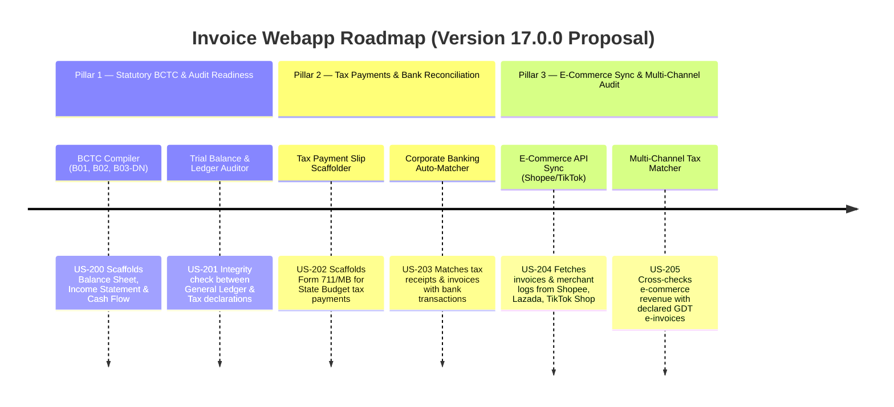

# Proposal: Version 17.0.0 Product Roadmap & Upgrade Plan

This document outlines the detailed upgrade plan and three strategic pillars proposed for **Version 17.0.0** of the GDT Invoice Hub. It bridges invoice data, financial bookkeeping, government tax payment terminals, and modern multi-channel sales channels (e-commerce platforms) to complete the statutory accounting lifecycle.

---

## 🗺️ Proposed Product Roadmap Overview

---

## 📋 Detailed Pillars & User Stories (US-200 to US-205)

### 📂 Pillar 1: Statutory BCTC Compiler & Audit Readiness Engine (US-200, US-201)
*Focus: Automatically compiling Vietnamese Financial Statements (Báo cáo Tài chính - BCTC) and auditing bookkeeping compliance.*

#### 🎯 Story US-200: Statutory Financial Statements (BCTC) Scaffolder (B01, B02, B03-DN)
- **Concept**: Translates the general ledger and adjusted tax data (from VAT, CIT, PIT modules) into the standard Vietnamese accounting templates: Balance Sheet (B01-DN), Income Statement (B02-DN), and Cash Flow Statement (B03-DN).
- **Scope & API**:
  - Exposes `POST /api/bctc/compile` to aggregate ledger accounts (using standard VAS chart of accounts).
  - Validates balance sheet mathematical identities (Assets = Liabilities + Equity).
  - Exports XML files ready to upload to GDT HTKK and PDF reports for audit review.
- **Why this upgrades the platform**: Connects invoice aggregation directly with the final corporate financial reporting stage.

#### 🎯 Story US-201: Trial Balance & Ledger Integrity Auditor
- **Concept**: Audits the general ledger (Sổ cái) and trial balance (Bảng cân đối số phát sinh) against GDT e-invoice data. It flags entries that lack corresponding XML invoices or have mismatched values.
- **Scope & API**:
  - Exposes `POST /api/bctc/audit-ledger` uploading ledger Excel files.
  - Matches double-entry transactions (e.g. Debit 156/Credit 331) against purchase XMLs.
  - Flags missing source documents, wrong VAT accounting rates, or out-of-period entries.

---

### 📂 Pillar 2: Tax Payment Slip Scaffolder & Corporate Banking Auto-Matcher (US-202, US-203)
*Focus: Closing the loop on cash payment validation and state budget tax transactions.*

#### 🎯 Story US-202: GDT Tax Payment Slip Scaffolder (Form 711/MB)
- **Concept**: Automates the generation of the official State Budget Tax Payment Slip (Giấy nộp tiền vào Ngân sách Nhà nước - Form 711/MB) based on calculated VAT, CIT, PIT, and Customs Duty liabilities.
- **Scope & API**:
  - Exposes `POST /api/payments/tax-slip` compiling tax liabilities into the official payment slip format.
  - Automatically maps GDT tax chapter/sub-chapter codes (Chương/Tiểu mục) for VAT (1701), CIT (1052), PIT (1001), and FCT.
  - Generates the XML format compatible with GDT's electronic tax portal (thuedientu.gdt.gov.vn) and VietQR codes for instant banking apps payment.

#### 🎯 Story US-203: Corporate Banking Transaction Reconciler
- **Concept**: Syncs bank statements (mock API/Excel upload) and matches payment details against domestic invoices, foreign vendor payments (FCT), and state tax payments.
- **Scope & API**:
  - Exposes `POST /api/payments/bank-recon` to parse corporate bank statement feeds.
  - Matches transfer descriptors, values, and transaction times with buyer/seller profiles and tax payment slips.
  - Flags partial payments, unlinked cash receipts, and unpaid aged invoices.

---

### 📂 Pillar 3: E-Commerce API Sync & Multi-Channel Audit Hub (US-204, US-205)
*Focus: Managing high-volume digital tax compliance for multi-channel merchants.*

#### 🎯 Story US-204: E-Commerce Seller Portal Invoice Synchronizer (Shopee, Lazada, TikTok Shop)
- **Concept**: Integrates via APIs or merchant export logs with Vietnamese major e-commerce platforms to fetch transaction records, commission fees, and platform-generated e-invoices.
- **Scope & API**:
  - Exposes API endpoints `POST /api/ecommerce/sync` to connect merchant APIs (Shopee OpenAPI, TikTok Shop API).
  - Parses high-volume transaction feeds, shipping fees, and refund offsets.
  - Consolidates merchant invoices and service charge bills issued by Shopee/Lazada/TikTok.

#### 🎯 Story US-205: Multi-Channel Revenue & Tax Reconciliation Engine
- **Concept**: Reconciles e-commerce revenue logs with GDT's official e-invoice list to ensure that sellers do not under-report retail sales and that tax deductions on platform commissions are fully backed by valid input XMLs.
- **Scope & API**:
  - Exposes `GET /api/ecommerce/reconcile` showing discrepancies.
  - Flags retail transactions missing an output invoice.
  - Verifies that input invoices issued by e-commerce operators for service fees match actual bank deductions and commission rates.

---

## 🛠️ Verification Strategy & Testing Framework

| Story ID | Unit Test Target (`pytest`) | Integration Test Target (API client) |
| :--- | :--- | :--- |
| **US-200** | Test balance sheet equations and accounts mappings | `/api/bctc/compile` exports compliant XML |
| **US-201** | Test double-entry validation logic against mock invoices | `/api/bctc/audit-ledger` flags missing vouchers |
| **US-202** | Test sub-chapter (Tiểu mục) code mapping accuracy | `/api/payments/tax-slip` generates valid VietQR codes |
| **US-203** | Test bank statement matcher regex and transaction scores | `/api/payments/bank-recon` maps statements to database |
| **US-204** | Test Shopee/TikTok payload parsers on edge-case fees | `/api/ecommerce/sync` imports mock transactions |
| **US-205** | Test transaction-to-invoice match logic and alerts | `/api/ecommerce/reconcile` reports tax discrepancy percentages |
