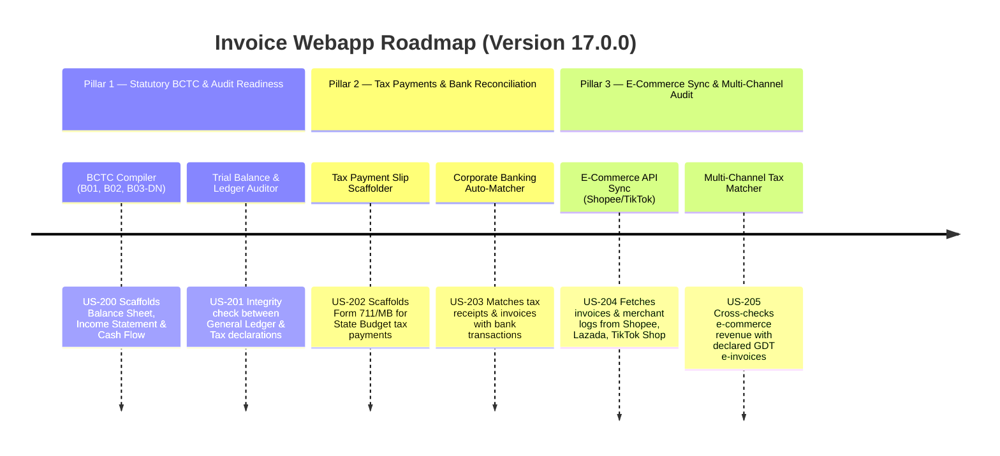

# Version 17.0.0 Product Roadmap — Statutory Accounting, E-Commerce Integration & Banking Sync

This document defines the official product roadmap and development timeline for **Version 17.0.0** of the GDT Invoice Hub. It details the user stories, architectural specifications, integration schemas, and verification strategies to implement statutory Financial Statements compilation, State Budget tax payments, digital bank statements reconciliation, and multi-channel e-commerce tax compliance.

---

## 🗺️ Product Timeline & Core Pillars

---

## 📋 Story Specifications Mapping

| Story ID | Name | Core Business Objective | Target Output Format |
| :--- | :--- | :--- | :--- |
| **US-200** | Statutory Financial Statements (BCTC) Scaffolder | Compiles VAS balance sheet, income statement, and cash flow | XML (HTKK compatible) & PDF |
| **US-201** | Trial Balance & Ledger Integrity Auditor | Cross-audits ledger balances against source GDT invoice XMLs | JSON Audit Report & Alerts |
| **US-202** | GDT Tax Payment Slip Scaffolder | Automatically structures state tax payment forms with Chapter/Sub-chapter codes | XML Form 711/MB & VietQR |
| **US-203** | Corporate Banking Transaction Reconciler | Reconciles bank statements against bills and tax receipt logs | JSON Reconciled Ledger & Flags |
| **US-204** | E-Commerce Seller Portal Sync | Connects via API or parses logs from Shopee, Lazada, and TikTok Shop | Standardized Invoice Records |
| **US-205** | Multi-Channel Revenue & Tax Matcher | Compares e-commerce transactions against output invoice logs to identify gaps | Discrepancy Matrix & Risk Score |

---

## ⚙️ Technical Constraints & Integration Guidelines

1. **VAS Accounts Mapping (US-200)**: Follows the circular 200/2014/TT-BTC guidelines for corporate accounting. Ledger mappings must match account codes:
   - Cash: `111`, `112`
   - Accounts Receivable: `131`
   - Inventories: `152`, `153`, `156`
   - Accounts Payable: `331`
   - Taxes Payable: `333` (VAT: `3331`, CIT: `3334`, PIT: `3335`)
2. **HTKK XML Schema Specification (US-200, US-202)**: XML files must validate against the standard HTKK schemas issued by the General Department of Taxation. Giấy nộp tiền sử dụng XML mẫu 711/MB.
3. **E-Commerce API Payload Mocking (US-204)**: Standardized Shopee/TikTok Shop order payload parser extracting item price, discounts, platform vouchers, shipping fee, seller commission, and payment fees.
4. **State Budget Codes (US-202)**: Tax categories map to corresponding sub-chapter codes (Tiểu mục):
   - VAT on domestic goods: `1701`
   - Corporate Income Tax (CIT): `1052`
   - Personal Income Tax (PIT): `1001`
   - Import Duty: `1901`

---

## 📋 Epic & Story Mapping

| Epic ID | Epic Title | Story ID | Story Title | Status |
| :--- | :--- | :--- | :--- | :--- |
| **E82** | Statutory BCTC & Audit | **US-200** | Statutory Financial Statements (BCTC) Scaffolder | ✅ Implemented |
| **E82** | Statutory BCTC & Audit | **US-201** | Trial Balance & Ledger Integrity Auditor | ✅ Implemented |
| **E83** | Tax & Bank Reconciliation | **US-202** | GDT Tax Payment Slip Scaffolder | ✅ Implemented |
| **E83** | Tax & Bank Reconciliation | **US-203** | Corporate Banking Transaction Reconciler | ✅ Implemented |
| **E84** | E-Commerce Sync & Match | **US-204** | E-Commerce Seller Portal Sync | ✅ Implemented |
| **E84** | E-Commerce Sync & Match | **US-205** | Multi-Channel Revenue & Tax Matcher | ✅ Implemented |
