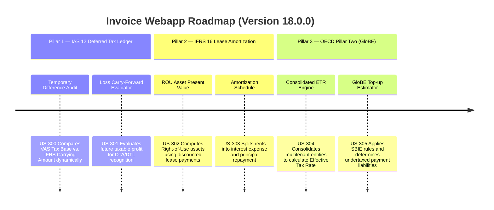

# Version 18.0.0 Product Roadmap — Enterprise IFRS Compliance & Global Tax Optimization

This document defines the official product roadmap and development specifications for **Version 18.0.0** of the GDT Invoice Hub. It details the core pillars, technical models, integration rules, and test verification strategies to implement standard International Financial Reporting Standards (IFRS/IAS) translations and OECD Pillar Two global minimum tax estimations.

---

## 🗺️ Product Timeline & Core Pillars

---

## 📋 Story Specifications Mapping

| Story ID | Name | Core Business Objective | Target Output Format |
| :--- | :--- | :--- | :--- |
| **US-300** | IAS 12 Deferred Tax Temporary Difference Engine | Calculates DTA & DTL based on assets and liabilities carrying differences | JSON & SQLite Ledger |
| **US-301** | Deferred Tax Balance Sheet Integration | Maps accrued expenses and depreciations to deferred tax accounts | Balance Sheet Adjustments |
| **US-302** | IFRS 16 Lease Present Value Calculator | Discounts monthly office and equipment rents to determine Right-of-Use assets | Discounted cash flow (PV) |
| **US-303** | Lease Liability Amortization Schedule | Generates month-by-month schedules separating interest from principal repayment | PDF & CSV Schedule |
| **US-304** | Cross-Tenant Consolidation Router | Merges financial figures across isolated tenant databases (`tenant_<mst>.db`) | Consolidated Income & Taxes |
| **US-305** | OECD Pillar Two GloBE Top-up Tax Estimator | Calculates ETR per jurisdiction and applies Substance-Based Income Exclusions (SBIE) | Top-Up Tax Audit Report |

---

## ⚙️ Technical Constraints & Integration Guidelines

1. **IAS 12 Audit Rules (US-300, US-301)**:
   - **Deferred Tax Liability (DTL)**: Asset Carrying Amount > Tax Base, OR Liability Carrying Amount < Tax Base.
   - **Deferred Tax Asset (DTA)**: Asset Carrying Amount < Tax Base, OR Liability Carrying Amount > Tax Base.
   - Tax rate defaults to standard statutory CIT rate (`20%` in Vietnam).
2. **IFRS 16 Present Value Formulation (US-302, US-303)**:
   - $$PV = \text{Payment} \times \left[\frac{1 - (1 + r)^{-n}}{r}\right]$$
   - Where $r$ is the monthly lease discount rate ($\text{annual rate} / 12$) and $n$ is the total lease term in months.
3. **OECD Pillar Two Thresholds (US-304, US-305)**:
   - Minimum global effective tax rate is set to **15%**.
   - Substance-Based Income Exclusion (SBIE) includes payroll exclusion and tangible asset exclusion (mocked at standard 8% in version 18.0.0).
   - Dynamic cross-tenant querying must bypass standard isolated database boundaries safely under admin/auditor roles only.

---

## 📋 Epic & Story Mapping

| Epic ID | Epic Title | Story ID | Story Title | Status |
| :--- | :--- | :--- | :--- | :--- |
| **E85** | IAS 12 Deferred Tax | **US-300** | IAS 12 Deferred Tax Temporary Difference Engine | ✅ Implemented |
| **E85** | IAS 12 Deferred Tax | **US-301** | Deferred Tax Balance Sheet Integration | ✅ Implemented |
| **E86** | IFRS 16 Leases | **US-302** | IFRS 16 Lease Present Value Calculator | ✅ Implemented |
| **E86** | IFRS 16 Leases | **US-303** | Lease Liability Amortization Schedule | ✅ Implemented |
| **E87** | OECD Pillar Two | **US-304** | Cross-Tenant Consolidation Router | ✅ Implemented |
| **E87** | OECD Pillar Two | **US-305** | OECD Pillar Two GloBE Top-up Tax Estimator | ✅ Implemented |
