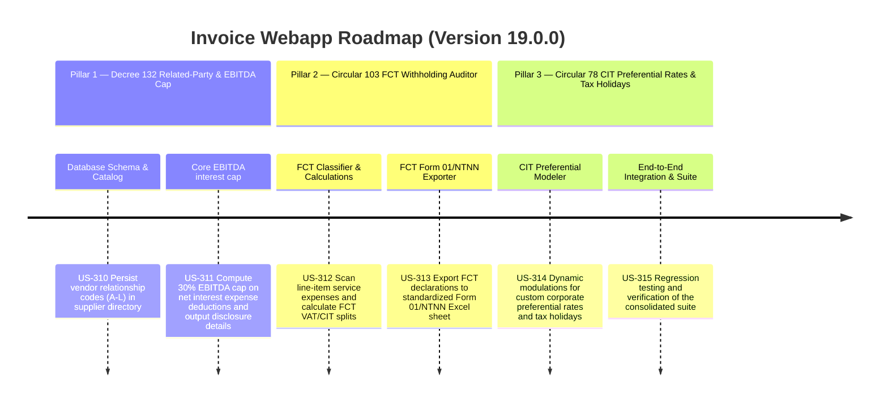

# Version 19.0.0 Product Roadmap — Enterprise Tax Compliance & Dynamic Multi-Tenant Audit Oracle

This document defines the official product roadmap and development specifications for **Version 19.0.0** of the GDT Invoice Hub. It details the core pillars, technical models, integration rules, and test verification strategies to implement related-party transactions tracking (Decree 132), foreign contractor withholding declarations (Circular 103), and dynamic CIT preferred rates, tax holidays, and R&D funds (Circular 78).

---

## 🗺️ Product Timeline & Core Pillars

---

## 📋 Story Specifications Mapping

| Story ID | Name | Core Business Objective | Target Output Format |
| :--- | :--- | :--- | :--- |
| **US-310** | Database Schema & Catalog Management | Extend database model for `Partner` to include Decree 132 relationship code column | SQLite Column & CRUD APIs |
| **US-311** | Core EBITDA interest cap & Form 01/132 disclosures | Compute 30% EBITDA interest caps and format related-party disclosures | Warnings & Form 01/132 XML |
| **US-312** | FCT Classifier & Line-item calculations | Classify foreign contractor transactions and split VAT/CIT on line items | JSON Calculations |
| **US-313** | FCT Form 01/NTNN Excel Exporter | Export contractor withholding declarations to GDT Form 01/NTNN sheet | Excel (XLSX) File |
| **US-314** | Preferred CIT Rates, Tax Holidays & R&D Modeler | Model preferred rates, tax holiday schedules, and R&D fund tax shielding | CIT Calculation Engine |
| **US-315** | End-to-End Integration & Suite Verification | Complete regression run of the entire consolidated test suite | Passing Test Suite |

---

## ⚙️ Technical Constraints & Integration Guidelines

1. **Decree 132 Relationship Codes (US-310)**:
   - Assign codes `A` through `L` to taxpayer partners to flag related-party transactions.
   - Restrict updates to authorized editor and admin roles.
2. **EBITDA Interest Cap formulation (US-311)**:
   - EBITDA calculated as: `Net Operating Profit + Net Interest Expense + Depreciation`.
   - Interest expense deductions capped at 30% of EBITDA.
3. **FCT Splitting rules (US-312)**:
   - Identify seller MST starting with `900` or matching foreign providers.
   - Apply specific tax splits on line-items: SaaS (VAT: 0%, CIT: 5%), Cloud/Ads (VAT: 5%, CIT: 5%), Royalties (VAT: 0%, CIT: 10%).

---

## 📋 Epic & Story Mapping

| Epic ID | Epic Title | Story ID | Story Title | Status |
| :--- | :--- | :--- | :--- | :--- |
| **E88** | Decree 132 Related-Party & EBITDA Cap | **US-310** | Database Schema & Catalog Management | ✅ Implemented |
| **E88** | Decree 132 Related-Party & EBITDA Cap | **US-311** | Core EBITDA interest cap & Form 01/132 disclosures | ✅ Implemented |
| **E89** | Circular 103 FCT Withholding Auditor | **US-312** | FCT Classifier & Line-item calculations | ✅ Implemented |
| **E89** | Circular 103 FCT Withholding Auditor | **US-313** | FCT Form 01/NTNN Excel Exporter | ✅ Implemented |
| **E90** | Circular 78 CIT Preferential Rates & Tax Holidays | **US-314** | Preferred CIT Rates, Tax Holidays & R&D Modeler | ✅ Implemented |
| **E90** | Circular 78 CIT Preferential Rates & Tax Holidays | **US-315** | End-to-End Integration & Suite Verification | ✅ Implemented |
