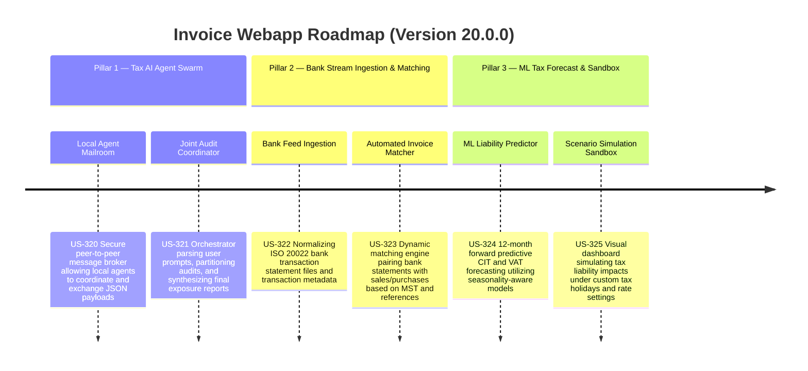

# Version 20.0.0 Product Roadmap — Enterprise Tax AI Swarm & Real-time Audit Network

This document defines the official product roadmap and development specifications for **Version 20.0.0** of the GDT Invoice Hub. It details the core pillars, technical models, integration rules, and test verification strategies to implement a multi-agent tax advisory swarm (aligned with Harness v2.0), real-time bank transaction streaming with invoice matching, and machine learning-powered tax liability forecasting.

---

## 🗺️ Product Timeline & Core Pillars

---

## 📋 Story Specifications Mapping

| Story ID | Name | Core Business Objective | Target Output Format |
| :--- | :--- | :--- | :--- |
| **US-320** | Local Agent Mailroom & Coordination Hub | Implement structured JSON-based message coordination and locking for local specialist agents | Python Mailroom Broker & API |
| **US-321** | Autonomous Joint Audit Coordinator | Parse complex prompts, delegate sub-tasks to specialists, and compile unified report | Markdown Joint Audit Report |
| **US-322** | Bank Feed Ingestion & Transaction Normalizer | Parse ISO 20022 Bank XML/CSV transaction statements into standard database model | SQLite Bank Ledger & APIs |
| **US-323** | Automated Bank-to-Invoice Matcher | Pair bank statement payments with corresponding purchase/sales invoices with risk warnings | Interactive Matching UI & PDF |
| **US-324** | Machine Learning Tax Liability Predictor | Forecast VAT and CIT liabilities 12 months ahead with confidence intervals | SVG Forecast & Forecast JSON |
| **US-325** | Tax Scenario Simulation Sandbox | Sandbox interface for financial planning to simulate tax holidays and M&A pricing | Interactive Planning Panel |

---

## ⚙️ Technical Constraints & Integration Guidelines

1. **Multi-Agent Mailroom Messaging (US-320, US-321)**:
   - Communication between localized agents must occur asynchronously via the local SQLite-backed inbox queue.
   - Output reports must include confidence scoring and references back to raw invoice UUIDs and statutory circulars.
2. **Bank Transaction Stream Matching (US-322, US-323)**:
   - Bank statement parsing must support standard Vietcombank, Techcombank, and ISO 20022 XML formats.
   - Matching rules: Exact Match (MST matches, reference code matches, amount within 0.1%), Partial Match (MST matches, reference code matches but amount mismatch - raises warning badge), No Match (raises cash settlement audit warnings for values >= 20M VND).
3. **Forecasting Algorithms (US-324)**:
   - Implement seasonal decomposition or auto-regressive moving average (ARIMA/Prophet) models to predict future VAT input/output based on historical monthly series (minimum 12 data points required).
   - Display a confidence band of 95% shadow area in the interactive SVG chart.

---

## 📋 Epic & Story Mapping

| Epic ID | Epic Title | Story ID | Story Title | Status |
| :--- | :--- | :--- | :--- | :--- |
| **E91** | Tax AI Agent Swarm | **US-320** | Local Agent Mailroom & Coordination Hub | ✅ Implemented |
| **E91** | Tax AI Agent Swarm | **US-321** | Autonomous Joint Audit Coordinator | ✅ Implemented |
| **E92** | Bank Stream Ingestion & Matching | **US-322** | Bank Feed Ingestion & Transaction Normalizer | ✅ Implemented |
| **E92** | Bank Stream Ingestion & Matching | **US-323** | Automated Bank-to-Invoice Matcher | ✅ Implemented |
| **E93** | ML Tax Forecast & Sandbox | **US-324** | Machine Learning Tax Liability Predictor | ✅ Implemented |
| **E93** | ML Tax Forecast & Sandbox | **US-325** | Tax Scenario Simulation Sandbox | ✅ Implemented |
