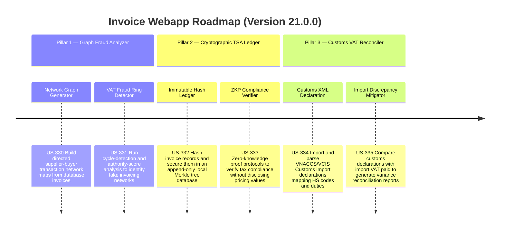

# Version 21.0.0 Product Roadmap — Advanced VAT Fraud Detection & Cryptographic TSA Vault v2

This document defines the official product roadmap and development specifications for **Version 21.0.0** of the GDT Invoice Hub. It details the core pillars, technical models, integration rules, and test verification strategies to implement graph-based VAT fraud ring analysis, Merkle tree cryptographic invoice ledgers, and Customs XML import reconciliation.

---

## 🗺️ Product Timeline & Core Pillars

---

## 📋 Story Specifications Mapping

| Story ID | Name | Core Business Objective | Target Output Format |
| :--- | :--- | :--- | :--- |
| **US-330** | Taxpayer Network Graph Generator | Construct transaction graph nodes and edges representation from local historical invoices | Network JSON & SVG Graph |
| **US-331** | VAT Fraud Ring Network Detector | Run Graph cycles & PageRank outlier filters to detect suspicious transaction loops | Fraud Threat Alerts UI |
| **US-332** | Immutable Cryptographic Merkle Ledger | Hash invoices sequentially, saving proof receipts into local secure store | Merkle Proof Receipts |
| **US-333** | Zero-Knowledge Proof Tax Compliance | Build proof protocols validating total invoice VAT matches rates without value disclosure | Cryptographic Proof file |
| **US-334** | Customs XML Declaration Parser | Parse Customs import declarations, extracting duties, VAT base, and exchange rates | Customs Database Schema |
| **US-335** | Import VAT Reconciliation & Mitigation | Match customs records with actual XML invoices to automatically draft tax declarations | Adjustment Report DOC |

---

## ⚙️ Technical Constraints & Integration Guidelines

1. **Graph Analytics and Outliers (US-330, US-331)**:
   - Calculate network density and identify cycles of length $\le 5$ to flag potential shell company circular invoicing.
   - Nodes with anomalously high HITS hub scores but minimal physical facilities must trigger top priority tax risk warnings.
2. **Merkle Tree & ZKP Formulations (US-332, US-333)**:
   - Root hashes are re-calculated on every database insert/update. If a historical row is tampered, validation fails.
   - Use standard SHA-256 hashing.
3. **Customs XML Ingestion (US-334, US-335)**:
   - Match invoice exchange rates with the customs published rates for the declaring week.
   - Detect HS code mismatches against purchase item descriptions.

---

## 📋 Epic & Story Mapping

| Epic ID | Epic Title | Story ID | Story Title | Status |
| :--- | :--- | :--- | :--- | :--- |
| **E94** | Graph Fraud Analyzer | **US-330** | Taxpayer Network Graph Generator | ✅ Implemented |
| **E94** | Graph Fraud Analyzer | **US-331** | VAT Fraud Ring Network Detector | ✅ Implemented |
| **E95** | Cryptographic TSA Ledger | **US-332** | Immutable Cryptographic Merkle Ledger | ✅ Implemented |
| **E95** | Cryptographic TSA Ledger | **US-333** | Zero-Knowledge Proof Tax Compliance | ✅ Implemented |
| **E96** | Customs VAT Reconciler | **US-334** | Customs XML Declaration Parser | ✅ Implemented |
| **E96** | Customs VAT Reconciler | **US-335** | Import VAT Reconciliation & Mitigation | ✅ Implemented |
