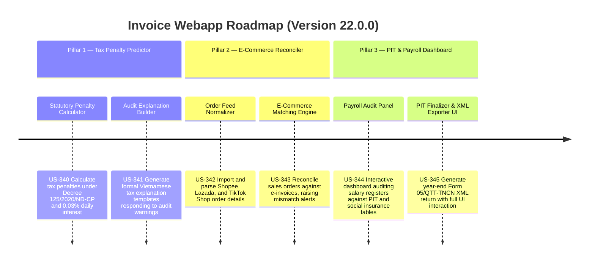

# Version 22.0.0 Product Roadmap — Intelligent Tax Penalty Predictor & Advanced Corporate Tax Compliance

This document defines the official product roadmap and development specifications for **Version 22.0.0** of the GDT Invoice Hub. It details the core pillars, technical models, integration rules, and test verification strategies to implement statutory tax penalty & interest calculations, e-commerce order-to-invoice tax reconciliation, and interactive payroll/PIT compliance dashboards.

---

## 🗺️ Product Timeline & Core Pillars

---

## 📋 Story Specifications Mapping

| Story ID | Name | Core Business Objective | Target Output Format |
| :--- | :--- | :--- | :--- |
| **US-340** | Statutory Tax Penalty & Interest Calculator | Automatically compute tax penalties (Decree 125/2020/NĐ-CP) and daily late interest (0.03%) on tax variances | Calculated Penalty JSON |
| **US-341** | AI-Generated Audit Explanation Builder | Generate official Vietnamese explanation letters responding to specific audit risks | Markdown/HTML Export |
| **US-342** | Shopee, Lazada & TikTok Shop Order Normalizer | Parse CSV/JSON export feeds from e-commerce platforms into standardized orders | E-Commerce Orders Schema |
| **US-343** | E-Commerce Tax Compliance Matching Engine | Pair platform transactions against issued e-invoices, detecting tax declaration gaps | Reconciliation Report |
| **US-344** | Interactive Payroll Audit Dashboard | Audit employees' progressive PIT rates and statutory insurance withholdings in a web view | Payroll Dashboard UI |
| **US-345** | PIT Finalizer & Form 05/QTT-TNCN UI | Step-by-step wizard to finalize PIT, previewing and exporting GDT-compliant XML | Form 05/QTT-TNCN XML |

---

## ⚙️ Technical Constraints & Integration Guidelines

1. **Statutory Penalties (US-340, US-341)**:
   - Penalty rate for under-declaration: **20%** of the underpaid tax amount.
   - Late payment interest rate: **0.03% per day**, calculated from `due_date + 1` to `payment_date`.
   - Evasion/fraud penalties must support scale configuration (1x to 3x of tax amount).
   - Generated defense letters must quote statutory decrees (Nghị định 125/2020/NĐ-CP, Thông tư 80/2021/TT-BTC).

2. **E-Commerce Reconciliation (US-342, US-343)**:
   - Match transactions based on platform Order ID, Customer Name, and Phone/Email.
   - Flag orders completed but without a matching invoice, or orders where the invoice amount differs from payment received by > 1,000 VND.

3. **Payroll & PIT Wizard (US-344, US-345)**:
   - PIT Progressive tax brackets: 5% (up to 5M), 10% (5M-10M), 15% (10M-18M), 20% (18M-32M), 25% (32M-52M), 30% (52M-80M), 35% (over 80M).
   - Social Insurance rate: Employee portion **10.5%**, Employer portion **21.5%**.
   - Year-end Form 05/QTT-TNCN XML output must be structured exactly matching GDT's HTKK schema with `<thongTinDK>`, `<bk05_1_TNCN>`, `<bk05_2_TNCN>`, and `<bk05_3_TNCN>`.

---

## 📋 Epic & Story Mapping

| Epic ID | Epic Title | Story ID | Story Title | Status |
| :--- | :--- | :--- | :--- | :--- |
| **E97** | Statutory Tax Penalty Predictor | **US-340** | Statutory Tax Penalty & Interest Calculator | ✅ Completed |
| **E97** | Statutory Tax Penalty Predictor | **US-341** | AI-Generated Audit Explanation Builder | ✅ Completed |
| **E98** | E-Commerce Platform Reconciler | **US-342** | Shopee, Lazada & TikTok Shop Order Normalizer | ✅ Completed |
| **E98** | E-Commerce Platform Reconciler | **US-343** | E-Commerce Tax Compliance Matching Engine | ✅ Completed |
| **E99** | PIT & Payroll Dashboard | **US-344** | Interactive Payroll Audit Dashboard | ✅ Completed |
| **E99** | PIT & Payroll Dashboard | **US-345** | PIT Finalizer & Form 05/QTT-TNCN UI | ✅ Completed |
