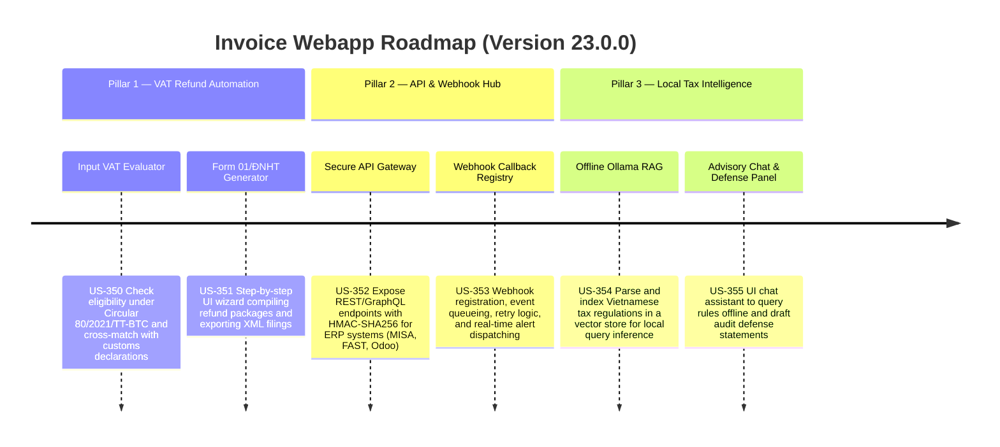

# Version 23.0.0 Product Roadmap — Exporter VAT Refund Automation, ERP Webhooks, & Local Ollama Tax RAG

This document defines the official product roadmap and development specifications for **Version 23.0.0** of the GDT Invoice Hub. It details the core pillars, technical models, integration rules, and test verification strategies to implement Exporter VAT Refund eligibility checking & filing packages, secure REST/GraphQL API gateways with Webhook callback registries for corporate ERP sync, and offline Ollama-based Vietnamese tax regulations RAG with interactive advisory chat.

---

## 🗺️ Product Timeline & Core Pillars

---

## 📋 Story Specifications Mapping

| Story ID | Name | Core Business Objective | Target Output Format |
| :--- | :--- | :--- | :--- |
| **US-350** | Input VAT Evaluator Engine | Assess inputs against Circular 80/2021/TT-BTC criteria (valid MST, bank payment >20M, customs matching). | Refund Eligibility JSON |
| **US-351** | Form 01/ĐNHT Refund Packet Wizard | Compilation interface to complete VAT Refund requests and export GDT-compatible XML/PDF. | Form 01/ĐNHT XML Package |
| **US-352** | Secure Versioned REST API Gateway | Provide external ERP clients access to invoices, risk scores, and ledger entries with HMAC authorization. | Secure API Response |
| **US-353** | ERP Webhook Dispatcher & Registry | Allow clients to subscribe to real-time invoice and risk events with retry queueing. | Webhook Events & Logs |
| **US-354** | Offline Ollama Tax Regulations RAG | Vector search & prompt runner using localized models (e.g. Gemma/Llama) referencing Vietnamese law. | Local Context RAG response |
| **US-355** | Advisory Chat & Defense Panel UI | Dashboard chat to query tax advisories, citation references, and draft defense arguments. | Advisory Chat UI & Defense Letter |

---

## ⚙️ Technical Constraints & Integration Guidelines

1. **Exporter VAT Refund (US-350, US-351)**:
   - Must evaluate Circular 80/2021/TT-BTC constraints:
     - Supplier tax code (MST) status must be active (not closed, suspended, or flagged as high risk).
     - Invoices > 20M VND must have corresponding non-cash bank transfer matching entries.
     - Customs declarations (Tờ khai Hải quan) must match export invoices by description, quantity, and currency value.
   - Form 01/ĐNHT XML schema must match General Department of Taxation (GDT) standards for tax refund requests, embedding base data fields, refund period, and details of input vouchers.

2. **API Gateway & Webhooks (US-352, US-353)**:
   - External APIs must be versioned (`/api/v1/...`).
   - Authentication must use API keys combined with HMAC-SHA256 signature verification computed over request method, path, timestamp, and body.
   - Webhook dispatcher must support backoff retry logic (exponential backoff up to 5 retries) and record delivery status/response logs in a database table.

3. **Offline Tax RAG (US-354, US-355)**:
   - Provide a connection interface to a local Ollama instance (default endpoint `http://localhost:11434`).
   - Use text embeddings (e.g. `nomic-embed-text` or similar) to index key articles of Decrees 123/2020/NĐ-CP, Decree 125/2020/NĐ-CP, and Circular 80/2021/TT-BTC.
   - Prompt templates must enforce citation output (quoting specific Law, Decree, Circular, Article, and Paragraph).

---

## 📋 Epic & Story Mapping

| Epic ID | Epic Title | Story ID | Story Title | Status |
| :--- | :--- | :--- | :--- | :--- |
| **E100** | Exporter VAT Refund Automation | **US-350** | Input VAT Evaluator Engine | ✅ Completed |
| **E100** | Exporter VAT Refund Automation | **US-351** | Form 01/ĐNHT Refund Packet Wizard | ✅ Completed |
| **E101** | Enterprise API & Webhook Gateway | **US-352** | Secure Versioned REST API Gateway | ✅ Completed |
| **E101** | Enterprise API & Webhook Gateway | **US-353** | ERP Webhook Dispatcher & Registry | ✅ Completed |
| **E102** | Local Tax Regulations Intelligence | **US-354** | Offline Ollama Tax Regulations RAG | ✅ Completed |
| **E102** | Local Tax Regulations Intelligence | **US-355** | Advisory Chat & Defense Panel UI | ✅ Completed |
