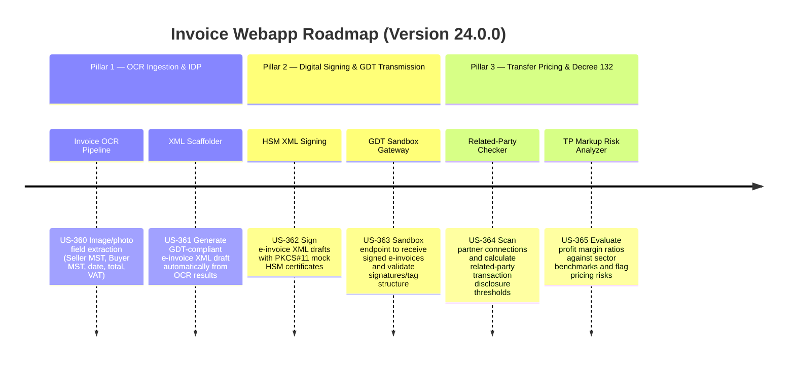

# Version 24.0.0 Product Roadmap — OCR Ingestion, HSM Cryptographic Signing, & Transfer Pricing Risk Engine

This document defines the official product roadmap and development specifications for **Version 24.0.0** of the GDT Invoice Hub. It details the core pillars, technical models, integration rules, and test verification strategies to implement physical invoice image OCR pipelines, automated XML scaffolding, HSM cryptographic digital signing, mock GDT receiving gateway transmission sandboxing, related-party transaction disclosures, and transfer pricing margin risk calculations.

---

## 🗺️ Product Timeline & Core Pillars

---

## 📋 Story Specifications Mapping

| Story ID | Name | Core Business Objective | Target Output Format |
| :--- | :--- | :--- | :--- |
| **US-360** | Physical Invoice Image OCR Pipeline | Extract standard fields from physical invoice photos/scans (PNG/JPG) using local OCR library or mock processor. | OCR Result JSON with Confidence Scores |
| **US-361** | Automated XML Scaffold from Image OCR | Generate a complete, editable, GDT-compliant draft XML from OCR fields. | Draft XML File |
| **US-362** | PKCS#11 HSM Cryptographic Signing Module | Perform cryptographic XML digital signing simulating HSM keys and X.509 certificates to embed `<ds:Signature>` nodes. | Digitally Signed e-Invoice XML |
| **US-363** | Mock GDT Receiving Gateway Transmission Sandbox | Receive signed e-invoices, audit signature validity and XML structure, and issue mock GDT status codes. | Transmission Log & GDT Status |
| **US-364** | Related Party Transaction Disclosure Checklist | Scan transactions with partners and identify Decree 132/2020/NĐ-CP related party relationships and disclosure thresholds. | Form 01/132 Disclosures & Checklist |
| **US-365** | Transfer Pricing Markup Risk Engine | Compute gross margin or EBIT margins and flag transfer pricing deviations against sector benchmarks. | Transfer Pricing Risk Analytics Report |

---

## ⚙️ Technical Constraints & Integration Guidelines

1. **Physical Invoice OCR & IDP (US-360, US-361)**:
   - File uploads must support PNG and JPEG image formats.
   - OCR engine must fall back gracefully to a regex-based parser or mock data injector when system packages (like Tesseract) are not available.
   - The generated XML must comply with GDT e-invoice schemas, including standard header, seller details, buyer details, VAT breakdown, and line item records.

2. **Digital Signing & Transmission (US-362, US-363)**:
   - Cryptographic signing must support standard XML digital signatures (XMLDSig) with SHA-256 digests.
   - Mock HSM must simulate certificate chains (Root CA, Intermediate CA, and User Certificate) and validate signature timestamps.
   - GDT sandbox API must respond with specific return codes (`00` for success, `01` for signature validation failure, `02` for format mismatch).

3. **Transfer Pricing & Related Parties (US-364, US-365)**:
   - Identify related-party relationships under Article 5 Decree 132/2020/NĐ-CP (e.g. ownership > 25%, loan > 50% owner's equity).
   - Evaluate Form 01/132 disclosure requirement (e.g., related-party transaction volume > 30B VND, or revenue > 150B VND).
   - Benchmarking comparisons must use statistical ranges (interquartile range) for Gross Margin or EBIT margins.

---

## 📋 Epic & Story Mapping

| Epic ID | Epic Title | Story ID | Story Title | Status |
| :--- | :--- | :--- | :--- | :--- |
| **E103** | AI OCR & Intelligent Document Processing | **US-360** | Physical Invoice Image OCR Pipeline | ✅ Completed |
| **E103** | AI OCR & Intelligent Document Processing | **US-361** | Automated XML Scaffold from Image OCR | ✅ Completed |
| **E104** | Secure e-Invoice Signing & Transmission | **US-362** | PKCS#11 HSM Cryptographic Signing Module | ✅ Completed |
| **E104** | Secure e-Invoice Signing & Transmission | **US-363** | Mock GDT Receiving Gateway Transmission Sandbox | ✅ Completed |
| **E105** | Related-Party & Transfer Pricing Analytics | **US-364** | Related Party Transaction Disclosure Checklist | ✅ Completed |
| **E105** | Related-Party & Transfer Pricing Analytics | **US-365** | Transfer Pricing Markup Risk Engine | ✅ Completed |
