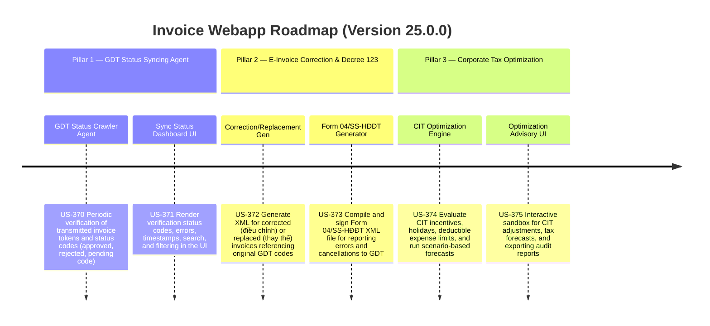

# Version 25.0.0 Product Roadmap — E-Invoice Corrections, GDT Status Syncing Agent, & Corporate Tax Optimization Modeler

This document defines the official product roadmap and development specifications for **Version 25.0.0** of the GDT Invoice Hub. It details the core pillars, technical models, integration rules, and test verification strategies to implement GDT Portal Status Syncing Agent, E-Invoice Correction/Replacement workflow, and Corporate Tax Optimization & Scenario Modeler.

---

## 🗺️ Product Timeline & Core Pillars

---

## 📋 Story Specifications Mapping

| Story ID | Name | Core Business Objective | Target Output Format |
| :--- | :--- | :--- | :--- |
| **US-370** | GDT Portal Syncing & Status Verification Crawler/Agent | Periodically sync with GDT sandbox/portal to verify transmission statuses and assign approved codes. | GDT Verification Code & Status JSON |
| **US-371** | Invoice Verification Status Dashboard UI | Build a dedicated status dashboard with search, filters, error detail badges, and manual re-sync triggers. | Verification Status UI |
| **US-372** | E-Invoice Correction & Replacement XML Generator | Compile Decree 123-compliant XMLs for corrected and replaced invoices citing original GDT codes. | Correction/Replacement XML bytes |
| **US-373** | Form 04/SS-HĐĐT XML Generator & GDT Transmission Wizard | Scaffolds Form 04/SS-HĐĐT XML, signs it with HSM, and transmits it via sandbox gateway. | Signed Form 04/SS XML & Log |
| **US-374** | Corporate Tax Optimization & Scenario Modeler Engine | Calculate CIT/VAT liabilities under different tax holiday schedules, deductible limits, and pricing markup options. | Tax Scenarios Projection JSON |
| **US-375** | Tax Scenario Sandbox & Optimization Advisory Panel UI | Sandbox UI allowing interactive sliders for parameters and rendering dynamic visual comparison charts. | Scenario Modeler UI & Report |

---

## ⚙️ Technical Constraints & Integration Guidelines

1. **GDT Portal Status Syncing (US-370, US-371)**:
   - Verification agent must execute periodically (cron or scheduler task).
   - Sync logic must query invoice transmission logs by transaction ID or secure token.
   - Statuses must transition: `pending` -> `approved` or `rejected` (with error message from portal).

2. **E-Invoice Correction & Decree 123 (US-372, US-373)**:
   - Corrected/Replaced invoice XML must include `<LHDon>` tag mapping the transaction type, and referencing elements linking back to the original invoice UUID/date/number.
   - Form 04/SS-HĐĐT XML structure must follow Circular 78 guidelines with elements `<MST>`, `<TenNNT>`, `<DanhSachSaiSot>`, and `<Signature>` nodes.
   - Transmission must pass through the HSM signing helper prior to gateway delivery.

3. **Tax Optimization Engine & UI (US-374, US-375)**:
   - Implement CIT deduction limits: e.g. employee benefit cap (1 month average salary), advertising/promotion caps if applicable, and loan interest EBITDA cap (30%).
   - Allow configuration of CIT tax rates (standard 20%, preferential 10% or 15%), and tax holiday phases (years of exemption / years of 50% reduction).
   - Render multi-layered SVG charts representing estimated tax payments, highlighting tax saving opportunities.

---

## 📋 Epic & Story Mapping

| Epic ID | Epic Title | Story ID | Story Title | Status |
| :--- | :--- | :--- | :--- | :--- |
| **E106** | GDT Portal Syncing & Monitoring Agent | **US-370** | GDT Portal Syncing & Status Verification Crawler/Agent | ✅ Completed |
| **E106** | GDT Portal Syncing & Monitoring Agent | **US-371** | Invoice Verification Status Dashboard UI | ✅ Completed |
| **E107** | E-Invoice Corrections & Decree 123 | **US-372** | E-Invoice Correction & Replacement XML Generator | ✅ Completed |
| **E107** | E-Invoice Corrections & Decree 123 | **US-373** | Form 04/SS-HĐĐT XML Generator & GDT Transmission Wizard | ✅ Completed |
| **E108** | Corporate Tax Optimization & Scenarios | **US-374** | Corporate Tax Optimization & Scenario Modeler Engine | ✅ Completed |
| **E108** | Corporate Tax Optimization & Scenarios | **US-375** | Tax Scenario Sandbox & Optimization Advisory Panel UI | ✅ Completed |
