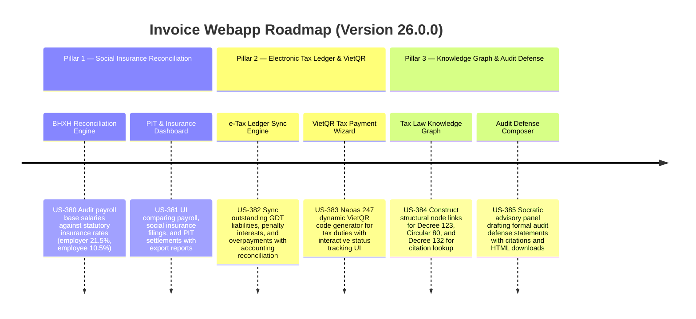

# Version 26.0.0 Product Roadmap — Social Insurance Reconciliation, Electronic Tax Ledger Payments, & Tax Law Knowledge Graph

This document defines the official product roadmap and development specifications for **Version 26.0.0** of the GDT Invoice Hub. It details the core pillars, technical models, integration rules, and test verification strategies to implement Social Insurance (BHXH/BHYT/BHTN) Reconciliation, Electronic Tax Ledger (Sổ thuế điện tử) sync, VietQR Dynamic Tax Payment Slips, Vietnamese Tax Law Knowledge Graph, and Dynamic AI Audit Defense Document Composer.

---

## 🗺️ Product Timeline & Core Pillars

---

## 📋 Story Specifications Mapping

| Story ID | Name | Core Business Objective | Target Output Format |
| :--- | :--- | :--- | :--- |
| **US-380** | Social Insurance (BHXH/BHYT/BHTN) Reconciliation & Auditing Engine | Assess employee salaries and verify payroll against statutory employer (21.5%) and employee (10.5%) contribution rates. | Insurance Reconciliation JSON |
| **US-381** | PIT Finalization Settlement & Insurance Reconciliation Dashboard UI | Build UI to review discrepancies between payroll, PIT settlement parameters, and social insurance calculations. | PIT & Insurance Reconciliation UI & CSV |
| **US-382** | Electronic Tax Ledger (Sổ thuế điện tử) Sync & Reconciliation Engine | Fetch and parse taxpayer's GDT liabilities, payments, interest on late payments, and reconcile with accounts. | e-Tax Ledger Reconciliation JSON |
| **US-383** | VietQR Dynamic Payment Slip Generator & Interactive Tax Payment Status Panel UI | Scaffolds dynamic Napas 247 compliant VietQR payment code to pay outstanding tax liabilities. | VietQR string and Payment Wizard UI |
| **US-384** | Vietnamese Tax Law Knowledge Graph Constructor & Vector Store Indexer | Index Decree 123/2020/NĐ-CP, Circular 80/2021/TT-BTC, and Decree 132/2020/NĐ-CP as a queryable structural graph. | Tax Law Knowledge Graph nodes & vectors |
| **US-385** | Dynamic Audit Defense Document Composer & Socratic Advisory Panel UI | Compose official explanation letters and defense sheets citing specific regulations for audit warning flags. | Socratic Advisory Panel & Defense Document |

---

## ⚙️ Technical Constraints & Integration Guidelines

1. **Social Insurance & PIT (US-380, US-381)**:
   - Compute statutory rates: BHXH (Social Insurance: employer 17.5%, employee 8%), BHYT (Health Insurance: employer 3%, employee 1.5%), BHTN (Unemployment Insurance: employer 1%, employee 1%).
   - Perform automated auditing to detect if base wages exceed the statutory cap (20 times the basic wage / 20 * basic_salary).
   - Social Insurance basic salary cap is 1,800,000 VND * 20 = 36,000,000 VND (or 2,340,000 VND * 20 = 46,800,000 VND under newer regulations). Allow configurable basic salary parameters.

2. **Electronic Tax Ledger & VietQR Payments (US-382, US-383)**:
   - Reconcile e-Tax balance entries (`CIT_liability`, `VAT_liability`, `late_payment_interest`, `overpaid_credits`) against accounting books.
   - Generate Napas 247 compliant VietQR code payload: e.g. EMVCo specifications containing merchant category code, transaction currency, transaction amount, recipient bank bin, account number, and invoice details.
   - Payment panel must show simulated status updates transition from `pending` to `paid` to emulate instant payment verification.

3. **Tax Law Knowledge Graph & AI Defense Composer (US-384, US-385)**:
   - Store law nodes structured as: `{id: "node_id", document: "Decree 123/2020/NĐ-CP", article: "Article 15", content: "...", links: ["node_id_2"]}`.
   - Defense letters must cite exact document, article, and section in a downloadable PDF-ready HTML structure.
   - Integrate a questionnaire interface asking users to clarify facts (e.g. "Was the transaction completed in cash?") and dynamically tailoring the defense argument accordingly.

---

## 📋 Epic & Story Mapping

| Epic ID | Epic Title | Story ID | Story Title | Status |
| :--- | :--- | :--- | :--- | :--- |
| **E109** | Social Insurance Compliance | **US-380** | Social Insurance (BHXH/BHYT/BHTN) Reconciliation & Auditing Engine | ✅ Completed |
| **E109** | Social Insurance Compliance | **US-381** | PIT Finalization Settlement & Insurance Reconciliation Dashboard UI | ✅ Completed |
| **E110** | Dynamic Tax Payments & e-Ledger | **US-382** | Electronic Tax Ledger (Sổ thuế điện tử) Sync & Reconciliation Engine | ✅ Completed |
| **E110** | Dynamic Tax Payments & e-Ledger | **US-383** | VietQR Dynamic Payment Slip Generator & Interactive Tax Payment Status Panel UI | ✅ Completed |
| **E111** | Interactive Tax Advisory & KG | **US-384** | Vietnamese Tax Law Knowledge Graph Constructor & Vector Store Indexer | ✅ Completed |
| **E111** | Interactive Tax Advisory & KG | **US-385** | Dynamic Audit Defense Document Composer & Socratic Advisory Panel UI | ✅ Completed |
