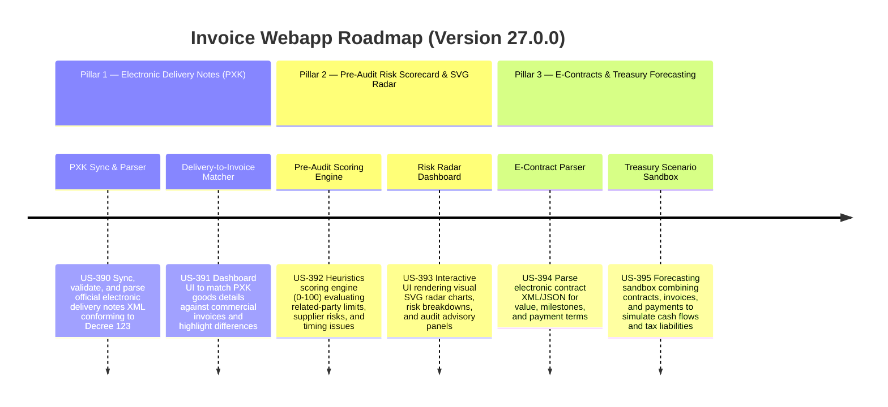

# Version 27.0.0 Product Roadmap — Electronic Delivery Notes, Pre-Audit Risk Radar, & E-Contract Treasury Sandbox

This document defines the official product roadmap and development specifications for **Version 27.0.0** of the GDT Invoice Hub. It details the core pillars, technical models, integration rules, and test verification strategies to implement Electronic Delivery Notes (Phiếu xuất kho kiêm vận chuyển điện tử - PXK) Sync and Reconciliation, Pre-Audit Risk Scorecard, SVG Risk Radar charts, E-Contract Lifecycle matching, and Treasury Forecasting Sandbox.

---

## 🗺️ Product Timeline & Core Pillars

---

## 📋 Story Specifications Mapping

| Story ID | Name | Core Business Objective | Target Output Format |
| :--- | :--- | :--- | :--- |
| **US-390** | Electronic Delivery Notes XML Sync & Validation Parser | Synchronize, parse, and validate XML schemas for Electronic Delivery Notes (PXK) under Decree 123. | PXK parsed model & JSON |
| **US-391** | Delivery-to-Invoice Reconciliation Dashboard UI | Build dashboard UI comparing delivery items (SKUs, quantities, prices) against final issued invoices. | PXK Reconciliation UI & CSV |
| **US-392** | Pre-Audit Corporate Tax Risk Scoring Engine | Calculate an overall Tax Risk Index (0-100) based on statutory rules, related-party interest caps, and supplier flags. | Tax Risk Scorecard JSON |
| **US-393** | Interactive Tax Risk Radar SVG & Audit Advisory Dashboard UI | Render dynamic SVG radar chart of risk domains and interactive panels proposing corrective legal actions. | SVG Radar UI & advisory text |
| **US-394** | E-Contract XML Metadata Parser and Milestone Tracker | Parse structured e-contracts to extract payment terms, values, signatures, and match them against invoices. | E-Contract parsed model & JSON |
| **US-395** | Smart Treasury & VAT Forecast Scenario Sandbox UI | Slider-based sandbox to model tax liabilities, payments schedule, and daily cash flow requirements. | Cashflow Sandbox UI & PDF report |

---

## ⚙️ Technical Constraints & Integration Guidelines

1. **Electronic Delivery Notes (PXK) (US-390, US-391)**:
   - Parse PXK XML structure, including fields: `SoPXK`, `NgayXuat`, `KhoXuat`, `KhoNhap`, SKU details (`MaHang`, `TenHang`, `DonViTinh`, `SoLuong`).
   - Reconcile PXK SKU lists against commercial invoice line items (`LineItem`). Track quantity mismatches (e.g. delivered 100 but invoiced 90).
   - Display a dashboard comparing PXK to Invoices, listing unmatched delivery notes and unmatched invoices.

2. **Pre-Audit Risk Scorecard & Radar (US-392, US-393)**:
   - Evaluate 5 risk dimensions: related party violations (Decree 132), supplier blacklist matches, transaction timing delay (>10 days between delivery and invoice), high cash transaction count (>= 20M VND), and invoice cancellation rate.
   - Combine scores into a weighted Tax Risk Index from 0 to 100.
   - Render custom zero-dependency SVG radar chart plotting the 5 dimensions.

3. **E-Contracts & Treasury Forecasting (US-394, US-395)**:
   - Parse e-contracts structure containing: contract number, value, effective date, signing parties, and list of payment milestones (payment percentage, due date).
   - Reconcile milestones against payments (`paid_date`) and invoices (`Invoice`) matching the contract reference.
   - Forecast cash balance and VAT/CIT liability projections over a 60-day window based on contract payment milestones and invoice due dates, displaying results in an interactive slider-based sandbox chart.

---

## 📋 Epic & Story Mapping

| Epic ID | Epic Title | Story ID | Story Title | Status |
| :--- | :--- | :--- | :--- | :--- |
| **E112** | Delivery Notes Compliance | **US-390** | Electronic Delivery Notes XML Sync & Validation Parser | ✅ Completed |
| **E112** | Delivery Notes Compliance | **US-391** | Delivery-to-Invoice Reconciliation Dashboard UI | ✅ Completed |
| **E113** | Pre-Audit Analytics | **US-392** | Pre-Audit Corporate Tax Risk Scoring Engine | ✅ Completed |
| **E113** | Pre-Audit Analytics | **US-393** | Interactive Tax Risk Radar SVG & Audit Advisory Dashboard UI | ✅ Completed |
| **E114** | Contracts & Treasury | **US-394** | E-Contract XML Metadata Parser and Milestone Tracker | ✅ Completed |
| **E114** | Contracts & Treasury | **US-395** | Smart Treasury & VAT Forecast Scenario Sandbox UI | ✅ Completed |
