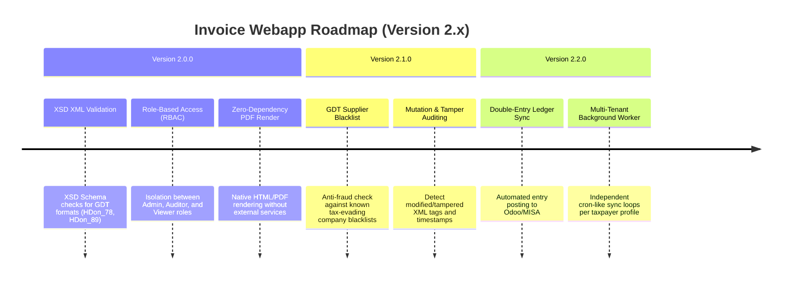

# Next-Gen Webapp XML: Version 2.x Product Roadmap & Goals

This document outlines the next major milestones and target goals for **Version 2.x (v2.0, v2.1, v2.2)** of the Webapp XML invoice auditing suite. It aligns future features with Vietnamese VAT Law 2024 compliance, local database persistence, and advanced AI-driven verification systems.

---

## 🗺️ Product Roadmap Overview

---

## 🚀 Milestone v2.0.0: Enterprise Compliance & Offline Rendering
*Focus: Internal security, strict format verification, and visual independence.*

### 🎯 Goal 2.0.1: Real-time GDT XML XSD Schema Validation
- **Problem**: Malformed or altered XML documents may bypass parser checks but fail official GDT compliance, leading to tax deduction rejections.
- **Solution**: Implement automatic schema validation using official General Department of Taxation (GDT) `.xsd` templates.
- **Acceptance Criteria**:
  - Uploading/importing an XML immediately runs XSD validation.
  - Detects namespace errors, missing mandatory tags, or malformed data types.
  - Invalid XMLs are flagged with `XSD_VALIDATION_FAILED` status in the database.

### 🎯 Goal 2.0.2: Role-Based Access Control (RBAC)
- **Problem**: Finance directors, accountants, and general managers all share the same settings page, creating risk for API configuration tampering.
- **Solution**: Implement three user roles:
  1. `Admin`: Full permissions (system credentials, API keys, SMTP, Webhooks).
  2. `Auditor`: Manage taxpayer profiles, trigger AI audits, run exports.
  3. `Viewer`: Read-only access to invoices and stats.
- **Acceptance Criteria**:
  - Enforce route-level authorization via Flask decorators.
  - Mask sensitive API settings in UI for non-Admin users.

### 🎯 Goal 2.0.3: Zero-Dependency HTML/PDF Invoice Rendering
- **Problem**: Current invoice rendering depends on standard browser print engines, resulting in alignment or pagination differences.
- **Solution**: Build a local, clean Python-based PDF generation engine.
- **Acceptance Criteria**:
  - Renders red VAT invoices matching Circular 78/2021/TT-BTC format.
  - Generates downloadable PDFs with embedded signatures and stamps.

---

## 🚀 Milestone v2.1.0: Advanced Audit Intelligence
*Focus: Anti-fraud and regulatory risk prevention.*

### 🎯 Goal 2.1.1: GDT Supplier Blacklist Check
- **Problem**: Invoices issued by companies blacklisted for tax evasion (closed, runaway, or fake status) are disqualified for VAT deductions.
- **Solution**: Synchronize or query a local SQLite blacklist cache derived from the GDT database.
- **Acceptance Criteria**:
  - T-Score engine queries the database of high-risk MSTs.
  - Flag invoices issued by blacklisted MSTs as `CRITICAL_BLACKLIST_ALERT` (T-Score drops to 0).

### 🎯 Goal 2.1.2: XML Mutation & Tamper Auditing
- **Problem**: XML files can be modified after signature generation, rendering the digital signature cryptographically invalid.
- **Solution**: Verify the cryptographic validity of every node in the XML relative to the signature digest.
- **Acceptance Criteria**:
  - Automatically alert when any element in the `<SignedInfo>` references altered elements.

---

## 🚀 Milestone v2.2.0: Automated Ledger & Direct ERP Integration
*Focus: Eliminating manual entries for accounting pipelines.*

### 🎯 Goal 2.2.1: Double-Entry Ledger Synchronization
- **Problem**: Invoices must be manually posted as ledger journal entries in accounting software.
- **Solution**: Auto-generate double-entry ledger records based on classification categories.
- **Acceptance Criteria**:
  - Trigger direct API postings to MISA SME or Odoo accounting ledger.

---

## 📋 Epic & Story Mapping

| Epic ID | Epic Title | Story ID | Story Title | Targets |
| :--- | :--- | :--- | :--- | :--- |
| **E43** | XSD Schema Validation | **US-047** | XSD Template Validation Engine | v2.0.0 |
| **E44** | System Authorization | **US-048** | Role-Based Access Control (RBAC) | v2.0.0 |
| **E45** | Native Rendering | **US-049** | PDF Invoice Export Generation | v2.0.0 |
| **E46** | Fraud Auditing | **US-050** | GDT Blacklist Verification & T-Score Update | v2.1.0 |
| **E47** | Mutation Auditing | **US-051** | Node-Level Cryptographic Tampering Auditor | v2.1.0 |
| **E48** | Ledger Posting | **US-052** | ERP Double-Entry Journal Auto-Poster | v2.2.0 |
