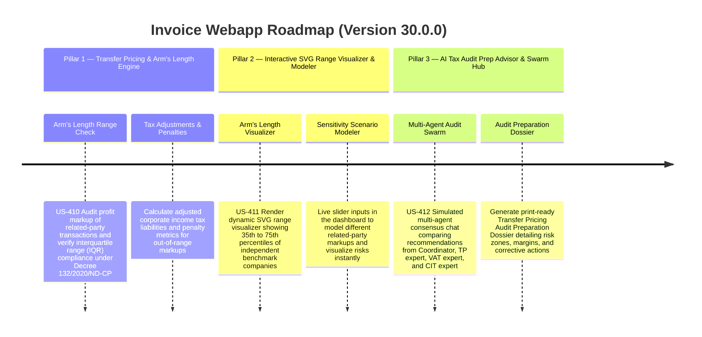

# Version 30.0.0 Product Roadmap — Transfer Pricing, Arm's Length Range Visualizer, & AI Tax Audit Prep Advisor Swarm Hub

This document defines the official product roadmap and development specifications for **Version 30.0.0** of the GDT Invoice Hub. It details the core pillars, technical models, integration rules, and test verification strategies to implement Transfer Pricing and Arm's Length Transaction Analysis Engine, Interactive SVG Arm's Length Visualizer, and AI Tax Audit Prep Advisor Swarm Hub.

---

## 🗺️ Product Timeline & Core Pillars

---

## 📋 Story Specifications Mapping

| Story ID | Name | Core Business Objective | Target Output Format |
| :--- | :--- | :--- | :--- |
| **US-410** | Transfer Pricing & Arm's Length Transaction Analysis Engine | Calculate markup profit margins of related-party transactions and audit interquartile range (IQR) compliance. | Arm's Length Analysis JSON |
| **US-411** | Interactive SVG Arm's Length Visualizer & Markup Sensitivity Modeler | Render zero-dependency SVG arm's length distribution range and include dynamic sliders to model sensitivity. | SVG Range Visualizer UI |
| **US-412** | AI Tax Audit Prep Advisor & Multi-Agent Swarm Collaboration Hub | Run multi-agent consensus audit prep chat and generate the Transfer Pricing Audit Preparation Dossier. | Swarm Chat UI & Dossier PDF/Markdown |

---

## ⚙️ Technical Constraints & Integration Guidelines

1. **Transfer Pricing & Arm's Length Transaction Engine (US-410)**:
   - Calculate margins for related-party transactions: Operating Margin (OM) or Cost Plus Markup (Markup).
   - Set the benchmark interquartile range (IQR) percentiles (e.g. 35th percentile to 75th percentile) dynamically based on selected sector (e.g. Manufacturing: 8% to 15%, Services: 10% to 18%, Distribution: 4% to 9%).
   - Classify transaction as compliant (within range) or non-compliant (outside range). If markup is below the 35th percentile, compute adjusted taxable income to the median (50th percentile) and calculate corporate income tax (CIT) underpayment (20%), 20% penalty on underpaid tax, and late payment interest (0.03% per day over 365 days).

2. **Interactive SVG Arm's Length Range Visualizer & Sensitivity Scenario Sandbox Panel (US-411)**:
   - Render custom zero-dependency SVG box plot or range visualization displaying 35th percentile, Median (50th), and 75th percentile.
   - Plot the taxpayer's related-party transaction markup on the SVG range.
   - Expose interactive sliders to adjust markup percentage and immediately update the SVG, risk level, and penalty projection.

3. **AI Tax Audit Prep Advisor & Multi-Agent Swarm Chat Hub (US-412)**:
   - Simulates a discussion between `JointAuditCoordinator`, `TransferPricingSpecialist`, `VATSpecialist`, and `CITSpecialist` to critique the taxpayer's related-party transactions.
   - Synthesize the discussion into a detailed, printable "Transfer Pricing Audit Preparation Dossier" in Markdown/HTML.

---

## 📋 Epic & Story Mapping

| Epic ID | Epic Title | Story ID | Story Title | Status |
| :--- | :--- | :--- | :--- | :--- |
| **E115** | Transfer Pricing Compliance | **US-410** | Transfer Pricing & Arm's Length Transaction Analysis Engine | ✅ Completed |
| **E115** | Transfer Pricing Compliance | **US-411** | Interactive SVG Arm's Length Visualizer & Markup Sensitivity Modeler | ✅ Completed |
| **E115** | Transfer Pricing Compliance | **US-412** | AI Tax Audit Prep Advisor & Multi-Agent Swarm Collaboration Hub | ✅ Completed |
