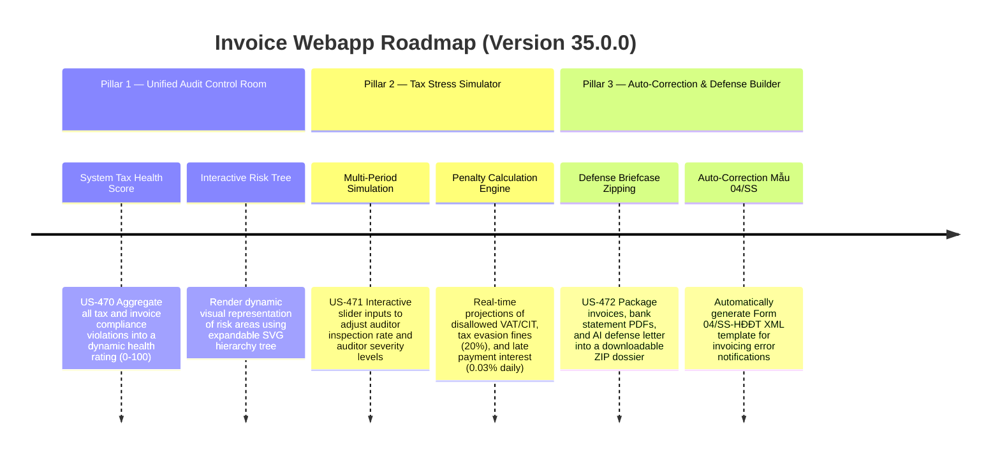

# Version 35.0.0 Product Roadmap — Unified Tax Audit Control Room, Multi-Period Risk Simulation Sandbox & Automatic Defense Package Builder

This document defines the official product roadmap and development specifications for **Version 35.0.0** of the GDT Invoice Hub. It details the core pillars, technical models, integration rules, and test verification strategies to implement a Unified Tax Audit Control Room, Multi-Period Risk Simulation Sandbox, and Automated Defense Briefcase & Correction Builder.

---

## 🗺️ Product Timeline & Core Pillars

---

## 📋 Story Specifications Mapping

| Story ID | Name | Core Business Objective | Target Output Format |
| :--- | :--- | :--- | :--- |
| **US-470** | Interactive Systems-Level Tax Audit Control Room UI | Centralize all audit warning indicators (VAT, cash, signing, supplier) with an interactive SVG risk tree and health score. | Glassmorphic Control Room Page (`/v35-compliance`) |
| **US-471** | Dynamic Tax Audit Risk Stress Simulator Engine | Enable user-driven modeling of inspection rates and auditor severity to project financial penalties dynamically. | Simulator API & Interactive Sidebar Control Panel |
| **US-472** | Automated Audit Defense Briefcase & Auto-Correction Package | Group documents, bank listings, and generated AI descriptions into a ZIP, and create GDT Form 04/SS XML. | Zip Downloader API & XML Generator Response |
| **US-473** | Multi-Period Interactive Tax Map Explainer UI | Trace tax flows from Revenue items to tax forms visually using clickable SVG nodes showing disallowed amounts. | Interactive Tax Flow Map SVG Component |
| **US-474** | Enterprise Swarm Collaborative Audit Copilot | Simulate debate between Inspector, Adviser, CFO, and Legal Counsel agents to output a formal justification draft. | Multi-Agent Swarm Debate Console & Downloadable MD Letter |
| **US-475** | End-to-End System-Wide Validation Suite | Provide comprehensive regression protection for V35 control APIs, simulation formulas, and ZIP packaging. | Pytest Suite (`tests/test_v35_features.py`) |

---

## ⚙️ Technical Constraints & Integration Guidelines

1. **Unified Tax Audit Control Room (US-470)**:
   - Combine data from `models.Invoice`, `models.LineItem`, `models.Partner`, and `tax_audit_service`.
   - Calculate the **System Tax Health Score** as:
     $$\text{Health Score} = 100 - \sum (\text{Severity Penalty} \times \text{Occurrence Count})$$
     Where severity levels are defined as: Critical (e.g. blacklisted MST, double invoices) = 15 points, Major (cash violation, late signing) = 8 points, Minor (typo, late TSA) = 3 points. Cap score at 0.
   - Render a custom zero-dependency SVG or pure-CSS hierarchical tree.

2. **Tax Audit Stress Simulator Engine (US-471)**:
   - Calculate potential tax exposures based on inputs:
     - `audit_scan_rate` (0.0 to 1.0)
     - `auditor_strictness` ("lenient", "medium", "strict")
   - Penalties:
     - Under "lenient": only cash payment violations are disallowed.
     - Under "medium": disallow cash payment and late-signing invoices.
     - Under "strict": disallow cash payment, late-signing, high-risk suppliers, and unrelated markup transactions.
     - Underpayment Penalty = 20% of the total disallowed VAT/CIT tax amount.
     - Late Interest = 0.03% per day over a baseline of 180 days (or actual invoice days overdue if larger).

3. **Automated Defense Briefcase & Auto-Correction Package Builder (US-472)**:
   - Archive generation: Create a ZIP file on the fly using `zipfile` module. Save temporarily in the overridden `TEMP`/`TMP` directory.
   - Generates the GDT Form 04/SS-HĐĐT XML template. Must contain valid XML structures matching official GDT specs.

4. **Interactive Tax Map & Swarm Dialogue (US-473 & US-474)**:
   - Tax map outlines key indicators like VAT taxable values and deductible costs. Click on nodes to display the list of disallowances.
   - The Swarm chat consists of mock agent roles reacting to the calculated tax exposure.

---

## 📋 Epic & Story Mapping

| Epic ID | Epic Title | Story ID | Story Title | Status |
| :--- | :--- | :--- | :--- | :--- |
| **E116** | Unified Audit & Stress Simulation | **US-470** | Interactive Systems-Level Tax Audit Control Room UI | ✅ Completed |
| **E116** | Unified Audit & Stress Simulation | **US-471** | Dynamic Tax Audit Risk Stress Simulator Engine | ✅ Completed |
| **E116** | Unified Audit & Stress Simulation | **US-472** | Automated Audit Defense Briefcase & Auto-Correction Package | ✅ Completed |
| **E116** | Unified Audit & Stress Simulation | **US-473** | Multi-Period Interactive Tax Map Explainer UI | ✅ Completed |
| **E116** | Unified Audit & Stress Simulation | **US-474** | Enterprise Swarm Collaborative Audit Copilot | ✅ Completed |
| **E116** | Unified Audit & Stress Simulation | **US-475** | End-to-End System-Wide Validation Suite | ✅ Completed |
