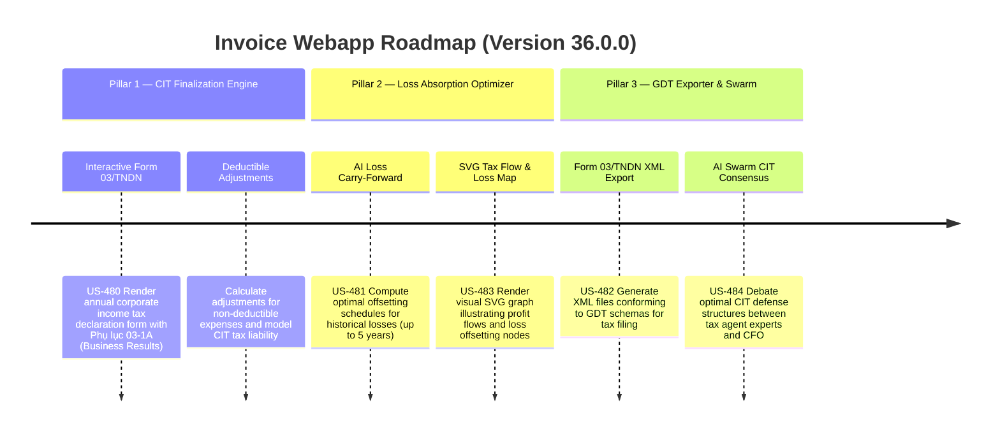

# Version 36.0.0 Product Roadmap — Annual CIT Finalization Engine, loss carry-forward optimizer, & Form 03/TNDN XML exporter

This document defines the official product roadmap and development specifications for **Version 36.0.0** of the GDT Invoice Hub. It details the core pillars, technical models, integration rules, and test verification strategies to implement the Annual CIT Finalization Engine (Form 03/TNDN), AI-Driven Loss Carry-Forward & Tax Holiday Optimizer, and GDT Schema-Compliant XML Exporter.

---

## 🗺️ Product Timeline & Core Pillars

---

## 📋 Story Specifications Mapping

| Story ID | Name | Core Business Objective | Target Output Format |
| :--- | :--- | :--- | :--- |
| **US-480** | Interactive Form 03/TNDN Builder & CIT Finalization Hub | Centralize annual CIT finalization fields and Phụ lục 03-1A in a glassmorphic dashboard interface. | Glassmorphic CIT Finalization Page (`/v36-cit-finalization`) |
| **US-481** | AI-Driven Loss Carry-Forward & Tax Holiday Optimizer | Offset historical tax losses optimal across years (max 5 years carry-forward rule) to minimize CIT NPV. | Optimization API & Carry-Forward Schedule Table |
| **US-482** | Form 03/TNDN XML Exporter & GDT Schema Validator | Export the compiled Form 03/TNDN and its appendices into a schema-conforming GDT XML file structure. | XML Exporter API & GDT XML File Generator |
| **US-483** | SVG Corporate Tax Flow & Loss Absorption Graph | Render zero-dependency responsive interactive SVG diagram displaying CIT calculations and loss absorption. | SVG Flow Graph Component with Hover tooltips |
| **US-484** | AI Swarm CIT Finalization Advisory Consensus Chat | Run a debate simulation on tax defense posture for deductible items and generate a CIT Advisory Memo. | Swarm Chat UI Panel & Downloadable MD memo |
| **US-485** | End-to-End CIT Finalization Validation Suite | Provide regression verification for CIT math, optimization offsets, and GDT Form 03/TNDN XML structure. | Pytest Suite (`tests/test_v36_features.py`) |

---

## ⚙️ Technical Constraints & Integration Guidelines

1. **Interactive Form 03/TNDN Builder (US-480)**:
   - Calculate Corporate Income Tax (CIT) liability based on:
     - Revenue (Doanh thu)
     - COGS (Giá vốn)
     - Expenses (Chi phí hoạt động: Bán hàng, Quản lý)
     - Adjustments: Non-deductible expenses (Chi phí không được trừ - Code B4 in GDT Form) which increase taxable profit.
   - Standard CIT Rate = 20%. Incentive Rates (e.g. 10% or 15%) or Tax Holidays (e.g. 50% reduction) should apply dynamically if configured.
   - Formula:
     $$\text{Taxable Income} = \text{Revenue} - \text{Expenses} + \text{Non-Deductible Adjustments} - \text{Loss Carry-Forward}$$
     $$\text{CIT Liability} = \text{Taxable Income} \times \text{CIT Rate} \times (1 - \text{Incentive Discount Rate})$$

2. **AI-Driven Loss Carry-Forward & Tax Holiday Optimizer (US-481)**:
   - Vietnam tax regulation allows losses to be carried forward continuously for up to 5 years starting from the year following the loss-incurring year.
   - Loss applied in any year cannot exceed that year's taxable income (prior to loss offsetting).
   - Historical losses from year $Y$ must be offset chronologically (oldest first).
   - If there are tax holidays (e.g., 100% tax exemption in year N, 50% tax reduction in year N+1 and N+2), it is often optimal *not* to absorb losses in the tax-free year N (as tax rate is already 0%), but instead save the losses for year N+3 when the full rate returns, *subject* to the 5-year expiry limit.
   - The optimization engine computes the optimal loss offsetting matrix (loss year vs offset year) to maximize tax savings (NPV of tax reduction).

3. **Form 03/TNDN XML Exporter (US-482)**:
   - Generates the GDT XML structure. Root tag `<hoSoKhaiThue>`.
   - Schema elements:
     - `<toaKhai>`: Standard declaration headers (MST, taxpayer name, period, tax office).
     - `<ct21>`: Doanh thu (Revenue)
     - `<ct22>`: Chi phí (Expenses)
     - `<ct23>`: Chi phí không được trừ (Non-deductible adjustments)
     - `<ct28>`: Thu nhập tính thuế (Taxable income)
     - `<ct31>`: Số lỗ chuyển vào kỳ này (Loss carry-forward offset)
     - `<ct36>`: Thuế TNDN phải nộp (CIT liability)
     - `<phuLuc_03_1A>`: Business results details.
     - `<phuLuc_03_2A>`: Loss carry-forward schedule showing the columns: Loss Year, Loss Amount, Amount Offset in Prior Years, Amount Offset in Current Year, Amount Expired, Amount Remaining.

4. **SVG Corporate Tax Flow & Loss absorption Map (US-483)**:
   - Responsive SVG diagram showing the nodes: Gross Profit -> Deductible Cost -> Non-deductible adjustments -> Net Taxable profit -> Loss Offset Engine -> Final CIT due.
   - Hovering over the Loss Offset node displays a breakdown of remaining loss balances for years N-5 to N-1.

5. **AI Swarm Tax Advisor Consensus for CIT Optimization (US-484)**:
   - Discussion panel between CFO, GDT Inspector, Tax Director, and Legal Advisor debating defense strategy for audited non-deductible items.
   - Generates a downloadable markdown CIT Advisory Memo (`dossier_cit.md`).

---

## 📋 Epic & Story Mapping

| Epic ID | Epic Title | Story ID | Story Title | Status |
| :--- | :--- | :--- | :--- | :--- |
| **E117** | Annual CIT Finalization Suite | **US-480** | Interactive Form 03/TNDN Builder & CIT Finalization Hub | ✅ Completed |
| **E117** | Annual CIT Finalization Suite | **US-481** | AI-Driven Loss Carry-Forward & Tax Holiday Optimizer | ✅ Completed |
| **E117** | Annual CIT Finalization Suite | **US-482** | Form 03/TNDN XML Exporter & GDT Schema Validator | ✅ Completed |
| **E117** | Annual CIT Finalization Suite | **US-483** | SVG Corporate Tax Flow & Loss Absorption Graph | ✅ Completed |
| **E117** | Annual CIT Finalization Suite | **US-484** | AI Swarm CIT Finalization Advisory Consensus Chat | ✅ Completed |
| **E117** | Annual CIT Finalization Suite | **US-485** | End-to-End CIT Finalization Validation Suite | ✅ Completed |
