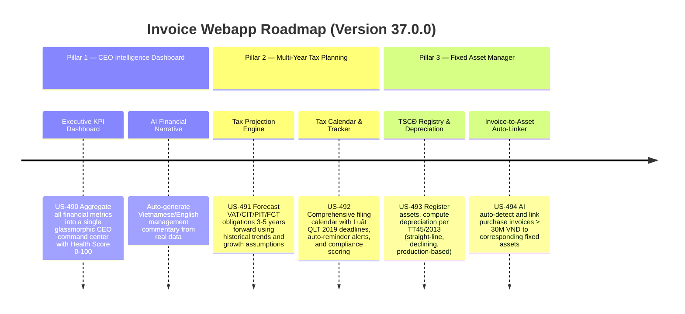

# Version 37.0.0 Product Roadmap — CEO Intelligence Dashboard, Multi-Year Tax Planning & Fixed Asset Depreciation Manager

This document defines the official product roadmap and development specifications for **Version 37.0.0** of the GDT Invoice Hub. It details the core pillars, technical models, integration rules, and test verification strategies to implement a CEO-Level Financial Intelligence Dashboard, Multi-Year Tax Planning & Compliance Calendar, and an Intelligent Fixed Asset Registry & Depreciation Engine.

---

## 🗺️ Product Timeline & Core Pillars

---

## 📋 Story Specifications Mapping

| Story ID | Name | Core Business Objective | Target Output Format |
| :--- | :--- | :--- | :--- |
| **US-490** | CEO Executive KPI Dashboard & Financial Health Score | Centralize Revenue, Expense, Tax Liability, Cash Flow, and compliance metrics into a single glassmorphic CEO command center with an overall Financial Health Score (0-100). | Glassmorphic CEO Dashboard Page (`/v37-ceo-dashboard`) |
| **US-491** | Multi-Year Tax Projection Engine & Optimization Simulator | Forecast VAT, CIT, PIT, and FCT obligations 3-5 years ahead using historical invoice data, trend regression, and user-defined growth assumptions. Simulate NPV savings from combining CIT incentives + VAT refund timing + FCT planning. | Projection API & Interactive Slider Controls |
| **US-492** | Comprehensive Tax Filing Calendar & Compliance Tracker | Provide a calendar-view of all Vietnamese tax filing deadlines per Luật Quản lý Thuế 2019 and Thông tư 80/2021, track filed vs pending status, calculate a Tax Compliance Score, and push Telegram/Email reminders. | Calendar UI Component & Alert Integration |
| **US-493** | Fixed Asset Registry & Depreciation Engine (TT45/2013) | Register fixed assets with acquisition date, original cost, useful life, and depreciation method. Compute monthly/annual depreciation per Thông tư 45/2013/TT-BTC (straight-line, declining balance, production-based). | Asset Registry API & Depreciation Schedule Table |
| **US-494** | AI Invoice-to-Asset Linker & CIT Depreciation Validator | Auto-detect purchase invoices ≥ 30M VND likely representing fixed assets, suggest asset creation, and validate that depreciation deductions comply with TT45 maximum useful life limits. | AI Linker API & Validation Report |
| **US-495** | End-to-End V37 Financial Intelligence Validation Suite | Comprehensive regression test coverage for CEO dashboard computations, tax projection formulas, calendar logic, asset depreciation calculations, and AI auto-linking accuracy. | Pytest Suite (`tests/test_v37_features.py`) |

---

## ⚙️ Technical Constraints & Integration Guidelines

1. **CEO Executive KPI Dashboard (US-490)**:
   - Aggregate data from existing services: `ai_service.py`, `cashflow_service.py`, `tax_forecaster.py`, `vat_declaration_engine.py`, `cit_service.py`, `supplier_risk_service.py`.
   - **Financial Health Score** formula:
     $$\text{Health Score} = w_1 \times \text{CashScore} + w_2 \times \text{TaxComplianceScore} + w_3 \times \text{AuditRiskScore} + w_4 \times \text{ARAgingScore}$$
     Where weights: $w_1 = 0.30$, $w_2 = 0.30$, $w_3 = 0.25$, $w_4 = 0.15$. Each sub-score is normalized to 0-100.
   - **AI Financial Narrative**: Use Ollama/Gemini to generate management commentary in Vietnamese from structured KPI JSON data. Template: "Trong kỳ [period], doanh thu đạt [revenue] VND, [tăng/giảm] [%] so với kỳ trước..."
   - Render interactive **Sankey SVG diagram**: Revenue → COGS → Gross Profit → OpEx → EBIT → Tax → Net Income → Cash Flow.
   - Include **Board Report PDF export** via wkhtmltopdf or in-memory HTML-to-PDF rendering.

2. **Multi-Year Tax Projection Engine (US-491)**:
   - Historical data source: Aggregate from `Invoice` model grouped by `tax_period` (monthly/quarterly/yearly).
   - Projection methods:
     - **Linear Regression**: Fit a trend line on 12-24 months of historical tax data.
     - **Growth Assumption**: User inputs annual revenue growth rate (%), cost inflation rate (%).
     - **Scenario Modeling**: Best case / Base case / Worst case using ±20% variance on growth assumptions.
   - NPV Optimizer: Compute Net Present Value of total tax payments across 3-5 years using discount rate (default 8% p.a.). Compare strategies:
     - Strategy A: Claim all CIT incentives in Year 1.
     - Strategy B: Defer loss carry-forward to post-holiday years.
     - Strategy C: Time VAT refund applications for maximum cash flow benefit.
   - Output: JSON response with year-by-year projection + NPV comparison table.

3. **Tax Filing Calendar & Compliance Tracker (US-492)**:
   - Vietnamese tax calendar rules per **Luật Quản lý Thuế 2019** (Law 38/2019/QH14) and **Thông tư 80/2021/TT-BTC**:
     - VAT Monthly: Due by 20th of following month.
     - VAT Quarterly: Due by last day of first month of following quarter.
     - CIT Quarterly Provisional: Due by 30th of first month of following quarter.
     - CIT Annual Finalization: Due by 90th day after fiscal year end (March 31st for calendar year).
     - PIT Annual Finalization: Due by 90th day after calendar year end.
     - FCT: Due by 10th of following month.
   - **Compliance Score**: $\text{Score} = \frac{\text{On-time Filings}}{\text{Total Required Filings}} \times 100$
   - Push alerts via existing `scheduler.py` integration (Telegram + Email) at T-7 days, T-3 days, and T-1 day before deadline.
   - Store filing status in new `TaxFilingRecord` model: `id, tax_type, period, deadline, filed_date, status, xml_file_path`.

4. **Fixed Asset Registry & Depreciation Engine (US-493)**:
   - **Model `FixedAsset`**: `id, asset_code, name, category, acquisition_date, original_cost, residual_value, useful_life_months, depreciation_method, linked_invoice_id, status (active/disposed/fully_depreciated), disposed_date, disposal_proceeds`.
   - **Model `DepreciationEntry`**: `id, asset_id, period (YYYY-MM), depreciation_amount, accumulated_depreciation, net_book_value`.
   - Depreciation methods per **Thông tư 45/2013/TT-BTC**:
     - **Straight-line**: $\text{Monthly} = \frac{\text{Original Cost} - \text{Residual Value}}{\text{Useful Life (months)}}$
     - **Declining balance**: Rate = $\frac{1}{\text{Useful Life (years)}} \times \text{Acceleration Factor}$ (factor = 1.5 for ≤4 years, 2.0 for >4 years).
     - **Production-based**: $\text{Monthly} = \frac{\text{Original Cost} - \text{Residual Value}}{\text{Total Estimated Output}} \times \text{Actual Output}$
   - Maximum useful life limits from TT45 Appendix 1 (e.g., computers = 3-5 years, vehicles = 6-10 years, buildings = 25-50 years).
   - API endpoints: `GET/POST /api/assets`, `GET /api/assets/<id>/depreciation-schedule`, `POST /api/assets/<id>/dispose`.

5. **AI Invoice-to-Asset Linker & CIT Depreciation Validator (US-494)**:
   - Auto-scan invoice pool for purchases with `tong_tien_thanh_toan ≥ 30,000,000 VND` and description keywords matching asset categories (máy tính, xe, máy móc, thiết bị, bất động sản).
   - Use Ollama/Gemini to classify invoice as fixed asset candidate with confidence score.
   - **CIT Depreciation Validator**: Cross-check `useful_life_months` against TT45 Appendix 1 maximum. Flag if depreciation exceeds allowable CIT deduction.
   - API: `POST /api/assets/auto-detect` returns list of invoice candidates with suggested asset metadata.

6. **End-to-End V37 Validation Suite (US-495)**:
   - Test CEO dashboard KPI aggregation formulas.
   - Test tax projection regression accuracy with known datasets.
   - Test calendar deadline calculations for edge cases (leap years, weekends, holidays).
   - Test depreciation math (straight-line, declining, production-based) and TT45 limits.
   - Test AI auto-linking with mock invoice data.

---

## 📋 Epic & Story Mapping

| Epic ID | Epic Title | Story ID | Story Title | Status |
| :--- | :--- | :--- | :--- | :--- |
| **E118** | CEO Intelligence, Tax Planning & Asset Management | **US-490** | CEO Executive KPI Dashboard & Financial Health Score | ✅ Completed |
| **E118** | CEO Intelligence, Tax Planning & Asset Management | **US-491** | Multi-Year Tax Projection Engine & Optimization Simulator | ✅ Completed |
| **E118** | CEO Intelligence, Tax Planning & Asset Management | **US-492** | Comprehensive Tax Filing Calendar & Compliance Tracker | ✅ Completed |
| **E118** | CEO Intelligence, Tax Planning & Asset Management | **US-493** | Fixed Asset Registry & Depreciation Engine (TT45/2013) | ✅ Completed |
| **E118** | CEO Intelligence, Tax Planning & Asset Management | **US-494** | AI Invoice-to-Asset Linker & CIT Depreciation Validator | ✅ Completed |
| **E118** | CEO Intelligence, Tax Planning & Asset Management | **US-495** | End-to-End V37 Financial Intelligence Validation Suite | ✅ Completed |
