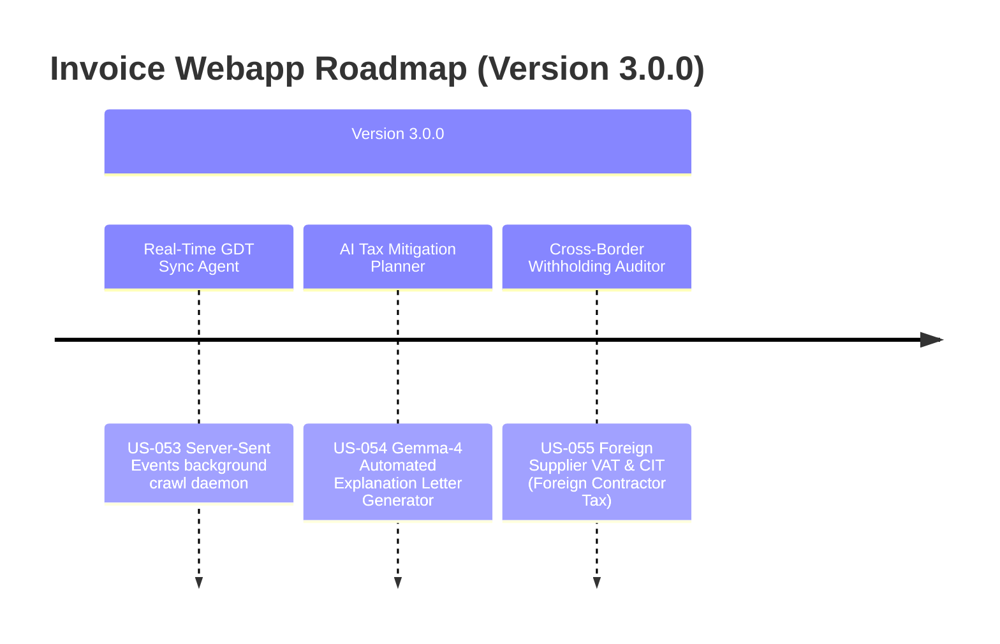

# Next-Gen Webapp XML: Version 3.x Product Roadmap & Goals

This document outlines the next major milestones and target goals for **Version 3.0.0** of the Webapp XML invoice auditing suite. It focuses on enterprise-level multi-taxpayer scaling, real-time synchronization, and AI-driven automated tax defense and cross-border auditing.

---

## 🗺️ Product Roadmap Overview

---

## 🚀 Milestone v3.0.0: Enterprise Tax Intelligence & Multi-Taxpayer AI Automation
*Focus: Real-time compliance, automated tax litigation defense, and cross-border digital transactions.*

### 🎯 Goal 3.0.1: Real-Time GDT Invoice Synchronization Agent (US-053)
- **Problem**: Invoices are crawled either manually or on a scheduled batch. This lag prevents real-time compliance reporting and cash flow tracking.
- **Solution**: Build a real-time reactive crawl daemon that utilizes background service workers to stream newly issued invoices directly from the GDT Portal.
- **Acceptance Criteria**:
  - Automatically query and download newly issued invoices for all active taxpayer MST profiles using background polling workers.
  - Integrate a secure CAPTCHA prefetch queue with transparent auto-solve triggers.
  - Fire immediate webhook events (`invoice.downloaded`) upon successful retrieval.

### 🎯 Goal 3.0.2: AI Tax Optimization & Audit Mitigation Planner (US-054)
- **Problem**: When high-risk tax issues are flagged (T-Score < 60), accountants must manually draft formal tax explanation letters (Công văn giải trình) to the tax authorities.
- **Solution**: Use local Gemma-4 intelligence to auto-compile formal legal tax explanation templates (Mẫu công văn giải trình theo Thông tư 80/2021/TT-BTC) pre-filled with tax code references and justification narratives.
- **Acceptance Criteria**:
  - Add a "Soạn Thảo Giải Trình AI" button under the Invoice details tab.
  - Automatically extract invoice audit anomalies (e.g. personal purchase, price inflation, cash payment risk) and generate a professionally formatted Vietnamese tax defense letter.
  - Export draft as standard Microsoft Word (`.docx`) or PDF format.

### 🎯 Goal 3.0.3: Cross-Border E-Commerce & Multi-Currency VAT Auditor (US-055)
- **Problem**: Digital services purchased from foreign giants (Google, Meta, AWS) are subject to Foreign Contractor Tax (Thuế nhà thầu nước ngoài - NTNN) and require special CIT/VAT calculations.
- **Solution**: Build an automated Foreign Contractor Tax compliance engine that identifies foreign digital suppliers, calculates NTNN withholding liability (VAT & CIT), and drafts tax form returns.
- **Acceptance Criteria**:
  - Detect invoices from foreign digital giants based on special non-resident supplier tax registration prefixes (MST 10 số đầu 900xxxxxx).
  - Automatically calculate withholding VAT (typically 3%-5%) and withholding CIT (typically 2%-5%).
  - Populate Draft Form 01/NTNN for local tax declaration reports.

---

## 📋 Epic & Story Mapping

| Epic ID | Epic Title | Story ID | Story Title | Targets |
| :--- | :--- | :--- | :--- | :--- |
| **E49** | Real-Time Sync | **US-053** | Real-Time GDT Invoice Synchronization Agent | v3.0.0 |
| **E50** | Audit Mitigation | **US-054** | AI Tax Optimization & Audit Mitigation Planner | v3.0.0 |
| **E51** | Cross-Border Tax | **US-055** | Cross-Border E-Commerce & Multi-Currency VAT Auditor | v3.0.0 |
