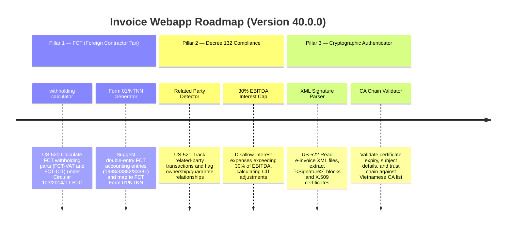

# Version 40.0.0 Product Roadmap — FCT Declarations, Related-Party EBITDA Cap Auditor & XML Signature Authenticator

This document defines the official product roadmap and development specifications for **Version 40.0.0** of the GDT Invoice Hub. It details the core pillars, technical models, integration rules, and test verification strategies to implement Foreign Contractor Tax (FCT) declarations, related-party transaction compliance (EBITDA Interest Cap under Decree 132/2020/NĐ-CP), and a cryptographic GDT invoice XML signature authenticator.

---

## 🗺️ Product Timeline & Core Pillars



---

## 📋 Story Specifications Mapping

| Story ID | Name | Core Business Objective | Target Output Format |
| :--- | :--- | :--- | :--- |
| **US-520** | FCT (Foreign Contractor Tax) Auditing & Form 01/NTNN Calculation Engine | Compute withholding tax components (FCT-VAT and FCT-CIT) for payments to foreign contractors under Circular 103/2014/TT-BTC, suggesting ledger journal entries. | FCT Calculation Engine & Form 01/NTNN JSON |
| **US-521** | Related-Party Transaction Detector & Decree 132 EBITDA Cap Auditor | Track related-party transactions, compute company EBITDA, enforce the 30% EBITDA net interest expense cap, and calculate CIT taxable profit adjustments under Decree 132/2020/NĐ-CP. | EBITDA Cap Audit Engine & CIT Reconciliation Data |
| **US-522** | E-Invoice XML Signature Authenticator & Certificate Chain Validator | Verify cryptographic integrity of GDT XML invoices, extract X.509 certificate metadata, and simulate verification against trusted Vietnamese Certificate Authorities (CAs). | Cryptographic Certificate Audit Report |
| **US-523** | Interactive FCT & Related Party Compliance Dashboard UI | Premium user interface presenting FCT withholding cards, related party transactional tables with interest caps, and signature validator files. | HTML Compliance Dashboard Page (`/v40-compliance-dashboard`) |
| **US-524** | End-to-End V40 Verification Test Suite | Verify correctness of FCT withholding, Decree 132 EBITDA cap calculations, and XML signature validation checks. | Pytest Suite (`tests/test_v40_features.py`) |

---

## ⚙️ Technical Constraints & Integration Guidelines

1. **Foreign Contractor Tax withholding (US-520)**:
   - Support Gross contract and Net contract scenarios.
   - For Net contracts, gross up taxable revenues:
     $$\text{Gross Revenue} = \frac{\text{Net Revenue}}{1 - \text{FCT Tax Rate}}$$
   - FCT Rates under Circular 103/2014/TT-BTC:
     - Goods Supply: VAT Exempt, CIT 1%
     - Services: VAT 5%, CIT 5%
     - Technical Services: VAT 5%, CIT 5%
     - Software licensing/Royalties: VAT Exempt, CIT 10%
     - Construction with materials: VAT 3%, CIT 2%
     - Construction without materials: VAT 5%, CIT 2%
   - Suggested Ledger post:
     - Debit Expenses/Assets (grossed up)
     - Credit Account 33381 (FCT-VAT)
     - Credit Account 33382 (FCT-CIT)
     - Credit Account 331 (Vendor payable)

2. **Decree 132/2020/NĐ-CP Related Party Interest Cap (US-521)**:
   - Identify Related Parties based on:
     - Ownership percentage $\ge 25\%$.
     - One enterprise guarantees loans of another exceeding 25% of owners' equity and representing $> 50\%$ of total debt value.
   - Calculate Net Interest Expense:
     $$\text{Net Interest Expense} = \text{Interest Expense} - \text{Interest Income}$$
   - Calculate EBITDA:
     $$\text{EBITDA} = \text{Profit Before Tax} + \text{Interest Expense} + \text{Depreciation} + \text{Amortization}$$
   - EBITDA Cap limit: $30\%$ of EBITDA. If EBITDA is negative, the cap is 0.
   - Disallowed interest expense:
     $$\text{Disallowed Interest} = \max(0, \text{Net Interest Expense} - 0.30 \times \text{EBITDA})$$
   - Disallowed interest expense is added back to CIT taxable income (Form 03/TNDN, line B4).

3. **XML Signature Authenticator (US-522)**:
   - Parse GDT e-invoice XML.
   - Check if `<Signature>` tags exist under `<DSCKK>` or `<HDon>`.
   - Parse certificate element `<X509Certificate>`. Decode Base64 binary DER to extract subject name, issuer name, valid dates (NotBefore, NotAfter), and serial number.
   - Check validity: `NotBefore <= current_date <= NotAfter`.
   - Simulate verification against Vietnamese CA trust anchor registry (e.g. VNPT, Viettel, FPT, Bkav).

---

## 🧪 Verification Plan

- Run validation wrapper:
  ```bash
  python scripts/harness_win.py validate --cmd "venv\Scripts\python.exe -m pytest tests/test_v40_features.py"
  ```
