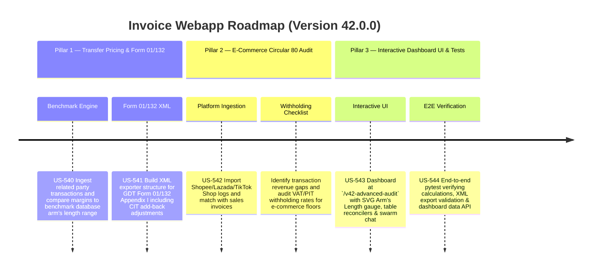

# Version 42.0.0 Product Roadmap — Transfer Pricing (Form 01/132) & E-Commerce Tax Refund Hub

This document defines the official product roadmap and development specifications for **Version 42.0.0** of the GDT Invoice Hub. It details the core pillars, technical models, integration rules, and test verification strategies to implement Transfer Pricing comparisons under Decree 132/2020/NĐ-CP (Form 01/132 Appendix I) and Circular 80 E-Commerce transactions audit.

---

## 🗺️ Product Timeline & Core Pillars



---

## 📋 Story Specifications Mapping

| Story ID | Name | Core Business Objective | Target Output Format |
| :--- | :--- | :--- | :--- |
| **US-540** | Transfer Pricing Transaction Ingestion & Benchmark Comparator Engine | Ingest related-party transactions, compare profit margins (e.g. Operating Margin) against interquartile arm's length range (25th to 75th percentiles), and compute CIT taxable adjustments under Decree 132/2020/NĐ-CP. | Transfer Pricing Audit Engine & CIT Adjustments |
| **US-541** | Form 01/132 (Related-Party Disclosures & CIT Adjustments) XML Exporter | Scaffolder to compile related-party transactions, relationships, and CIT add-back adjustments into a GDT-compliant Form 01/132 Appendix I XML. | XML Form Exporter & Validator |
| **US-542** | E-Commerce Transaction Matcher & Circular 80 Withholding Auditor | Import platform transaction logs, reconcile platform transactions against issued sales invoices, detect revenue gaps, and audit VAT/PIT withholding compliance. | E-Commerce Matcher & Reconciliation Report |
| **US-543** | Interactive Transfer Pricing & E-Commerce Audit Dashboard UI | Dashboard page at `/v42-advanced-audit` featuring interactive SVG arm's length ranges, upload widgets, gap analysis, and Swarm debate summaries. | HTML Compliance Dashboard Page |
| **US-544** | End-to-End V42 Verification Test Suite | Verify correctness of transfer pricing adjustments, XML validation of Form 01/132, e-commerce matching, and dashboard JSON responses. | Pytest Suite (`tests/test_v42_features.py`) |

---

## ⚙️ Technical Constraints & Integration Guidelines

1. **Transfer Pricing & Decree 132 adjustments (US-540)**:
   - Identify transaction types: Sale, Purchase, Loan, Service.
   - Profit margin used: Operating Margin = $\text{Operating Profit} / \text{Net Revenue}$.
   - Arm's Length Interquartile Range: 25th percentile ($P_{25}$) to 75th percentile ($P_{75}$).
   - Under Decree 132, if the taxpayer's margin is lower than $P_{25}$, the margin must be adjusted to the Median ($P_{50}$).
   - Adjust taxable profit (CIT adjustment):
     $$\text{CIT Adjustment} = (\text{Benchmark Median} - \text{Taxpayer Margin}) \times \text{Transaction Value}$$
   - This adjustment is added to CIT taxable profit (Form 03/TNDN, Code B4).

2. **Form 01/132 XML Export (US-541)**:
   - Generate standard schema-compliant GDT XML structures:
     - `<hoSoKhaiThue>` containing `<toaKhai01_132>`
     - Tag elements: `<mst>`, `<tenNNT>`, `<namKhaiThue>`, `<quanHeLienKet>`, `<giaoDichLienKet>`, `<dieuChinhLoiNhuan>`.

3. **E-Commerce Reconciliation & Circular 80 Withholding (US-542)**:
   - Platform transaction matching: Match platform ID (e.g., transaction ID) and/or date + amount within 1.0% tolerance.
   - For individual business households on e-commerce platforms, Circular 80 mandates:
     - Platform must withhold: VAT 1% and PIT 0.5% (Total 1.5% tax withholding on revenue).
     - Gaps are flagged if platform failed to withhold or if no sales invoice was matched.

---

## 🧪 Verification Plan

- Run validation wrapper:
  ```bash
  python scripts/harness_win.py validate --cmd "venv\Scripts\activate.bat && python -m pytest tests/test_v42_features.py"
  ```
