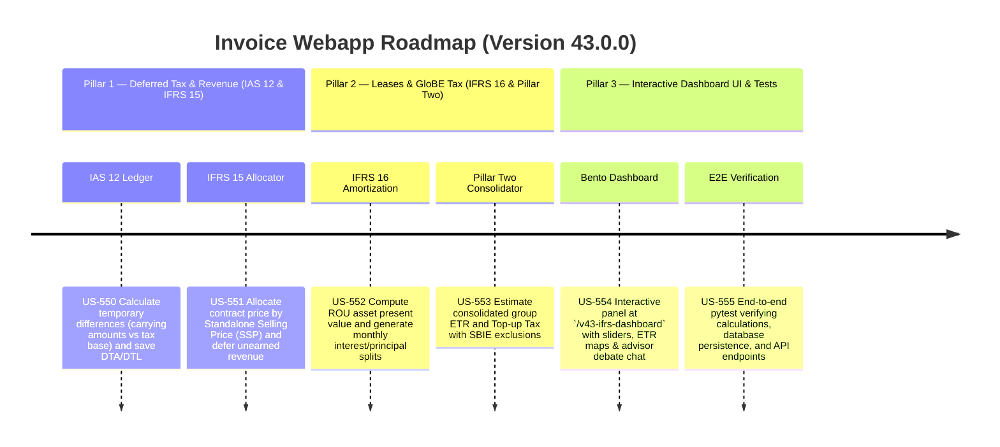

# Version 43.0.0 Product Roadmap — Enterprise IFRS Translation Engine & OECD Pillar Two GMT Dashboard

This document defines the official product roadmap and development specifications for **Version 43.0.0** of the GDT Invoice Hub. It details the core pillars, technical models, integration rules, and test verification strategies to implement dynamic IFRS translations (IAS 12, IFRS 15, IFRS 16) and consolidated global minimum tax estimates under OECD Pillar Two GloBE rules.

---

## 🗺️ Product Timeline & Core Pillars



---

## 📋 Story Specifications Mapping

| Story ID | Name | Core Business Objective | Target Output Format |
| :--- | :--- | :--- | :--- |
| **US-550** | IAS 12 Deferred Tax Automation Ledger & Temporary Difference Engine | Ingest asset/liability carrying amounts (IFRS) and tax bases (VAS), calculate temporary differences, and compute/save deferred tax assets and liabilities under IAS 12 rules. | Tenant DB Deferred Tax Ledger & Reports |
| **US-551** | IFRS 15 Revenue Recognition & Contract Milestone Matcher | Reconcile invoices against contract milestones, allocate transaction prices using standalone selling prices, defer unearned revenue, and generate revenue schedules. | Relative SSP Allocations & Recognized/Deferred Revenue |
| **US-552** | IFRS 16 Lease Amortization Matcher & ROU schedule generator | Parse rent invoices, compute right-of-use (ROU) asset present value, generate monthly interest/principal schedules, and save details to tenant DB. | Lease Amortization Schedule & ROU Ledger |
| **US-553** | OECD Pillar Two Global Minimum Tax (GMT) Estimator | Consolidate group-wide ETR across multiple tenant profiles (MSTs), apply substance-based income exclusion (SBIE) standard rates, and calculate estimated Top-up Tax. | Consolidated GloBE Tax Estimator Report |
| **US-554** | Interactive IFRS Translation & OECD GMT Compliance Dashboard UI | Premium dashboard at `/v43-ifrs-dashboard` with dynamic sliders (lease term, discount rate, GMT tax rate), bento grid stats, group ETR map, and AI advisor consensus panel. | HTML IFRS & GloBE Tax Console Page |
| **US-555** | End-to-End V43 Verification Test Suite | Verify correctness of IAS 12 differences, IFRS 15 relative SSP splits, IFRS 16 schedules, OECD Pillar Two ETR/Top-up calculations, and dashboard endpoints. | Pytest Suite (`tests/test_v43_features.py`) |

---

## ⚙️ Technical Constraints & Integration Guidelines

1. **IAS 12 Deferred Taxes (US-550)**:
   - Identify balance sheet items: Asset vs Liability.
   - Calculation rules:
     - Temporary Difference ($\text{TD}$) = $\text{Carrying Amount (IFRS)} - \text{Tax Base (VAS)}$.
     - For Assets:
       - If $\text{TD} > 0$ (Carrying > Tax Base) $\rightarrow$ Deferred Tax Liability (DTL) = $\text{TD} \times \text{Tax Rate}$.
       - If $\text{TD} < 0$ (Carrying < Tax Base) $\rightarrow$ Deferred Tax Asset (DTA) = $|\text{TD}| \times \text{Tax Rate}$.
     - For Liabilities:
       - If $\text{TD} > 0$ (Carrying > Tax Base) $\rightarrow$ Deferred Tax Asset (DTA) = $\text{TD} \times \text{Tax Rate}$.
       - If $\text{TD} < 0$ (Carrying < Tax Base) $\rightarrow$ Deferred Tax Liability (DTL) = $|\text{TD}| \times \text{Tax Rate}$.

2. **IFRS 15 Revenue Recognition (US-551)**:
   - Step 1: Identify contract and performance obligations.
   - Step 2: Allocate Transaction Price based on relative Standalone Selling Price (SSP) ratio:
     $$\text{Allocated Price}_i = \text{Total Transaction Price} \times \frac{\text{SSP}_i}{\sum \text{SSP}}$$
   - Step 3: Defer unearned revenue. Recognized Revenue = sum of allocated prices of satisfied performance obligations. Deferred Revenue = $\text{Total Transaction Price} - \text{Recognized Revenue}$.

3. **IFRS 16 Leases (US-552)**:
   - Present Value of Lease Liability (Opening ROU Asset value):
     $$PV = \text{Payment} \times \frac{1 - (1 + r)^{-n}}{r}$$
     where $r$ is the monthly discount rate and $n$ is the lease term in months.
   - Amortization splits: Monthly interest expense = $\text{Opening Balance} \times r$. Monthly principal = $\text{Payment} - \text{Interest}$. Closing balance = $\text{Opening Balance} - \text{Principal}$.

4. **OECD Pillar Two GloBE (US-553)**:
   - Consolidated Effective Tax Rate (ETR) across group companies (MSTs):
     $$\text{Consolidated ETR} = \frac{\sum \text{Covered Taxes}}{\sum \text{GloBE Income}}$$
   - Top-up Tax Rate:
     $$\text{Top-up Tax Rate} = \max(0, 15\% - \text{Consolidated ETR})$$
   - Substance-Based Income Exclusion (SBIE): Standard OECD rules exclude a percentage of payroll costs and tangible assets (we mock this using 8% of consolidated income for Vietnamese branches).
     $$\text{Excess Profit} = \max(0, \text{Consolidated Income} - \text{Substance Exclusion})$$
     $$\text{Top-up Tax} = \text{Excess Profit} \times \text{Top-up Tax Rate}$$

---

## 🧪 Verification Plan

- Run validation wrapper:
  ```bash
  python scripts/harness_win.py validate --cmd "venv\Scripts\activate.bat && python -m pytest tests/test_v43_features.py"
  ```
