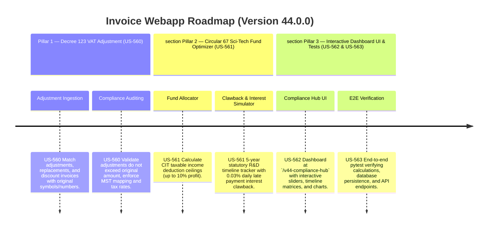

# Version 44.0.0 Product Roadmap — Corporate VAT Adjustment (Decree 123) & Welfare / Sci-Tech Fund Optimizer (Circular 67)

This document defines the official product roadmap and development specifications for **Version 44.0.0** of the GDT Invoice Hub. It details the core pillars, technical models, integration rules, and test verification strategies to implement dynamic Decree 123 VAT adjustment audits, trade discount matching, and Circular 67 / Circular 05 Science and Technology Development Fund & Corporate Welfare allocations.

---

## 🗺️ Product Timeline & Core Pillars



---

## 📋 Story Specifications Mapping

| Story ID | Name | Core Business Objective | Target Output Format |
| :--- | :--- | :--- | :--- |
| **US-560** | Decree 123 VAT Adjustments & Trade Discount Reconciliation Engine | Ingest original invoices and adjustment/replacement/discount invoices, perform matching, and run validation rules to ensure compliance. | Tenant DB Adjustment Audit Tables & Reports |
| **US-561** | Circular 67 & Circular 05 Science & Technology Development Fund Optimizer | Model CIT taxable income deductions, track R&D expenditures, simulate 5-year clawback timelines with late payment interest, and apply welfare limits. | Fund Simulation Engine & Multi-Year Projection Report |
| **US-562** | Interactive Version 44 Compliance Hub UI and API | Provide a premium UI dashboard at `/v44-compliance-hub` with input sliders, risk gauges, timeline widgets, and REST API endpoints. | HTML Compliance Hub Page & JSON APIs |
| **US-563** | End-to-End V44 Verification Test Suite | Verify correctness of Decree 123 VAT adjustment rules, Circular 67 fund allocation limits, clawback interest rates, and all REST API routes. | Pytest Suite (`tests/test_v44_features.py`) |

---

## ⚙️ Technical Constraints & Integration Guidelines

1. **Decree 123 VAT Adjustment Reconciliation Rules (US-560)**:
   - Identify invoice types: original sales/purchase invoice, adjustment (điều chỉnh), replacement (thay thế), discount (chiết khấu).
   - Check links by `original_invoice_symbol` and `original_invoice_number`.
   - Validate amount: The total adjusted amount (both net and VAT) summed across all adjustment invoices associated with an original invoice must not exceed the original invoice's total amounts in absolute terms (unless it is an upward adjustment).
   - Flag "Unlinked" adjustments where no original invoice is found in the tenant DB.
   - Enforce tax rate consistency (e.g. adjustment invoice tax rate must match the original invoice tax rate for that item).

2. **Circular 67 Science & Technology Development Fund Calculations (US-561)**:
   - Maximum annual tax-deductible contribution:
     $$\text{Max Allocation} = \text{CIT Taxable Income} \times 10\%$$
   - Clawback rules: Any portion of the fund that remains unspent after 5 years from the year of allocation must be clawed back.
   - CIT liability clawback amount:
     $$\text{CIT Clawback} = \text{Unspent Fund Amount} \times \text{CIT Statutory Tax Rate (20\%)}$$
   - Late payment interest (lãi chậm nộp) calculation:
     - Statutory interest rate is 0.03% per day.
     - Calculated from the tax finalization deadline of the allocation year (assume April 1st of Year+1) to the current simulation date.
     $$\text{Late Payment Interest} = \text{CIT Clawback} \times 0.0003 \times \text{Days Past Deadline}$$
   - Corporate Welfare Fund limit calculation:
     - Allowable CIT deductible welfare expenses must not exceed 1 month's average salary of the year.
     $$\text{Average Monthly Salary} = \frac{\text{Total Salaries Paid}}{\text{Average Headcount} \times 12}$$
     $$\text{Welfare Cap} = \text{Average Monthly Salary}$$

---

## 🧪 Verification Plan

- Run validation wrapper:
   ```bash
   python scripts/harness_win.py validate --cmd "venv\Scripts\activate.bat && python -m pytest tests/test_v44_features.py"
   ```
