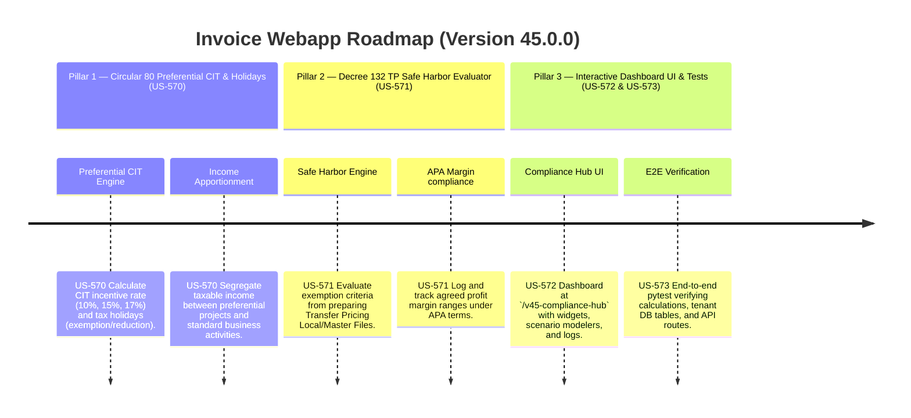

# Version 45.0.0 Product Roadmap — CIT Incentives (Circular 80) & Transfer Pricing Safe Harbors (Decree 132)

This document defines the official product roadmap and development specifications for **Version 45.0.0** of the GDT Invoice Hub. It details the core pillars, technical models, integration rules, and test verification strategies to implement preferential CIT rates, tax holidays allocation, and Decree 132 Transfer Pricing Safe Harbor assessments.

---

## 🗺️ Product Timeline & Core Pillars



---

## 📋 Story Specifications Mapping

| Story ID | Name | Core Business Objective | Target Output Format |
| :--- | :--- | :--- | :--- |
| **US-570** | Circular 80 Preferential CIT Rates & Tax Holidays Optimizer | Apportion corporate taxable income, compute tax exemptions/reductions, and estimate optimal tax liabilities under Circular 80 incentives. | Tenant DB CIT Preferential Ledgers & Calculations |
| **US-571** | Decree 132 Transfer Pricing Safe Harbor & APA Auditor Engine | Evaluate Safe Harbor eligibility thresholds, audit APA profit margins, and flag transfer pricing compliance warnings. | Safe Harbor Auditor Reports & APA Logs |
| **US-572** | Interactive Version 45 Compliance Hub UI and API | Provide a web dashboard at `/v45-compliance-hub` with sliders, charts, and API endpoints for simulation. | HTML Console UI & REST JSON APIs |
| **US-573** | End-to-End V45 Verification Test Suite | Verify CIT preferential calculations, Safe Harbor rules, and API routing correctness via isolated unit/integration tests. | Pytest Suite (`tests/test_v45_features.py`) |

---

## ⚙️ Technical Constraints & Integration Guidelines

1. **Circular 80 Preferential CIT & Tax Holiday Calculation Rules (US-570)**:
   - Allowable preferential rates: `10%`, `15%`, `17%` (standard is `20%`).
   - Tax Holidays:
     - Tax Exemption: 100% CIT reduction for $X$ years.
     - Tax Reduction: 50% CIT reduction for $Y$ years.
     - Holiday start trigger: First year of taxable income or first 3 years of revenue (if no taxable income).
   - Allocation formula:
     $$\text{CIT Preferential Liability} = \text{Preferential Taxable Income} \times \text{Preferential Rate} \times (1 - \text{Reduction Ratio})$$
     $$\text{CIT Standard Liability} = (\text{Total Taxable Income} - \text{Preferential Taxable Income}) \times 20\%$$
     $$\text{Total CIT Due} = \text{CIT Preferential Liability} + \text{CIT Standard Liability}$$

2. **Decree 132 Transfer Pricing Safe Harbor Rules (US-571)**:
   - Taxpayers with related-party transactions are exempt from preparing TP Local File and Master File (Safe Harbor) if:
     - **Condition 1**: Revenue < 50 billion VND AND related-party transaction value < 30 billion VND.
     - **Condition 2**: Revenue < 200 billion VND AND Net Profit Margin (NPM) on sales is at least:
       - 2% for distribution/trading activities.
       - 10% for manufacturing activities.
       - 15% for service activities.
     - **Condition 3**: Signed APA terms are met (actual operating margin falls within the agreed APA interquartile range).

---

## 🧪 Verification Plan

- Run validation wrapper:
   ```bash
   python scripts/harness_win.py validate --cmd "venv\Scripts\activate.bat && python -m pytest tests/test_v45_features.py"
   ```
