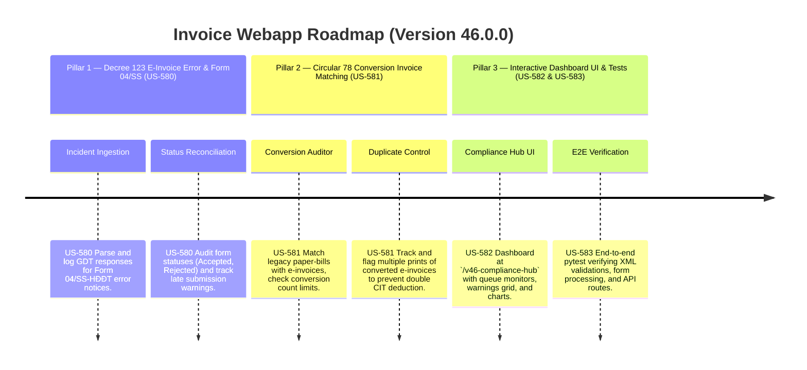

# Version 46.0.0 Product Roadmap — E-Invoice Incident Management (Decree 123) & Conversion Reconciliation (Circular 78)

This document defines the official product roadmap and development specifications for **Version 46.0.0** of the GDT Invoice Hub. It details the core pillars, technical models, integration rules, and test verification strategies to implement e-invoice error logs, Form 04/SS-HĐĐT statuses, and legacy-to-electronic conversion matching.

---

## 🗺️ Product Timeline & Core Pillars



---

## 📋 Story Specifications Mapping

| Story ID | Name | Core Business Objective | Target Output Format |
| :--- | :--- | :--- | :--- |
| **US-580** | Decree 123 E-Invoice Error Alerts & Form 04/SS-HĐĐT Status Tracker | Ingest error notices, track Form 04/SS-HĐĐT feedback codes, and alert taxpayers on late filings. | Tenant DB 04/SS Status Ledger & Alerts |
| **US-581** | Circular 78 Legacy Conversions & Double-Deduction Auditing Engine | Parse converted electronic invoice markers, match print logs to original bills, and block double expense claims. | Conversion Audit Logs & Warning Badges |
| **US-582** | Interactive Version 46 Compliance Hub UI and API | Provide a web dashboard at `/v46-compliance-hub` showing 04/SS status timelines, OCR conversion errors, and APIs. | HTML Dashboard UI & REST JSON APIs |
| **US-583** | End-to-End V46 Verification Test Suite | Verify error notice workflows, conversion deduplication criteria, and dashboard endpoint routes. | Pytest Suite (`tests/test_v46_features.py`) |

---

## ⚙️ Technical Constraints & Integration Guidelines

1. **Decree 123 E-Invoice Error Notification & Form 04/SS-HĐĐT Rules (US-580)**:
   - Error notices are filed using Form 04/SS-HĐĐT for:
     - Cancelled invoices (hủy hóa đơn).
     - Adjusted invoices (điều chỉnh hóa đơn).
     - Replaced invoices (thay thế hóa đơn).
     - Invoices with errors that do not affect net amount/tax amount (giải trình sai sót).
   - Ingest GDT response feedback codes:
     - `1` = GDT Accepted (Chấp nhận).
     - `2` = GDT Rejected (Không chấp nhận).
     - `0` = Pending GDT Processing (Chờ xử lý).
   - Deadline validation: Form 04/SS-HĐĐT must be submitted to GDT no later than the last day of the month of the subsequent quarter or month (depending on the taxpayer's VAT filing period). Late filings trigger `LATE_FILING_WARNING`.

2. **Circular 78 Conversion Invoice Matching Rules (US-581)**:
   - Converted e-invoices (Hóa đơn điện tử chuyển đổi sang hóa đơn giấy) must be printed once and must have the text "HÓA ĐƠN CHUYỂN ĐỔI TỪ HÓA ĐƠN ĐIỆN TỬ" along with name and signature of the person performing the conversion.
   - Audit rules:
     - Flags if an invoice has multiple conversion prints (possible duplicate expense deduction).
     - Scans buyer's local purchases database to match any legacy paper ticket/receipt with an XML e-invoice having the same date, seller, and amount. Flags `DUPLICATE_CONVERSION_CLAIM` if both receipt and e-invoice are claimed under deductible expenses.

---

## 🧪 Verification Plan

- Run validation wrapper:
   ```bash
   python scripts/harness_win.py validate --cmd "venv\Scripts\activate.bat && python -m pytest tests/test_v46_features.py"
   ```
