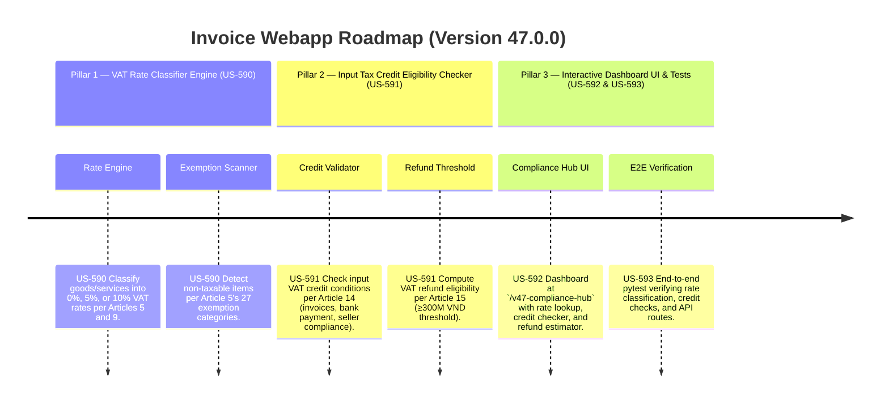

# Version 47.0.0 Product Roadmap — VAT Law 48/2024/QH15 Compliance Engine

This document defines the official product roadmap and development specifications for **Version 47.0.0** of the GDT Invoice Hub. It implements the core provisions of **Luật Thuế Giá Trị Gia Tăng (Luật số 48/2024/QH15)**, effective from July 1, 2025, covering VAT rate classification, input tax credit eligibility validation, and invoice requirements enforcement.

---

## 🗺️ Product Timeline & Core Pillars



---

## 📋 Story Specifications Mapping

| Story ID | Name | Core Business Objective | Target Output Format |
| :--- | :--- | :--- | :--- |
| **US-590** | VAT Rate Classifier & Exemption Scanner (Law 48, Articles 5 & 9) | Classify goods/services into correct VAT rate tiers (0%, 5%, 10%) and identify 27 categories of non-taxable items. | Tenant DB VAT Rate Ledger & Exemption Alerts |
| **US-591** | Input Tax Credit Validator & Refund Threshold Engine (Law 48, Articles 14 & 15) | Validate input VAT credit eligibility conditions (valid invoice, non-cash payment proof, seller declaration) and compute refund eligibility against 300M VND threshold. | Credit Eligibility Reports & Refund Estimates |
| **US-592** | Interactive Version 47 Compliance Hub UI and API | Provide a web dashboard at `/v47-compliance-hub` showing VAT rate lookups, credit eligibility checks, refund estimator, and AI advisory debate. | HTML Dashboard UI & REST JSON APIs |
| **US-593** | End-to-End V47 Verification Test Suite | Verify rate classification logic, credit validation rules, refund threshold calculations, and dashboard endpoint routes. | Pytest Suite (`tests/test_v47_features.py`) |

---

## ⚙️ Technical Constraints & Integration Guidelines

1. **VAT Rate Classification Rules (US-590, Article 9)**:
   - **0% rate** (Article 9.1): Exported goods/services, international transport, goods sold in duty-free shops, construction abroad or in non-tariff zones.
   - **5% rate** (Article 9.2): Clean water for production/daily use, fertilizers, pesticides, medical equipment, teaching equipment, children's toys, books, science & technology services, social housing.
   - **10% rate** (Article 9.3): All other taxable goods/services not in 0% or 5% categories, including cross-border e-commerce services.
   - **Non-taxable** (Article 5): 27 categories including raw agricultural products, land-use rights transfer, financial/banking services, healthcare services, education services, life/health insurance, software products, gold bars.

2. **Input Tax Credit Conditions (US-591, Article 14)**:
   - Must have a valid VAT invoice (hóa đơn GTGT) or import tax payment certificate.
   - Must have non-cash payment proof (chứng từ thanh toán không dùng tiền mặt), with exceptions per Government decree.
   - For exported goods: additionally requires contract with foreign buyer, sales invoice, non-cash payment proof, customs declaration.
   - Credits not deductible if invoices are from prohibited activities (Article 13).
   - Unclaimed input credits carry forward to subsequent months/quarters.

3. **VAT Refund Rules (US-591, Article 15)**:
   - Export refund: Input VAT not yet credited ≥ 300M VND → eligible for refund. Refund cap = 10% of export revenue for the refund period.
   - Investment refund: New/expanded projects with uncredited input VAT ≥ 300M VND after offsetting against current operations → eligible.
   - 5%-only producers: If uncredited input VAT ≥ 300M VND after 12 consecutive months or 4 consecutive quarters → eligible.
   - Dissolution/bankruptcy: Excess VAT paid or uncredited input VAT → refundable.

---

## 🧪 Verification Plan

- Run validation wrapper:
   ```bash
   python scripts/harness_win.py validate --cmd "venv\Scripts\activate.bat && python -m pytest tests/test_v47_features.py"
   ```
