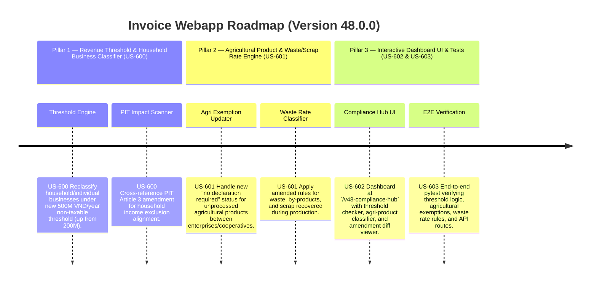

# Version 48.0.0 Product Roadmap — VAT Law Amendments 149/2025/QH15 Compliance Engine

This document defines the official product roadmap and development specifications for **Version 48.0.0** of the GDT Invoice Hub. It implements the amendments introduced by **Luật số 149/2025/QH15** (effective January 1, 2026), which modifies key provisions of the original VAT Law 48/2024/QH15, including revenue threshold changes, agricultural exemption updates, and waste/scrap tax rate revisions.

---

## 🗺️ Product Timeline & Core Pillars



---

## 📋 Story Specifications Mapping

| Story ID | Name | Core Business Objective | Target Output Format |
| :--- | :--- | :--- | :--- |
| **US-600** | Revenue Threshold Reclassifier & PIT Alignment Engine (Law 149, Article 5.25 amendment) | Reclassify household/individual businesses under the new 500M VND/year non-taxable threshold. Cross-reference the PIT Article 3 amendment. | Threshold Audit Reports & PIT Cross-Reference |
| **US-601** | Agricultural Exemption Updater & Waste/Scrap Rate Engine (Law 149, Articles 5.1 & 9.5 amendments) | Update VAT treatment for unprocessed agricultural products traded between enterprises/cooperatives and apply amended waste/scrap tax rates. | Agri-Product Classification & Waste Rate Ledger |
| **US-602** | Interactive Version 48 Compliance Hub UI and API | Provide a web dashboard at `/v48-compliance-hub` showing threshold checker, agri-product VAT classifier, waste rate lookup, and AI advisory debate. | HTML Dashboard UI & REST JSON APIs |
| **US-603** | End-to-End V48 Verification Test Suite | Verify threshold reclassification, agricultural exemption logic, waste/scrap rate rules, and dashboard endpoint routes. | Pytest Suite (`tests/test_v48_features.py`) |

---

## ⚙️ Technical Constraints & Integration Guidelines

1. **Revenue Threshold Reclassification (US-600, Article 5.25 amendment)**:
   - The non-taxable threshold for household/individual businesses (hộ, cá nhân kinh doanh) is raised from **200 million VND/year** to **500 million VND/year**.
   - Businesses with annual revenue ≤ 500M VND are exempt from VAT declaration and payment.
   - This amendment also affects **PIT (Personal Income Tax)**: under Article 17 of Law 48 (which amends Article 3 of the PIT Law), household/individual business income below the new threshold is excluded from PIT taxable income.
   - **Effective date**: January 1, 2026 (Article 18.2 of Law 48, as amended by Law 149).

2. **Agricultural Product Exemption Updates (US-601, Article 5.1 amendment)**:
   - Unprocessed or minimally-processed (sơ chế thông thường) agricultural, forestry, aquaculture, and fishery products traded **between enterprises and cooperatives** are reclassified as "not required to declare/pay VAT" (instead of simply "non-taxable").
   - Key difference: Under the new rule, input VAT credits on these transactions **are still deductible** (unlike standard non-taxable items which block input credit claims under Article 5.27).
   - This targets the agricultural supply chain to reduce tax cascading.

3. **Waste/Scrap Tax Rate Rules (US-601, Article 9.5 amendment)**:
   - Waste (phế phẩm), by-products (phụ phẩm), and scrap (phế liệu) recovered during production are taxed at the VAT rate of the waste/scrap item itself when sold.
   - Previously, these items were taxed at the rate of the primary product from which they were recovered.
   - The amendment corrects this to apply the rate specifically to the waste/scrap classification.

4. **Repealed Provisions (Law 149)**:
   - Certain provisions of Article 12 (direct method) and Article 15 (refund) of the original Law 48 are repealed to ensure consistency with the amended management framework.

---

## 🧪 Verification Plan

- Run validation wrapper:
   ```bash
   python scripts/harness_win.py validate --cmd "venv\Scripts\activate.bat && python -m pytest tests/test_v48_features.py"
   ```
