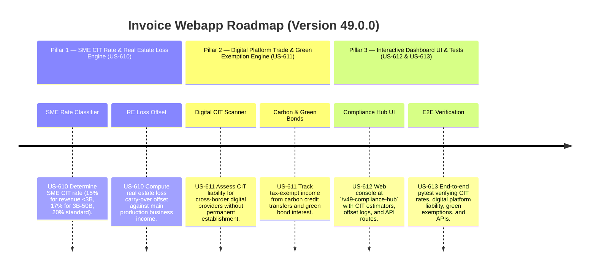

# Version 49.0.0 Product Roadmap — CIT Law Amendments 67/2025/QH15 Compliance Engine

This document defines the official product roadmap and development specifications for **Version 49.0.0** of the GDT Invoice Hub. It implements the amendments introduced by **Luật số 67/2025/QH15** (effective October 1, 2025), which updates the Corporate Income Tax (CIT) framework, including progressive SME tax rates, digital/e-commerce CIT liability for foreign entities, carbon credit/green bond exemptions, and real estate loss-offsetting rules.

---

## 🗺️ Product Timeline & Core Pillars



---

## 📋 Story Specifications Mapping

| Story ID | Name | Core Business Objective | Target Output Format |
| :--- | :--- | :--- | :--- |
| **US-610** | Revenue-Scaled CIT Classifier & RE Loss Offset Engine (Law 67, Article 10) | Classify CIT tax rates based on revenue scaling (15%, 17%, 20%) and compute real estate transfer loss offsets. | CIT Bracket Ledgers & Loss Offset Ledgers |
| **US-611** | Digital Platform CIT Auditor & Green Exemption Scanner (Law 67, Articles 4 & 8) | Audit digital business revenue for foreign entities and scan for green bond/carbon credit CIT exemptions. | E-Commerce CIT Registry & Green Exemptions Ledger |
| **US-612** | Interactive Version 49 Compliance Hub UI and API | Provide a web dashboard at `/v49-compliance-hub` displaying CIT rate estimators, digital tax logs, green bond trackers, and APIs. | HTML Dashboard UI & REST JSON APIs |
| **US-613** | End-to-End V49 Verification Test Suite | Verify SME progressive rates, digital CIT triggers, carbon/green exclusions, loss offsetting, and API routes. | Pytest Suite (`tests/test_v49_features.py`) |

---

## ⚙️ Technical Constraints & Integration Guidelines

1. **SME Revenue-Scaled CIT Rate Classification (US-610, Article 10 amendment)**:
   - Apply progressive CIT rates for small and medium enterprises:
     - Annual revenue under **3,000,000,000 VND** (3B): **15% CIT rate**.
     - Annual revenue from **3,000,000,000 VND to under 50,000,000,000 VND** (3B-50B): **17% CIT rate**.
     - Annual revenue **50,000,000,000 VND and above** (≥50B): **20% standard CIT rate**.
   - Note: Do not apply SME rate to subsidiaries or companies in transfer pricing relationships.

2. **Real Estate Transfer Loss Offsetting (US-610)**:
   - Losses from transfer of real estate can be offset against income from general production/business operations of the same tax period (unlike prior years where they had to be kept strictly separate).

3. **Digital Platform E-Commerce CIT Liability (US-611, Article 4 amendment)**:
   - Foreign organizations without permanent establishment in Vietnam but selling goods/services via e-commerce/digital platforms are subject to CIT on income generated in Vietnam.
   - For B2B/B2C transactions, default CIT withholding rate on services is **5%** (service component) or **1%** (trade components).

4. **Carbon Credit & Green Bond Tax Exemptions (US-611, Article 8 amendment)**:
   - First-time transfer of carbon credits after issuance is exempt from CIT.
   - Interest from green bonds and transfer of green bonds is exempt from CIT.

---

## 🧪 Verification Plan

- Run validation wrapper:
   ```bash
   python scripts/harness_win.py validate --cmd "venv\Scripts\activate.bat && python -m pytest tests/test_v49_features.py"
   ```
