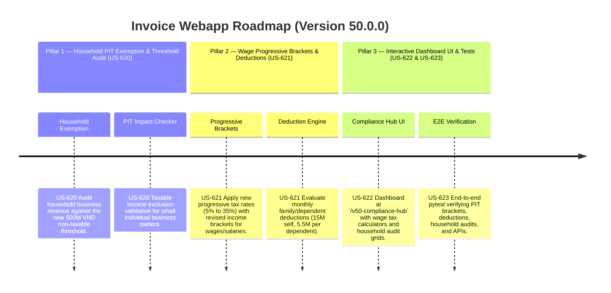

# Version 50.0.0 Product Roadmap — PIT Law Amendments 109/2025/QH15 Compliance Engine

This document defines the official product roadmap and development specifications for **Version 50.0.0** of the GDT Invoice Hub. It implements the Personal Income Tax (PIT) amendments introduced by **Luật số 109/2025/QH15** (effective July 1, 2026), aligning household business exemptions under the new 500M VND threshold and updating progressive tax brackets and family deductions for salaries and wages.

---

## 🗺️ Product Timeline & Core Pillars



---

## 📋 Story Specifications Mapping

| Story ID | Name | Core Business Objective | Target Output Format |
| :--- | :--- | :--- | :--- |
| **US-620** | Household Business PIT Exemption & Revenue Tracker (Law 109) | Audit household business revenue against the new 500M VND PIT threshold and exclude qualifying income from taxable bases. | PIT Exemption Ledgers & Audits |
| **US-621** | Wage progressive brackets scheduler & Family Deduction Engine (Law 109, Article 7) | Apply updated tax brackets and calculate personal (15M VND/month) and dependent (5.5M VND/month) PIT deductions. | Salary PIT Payroll Ledgers |
| **US-622** | Interactive Version 50 Compliance Hub UI and API | Provide a web dashboard at `/v50-compliance-hub` containing progressive PIT wage calculators, household checkers, and APIs. | HTML Dashboard UI & REST JSON APIs |
| **US-623** | End-to-End V50 Verification Test Suite | Verify household PIT exemption thresholds, wage progressive rates, deduction limits, and dashboard routes. | Pytest Suite (`tests/test_v50_features.py`) |

---

## ⚙️ Technical Constraints & Integration Guidelines

1. **Household Business PIT Exemption (US-620, Law 109 & Law 149 Alignment)**:
   - Individual and household businesses (cá nhân, hộ kinh doanh) with annual revenue ≤ **500,000,000 VND** (500M) are exempt from PIT.
   - For revenue > 500M VND, tax rates are applied based on activity:
     - Distribution/retail: 0.5% PIT.
     - Services/construction (without raw material supply): 2.0% PIT.
     - Manufacturing/transport/construction (with material supply): 1.5% PIT.
     - Other business activities: 1.0% PIT.

2. **Wages & Salary PIT Deductions and progressive brackets (US-621, Article 7 amendment)**:
   - Revised monthly personal deductions (Giảm trừ gia cảnh):
     - Self/taxpayer deduction: **15,000,000 VND/month** (up from 11M).
     - Dependent deduction: **5,500,000 VND/month per dependent** (up from 4.4M).
   - Monthly tax brackets (Tariff):
     - Grade 1: Income up to 5,000,000 VND -> **5%**.
     - Grade 2: Income over 5,000,000 to 10,000,000 VND -> **10%**.
     - Grade 3: Income over 10,000,000 to 18,000,000 VND -> **15%**.
     - Grade 4: Income over 18,000,000 to 32,000,000 VND -> **20%**.
     - Grade 5: Income over 32,000,000 to 52,000,000 VND -> **25%**.
     - Grade 6: Income over 52,000,000 to 80,000,000 VND -> **30%**.
     - Grade 7: Income over 80,000,000 VND -> **35%**.

---

## 🧪 Verification Plan

- Run validation wrapper:
   ```bash
   python scripts/harness_win.py validate --cmd "venv\Scripts\activate.bat && python -m pytest tests/test_v50_features.py"
   ```
