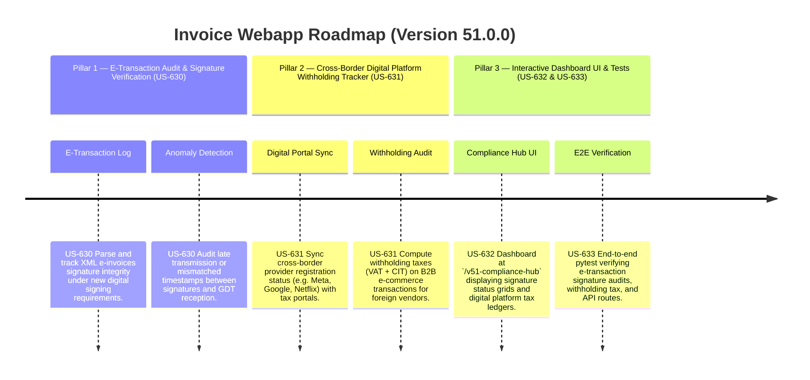

# Version 51.0.0 Product Roadmap — Tax Administration Law Amendments 108/2025/QH15 Compliance Engine

This document defines the official product roadmap and development specifications for **Version 51.0.0** of the GDT Invoice Hub. It implements the digital/e-commerce and electronic transaction auditing modifications introduced by **Luật số 108/2025/QH15** (effective July 1, 2026), providing tools to audit e-transaction compliance, track cross-border digital platforms registration and withholding tax, and report anomalies.

---

## 🗺️ Product Timeline & Core Pillars



---

## 📋 Story Specifications Mapping

| Story ID | Name | Core Business Objective | Target Output Format |
| :--- | :--- | :--- | :--- |
| **US-630** | E-Transaction Auditing & Digital Signature Integrity Engine (Law 108) | Audit electronic signatures on XML e-invoices, check timestamp validity, and alert for transmission delays. | E-Transaction Audit Logs & Warning Badges |
| **US-631** | Cross-Border E-Commerce Vendor Tax & Withholding Tracker (Law 108) | Track digital platforms tax codes, compute tax withholdings for foreign suppliers, and log transactions. | Withholding Tax Ledgers & Provider Registries |
| **US-632** | Interactive Version 51 Compliance Hub UI and API | Provide a web dashboard at `/v51-compliance-hub` showing signature timelines, e-commerce withholding reports, and APIs. | HTML Dashboard UI & REST JSON APIs |
| **US-633** | End-to-End V51 Verification Test Suite | Verify digital signature audit logic, B2B withholding computations, foreign vendor records, and APIs. | Pytest Suite (`tests/test_v51_features.py`) |

---

## ⚙️ Technical Constraints & Integration Guidelines

1. **E-Transaction Signature Auditing (US-630, Law 108)**:
   - All e-invoices must contain valid digital signatures conforming to the upgraded e-signature protocol under Law 108.
   - Flag warnings:
     - `SIGNATURE_EXPIRED`: If the certificate's validity range does not cover the invoice date.
     - `LATE_TRANSMISSION`: If the difference between the invoice signing date and GDT reception/code-generation date exceeds **24 hours**.

2. **Cross-Border E-Commerce Withholding (US-631, Law 108 & Law 67 Alignment)**:
   - Foreign contractors who do not register directly for tax in Vietnam must have their tax withheld by Vietnamese business buyers.
   - For B2B electronic purchases:
     - Apply withholding VAT: **5%** on digital services / e-commerce sales.
     - Apply withholding CIT: **5%** on services, **1%** on goods/digital content.
   - Track if the foreign contractor has a valid Tax Identification Number (MST) registered on the GDT portal for foreign vendors (Nhà thầu nước ngoài - NTNN). If registered, withholdings are declared directly by them, otherwise, the buyer must withhold.

---

## 🧪 Verification Plan

- Run validation wrapper:
   ```bash
   python scripts/harness_win.py validate --cmd "venv\Scripts\activate.bat && python -m pytest tests/test_v51_features.py"
   ```
