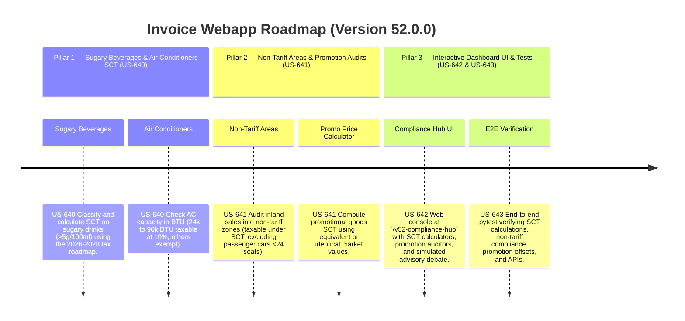

# Version 52.0.0 Product Roadmap — Special Consumption Tax (SCT) Law No. 66/2025/QH15 Compliance Engine

This document defines the official product roadmap and development specifications for **Version 52.0.0** of the GDT Invoice Hub. It implements the Special Consumption Tax (SCT) compliance engine under **Luật số 66/2025/QH15** (effective January 1, 2026), providing tools to audit sugary beverage tax roadmaps, classify air conditioner capacities, track inland to non-tariff area transactions, and calculate promotion-based SCT adjustments.

---

## 🗺️ Product Timeline & Core Pillars



---

## 📋 Story Specifications Mapping

| Story ID | Name | Core Business Objective | Target Output Format |
| :--- | :--- | :--- | :--- |
| **US-640** | Sugary Beverages Roadmap & Air Conditioner Classifier Engine (Law 66) | Classury and calculate SCT on sugary drinks (>5g/100ml) across the 2026-2028 timeline, and audit AC capacities for tax eligibility. | Beverage & AC SCT Ledgers |
| **US-641** | Inland to Non-Tariff Area SCT Auditor & Promotion Price Calculator (Law 66) | Audit inland sales to non-tariff areas under the new SCT rule (excluding cars <24 seats) and compute promotion SCT base prices. | Non-Tariff & Promo Price SCT Ledgers |
| **US-642** | Interactive Version 52 Compliance Hub UI and API | Provide a web dashboard at `/v52-compliance-hub` containing SCT calculators, promotional price adjusters, and APIs. | HTML Dashboard UI & REST JSON APIs |
| **US-643** | End-to-End V52 Verification Test Suite | Verify sugary drink rates, AC thresholds, non-tariff exclusions, promotional adjustments, and dashboard API routes. | Pytest Suite (`tests/test_v52_features.py`) |

---

## ⚙️ Technical Constraints & Integration Guidelines

1. **Sugary Beverage SCT Roadmap (US-640, Law 66)**:
   - Check if sugar content exceeds **5g/100ml**.
   - If sugar content > 5g/100ml, calculate SCT based on the roadmap:
     - Year 2026: **0%** tax rate.
     - Year 2027: **8%** tax rate.
     - Year 2028 and onwards: **10%** tax rate.
   - Exemptions: Category of drink must NOT be: milk, dairy products, 100% fruit juice, coconut water, mineral water, nectar.

2. **Air Conditioner SCT Classification (US-640, Law 66)**:
   - Capacity must be **over 24,000 BTU and up to 90,000 BTU** to be subject to SCT.
   - Tax rate is **10%** (standard SCT rate for air conditioners under the SCT tariff).
   - Air conditioners with capacity ≤ 24,000 BTU or > 90,000 BTU are **exempt** (0% rate / not taxable).

3. **Inland to Non-Tariff Area Transactions (US-641, Law 66)**:
   - Inland sales into non-tariff zones are subject to SCT, *except* cars with fewer than 24 seats (which are subject to SCT elsewhere, but excluded here to prevent double taxation).
   - Apply a standard tax rate (e.g. 10% or item specific, default to **10%** for generic goods sold into non-tariff zones for simulation purposes).

4. **Promotion Price SCT Calculations (US-641, Law 66)**:
   - For promotional or advertising goods, the taxable base for SCT calculations is determined based on the taxable price of **identical or equivalent goods** in the same tax period.
   - So if promotional price = 0, look up and apply equivalent item price as the tax base.

---

## 🧪 Verification Plan

- Run validation wrapper:
   ```bash
   python scripts/harness_win.py validate --cmd "venv\Scripts\activate.bat && python -m pytest tests/test_v52_features.py"
   ```
