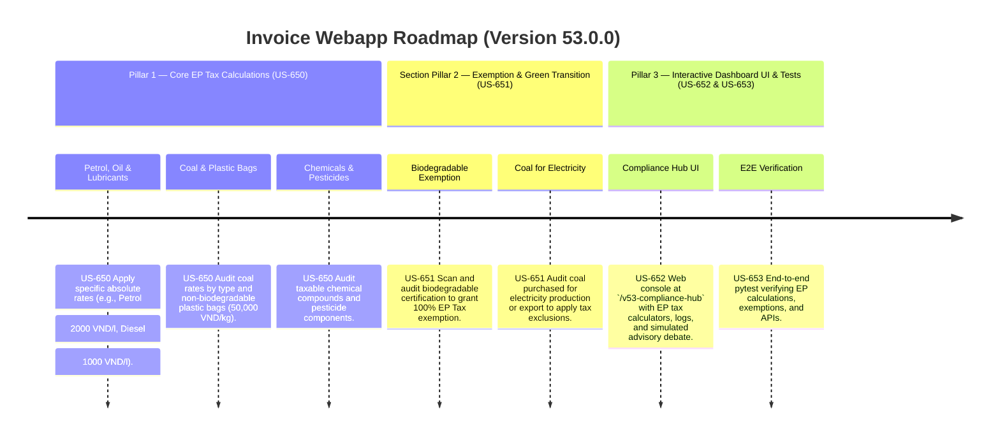

# Version 53.0.0 Product Roadmap — Environmental Protection (EP) Tax Compliance Engine

This document defines the official product roadmap and development specifications for **Version 53.0.0** of the GDT Invoice Hub. It implements the Environmental Protection Tax (EP Tax) compliance engine under **Nghị quyết số 19/2026/QH16** / **Nghị quyết số 109/2025/UBTVQH15** and **Luật Thuế bảo vệ môi trường**, providing tools to audit EP tax rates on petrol, oil, lubricants, coal, plastic bags, and chemicals, and verify tax exemptions (e.g., biodegradable plastics, coal for electricity).

---

## 🗺️ Product Timeline & Core Pillars



---

## 📋 Story Specifications Mapping

| Story ID | Name | Core Business Objective | Target Output Format |
| :--- | :--- | :--- | :--- |
| **US-650** | Core EP Tax Calculation Engine | Classify and calculate EP tax on fuels, coal, plastic bags, and chemicals using absolute tax-per-unit formulas. | EP Tax calculation ledgers |
| **US-651** | EP Tax Exemption & Green Transition Auditor | Audit exemptions for biodegradable plastics, coal for domestic electricity generation, and re-export exclusions. | EP Tax exemption audit ledgers |
| **US-652** | Interactive Version 53 Compliance Hub UI and API | Provide a web dashboard at `/v53-compliance-hub` containing EP tax calculators, logs, and REST JSON APIs. | HTML Dashboard UI & REST JSON APIs |
| **US-653** | End-to-End V53 Verification Test Suite | Verify EP tax rates, biodegradable certifications, coal exemptions, dashboard routes, and database logs. | Pytest Suite (`tests/test_v53_features.py`) |

---

## ⚙️ Technical Constraints & Integration Guidelines

1. **Core EP Tax Rates (US-650)**:
   - **Petrol (except ethanol)**: 2,000 VND / litre.
   - **Diesel oil**: 1,000 VND / litre.
   - **Kerosene**: 600 VND / litre.
   - **Coal (Lignite/Sub-bituminous)**: 20,000 VND / tonne; **Anthracite**: 30,000 VND / tonne; **Other coal**: 15,000 VND / tonne.
   - **Non-biodegradable Plastic Bags**: 50,000 VND / kg.
   - **HCFC (Hydrochlorofluorocarbons)**: 5,000 VND / kg.
   - Formula: `EP Tax = Quantity * Tax Rate per Unit`.

2. **Exemption Audits (US-651)**:
   - **Biodegradable Plastic Bags**: If the product is certified biodegradable, it is **exempt** (EP tax = 0).
   - **Coal for Electricity / Export**: Coal directly used for electricity generation or coal exported directly by mining companies is **exempt** from EP tax.
   - **Fuels for Transit / Re-export**: Fuels temporarily imported and re-exported or in transit are **exempt**.

---

## 🧪 Verification Plan

- Run validation wrapper:
   ```bash
   python scripts/harness_win.py validate --cmd "venv\Scripts\activate.bat && python -m pytest tests/test_v53_features.py"
   ```
