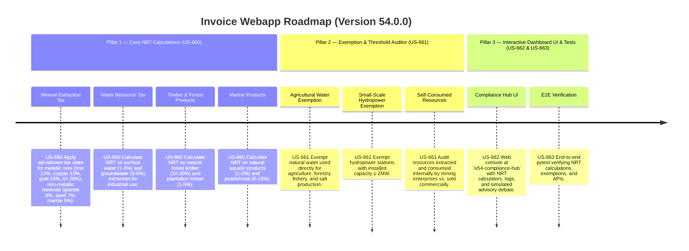

# Version 54.0.0 Product Roadmap — Natural Resources Tax (NRT) Compliance Engine

This document defines the official product roadmap and development specifications for **Version 54.0.0** of the GDT Invoice Hub. It implements the Natural Resources Tax (NRT) compliance engine under **Luật Thuế tài nguyên 45/2009/QH12** as amended by **Luật 71/2014/QH13**, providing tools to calculate ad-valorem resource extraction taxes on minerals, water, timber, and marine products, and verify tax exemptions for natural water used in agriculture and hydropower below thresholds.

---

## 🗺️ Product Timeline & Core Pillars



---

## 📋 Story Specifications Mapping

| Story ID | Name | Core Business Objective | Target Output Format |
| :--- | :--- | :--- | :--- |
| **US-660** | Core Natural Resources Tax Calculation Engine | Classify and calculate NRT on minerals, water, timber, and marine products using ad-valorem percentage rates. | NRT calculation ledgers |
| **US-661** | NRT Exemption & Threshold Auditor | Audit exemptions for agricultural water, small-scale hydropower (≤ 2MW), and self-consumed resources. | NRT exemption audit ledgers |
| **US-662** | Interactive Version 54 Compliance Hub UI and API | Provide a web dashboard at `/v54-compliance-hub` containing NRT calculators, logs, and REST JSON APIs. | HTML Dashboard UI & REST JSON APIs |
| **US-663** | End-to-End V54 Verification Test Suite | Verify NRT rates, agricultural exemptions, hydropower thresholds, dashboard routes, and database logs. | Pytest Suite (`tests/test_v54_features.py`) |

---

## ⚙️ Technical Constraints & Integration Guidelines

1. **Core NRT Rates (US-660)**:
   - **Formula**: `NRT = Taxable Output Quantity × Unit Resource Price × Tax Rate (%)`
   - **Metallic Ores**: Iron ore 12%, Copper ore 13%, Gold ore 15%, Tin ore 20%.
   - **Non-Metallic Minerals**: Granite 8%, Sand 7%, Marble 9%, Limestone 5%.
   - **Water Resources**: Surface water 1-3% (industrial default 2%), Groundwater 3-5% (industrial default 4%).
   - **Natural Timber**: Natural forest timber 10-35% (hardwood default 25%), Plantation timber 1-5% (default 3%).
   - **Marine Products**: Natural aquatic products 1-2% (default 2%), Pearls/Coral 6-10% (default 8%).

2. **Exemption Audits (US-661)**:
   - **Agricultural Water**: Natural water used directly for agriculture, forestry, fishery, salt production → **100% exempt**.
   - **Small-Scale Hydropower**: Hydropower stations with installed capacity ≤ 2MW → **100% exempt**.
   - **Self-Consumed Resources**: Resources extracted and used internally (not sold) by the mining enterprise → taxed at **70% of the standard rate**.

---

## 🧪 Verification Plan

- Run validation wrapper:
   ```bash
   python scripts/harness_win.py validate --cmd "venv\Scripts\activate.bat && python -m pytest tests/test_v54_features.py"
   ```
