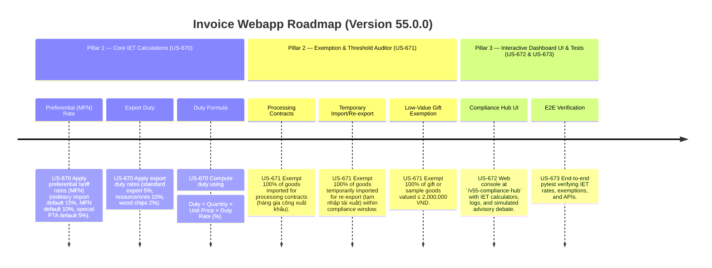

# Version 55.0.0 Product Roadmap — Import-Export Tax (IET) Compliance Engine

This document defines the official product roadmap and development specifications for **Version 55.0.0** of the GDT Invoice Hub. It implements the Import-Export Tax (IET) compliance engine under **Luật Thuế xuất khẩu, thuế nhập khẩu 107/2016/QH13**, providing tools to calculate duties on imported/exported goods using ad-valorem, ordinary, and preferential rates, and verify exemptions for goods under processing contracts, temporary imports, and low-value gifts.

---

## 🗺️ Product Timeline & Core Pillars



---

## 📋 Story Specifications Mapping

| Story ID | Name | Core Business Objective | Target Output Format |
| :--- | :--- | :--- | :--- |
| **US-670** | Core Import-Export Tax Calculation Engine | Calculate import duties (MFN, ordinary, special) and export duties on cargo using ad-valorem percentages. | IET calculation ledgers |
| **US-671** | IET Exemption & Threshold Auditor | Verify exemptions for processing contracts, temporary import for re-export, and low-value gift thresholds (≤ 2,000,000 VND). | IET exemption audit ledgers |
| **US-672** | Interactive Version 55 Compliance Hub UI and API | Provide a web dashboard at `/v55-compliance-hub` containing IET calculators, logs, and REST JSON APIs. | HTML Dashboard UI & REST JSON APIs |
| **US-673** | End-to-End V55 Verification Test Suite | Verify IET rates, processing exemptions, low-value thresholds, dashboard routes, and database logs. | Pytest Suite (`tests/test_v55_features.py`) |

---

## ⚙️ Technical Constraints & Integration Guidelines

1. **Core IET Rates (US-670)**:
   - **Import Duty**:
     - Preferential (MFN) Rate: Default 10%
     - Ordinary (Standard) Rate: Default 15% (or 150% of MFN rate)
     - Special Preferential Rate (FTAs like EVFTA): Default 5%
   - **Export Duty**:
     - Standard: 5%
     - Minerals/Ores: 10%
     - Raw materials/Wood chips: 2%

2. **Exemption Audits (US-671)**:
   - **Processing Contracts**: Goods imported under processing contract for foreign parties → **100% exempt**.
   - **Temporary Import / Re-export**: Goods temporarily imported and subsequently re-exported → **100% exempt**.
   - **Low-value gift/sample**: Consignments sent via post/express courier with total declared value ≤ 2,000,000 VND → **100% exempt**.

---

## 🧪 Verification Plan

- Run validation wrapper:
   ```bash
   python scripts/harness_win.py validate --cmd "venv\Scripts\activate.bat && python -m pytest tests/test_v55_features.py"
   ```
