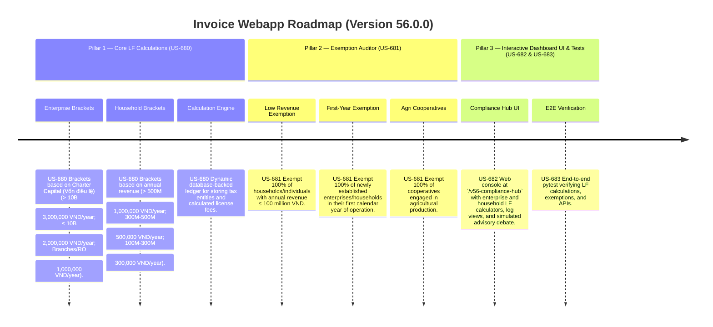

# Version 56.0.0 Product Roadmap — License Fee (LF) Compliance Engine

This document defines the official product roadmap and development specifications for **Version 56.0.0** of the GDT Invoice Hub. It implements the License Fee (LF) compliance engine under **Nghị định 139/2016/NĐ-CP** (Lệ phí môn bài), providing tools to calculate license fees for enterprises and households based on charter capital and revenue brackets, and check for operational, agricultural, or revenue-based exemptions.

---

## 🗺️ Product Timeline & Core Pillars



---

## 📋 Story Specifications Mapping

| Story ID | Name | Core Business Objective | Target Output Format |
| :--- | :--- | :--- | :--- |
| **US-680** | Core License Fee Calculation Engine | Calculate license fees for enterprises based on charter capital and branches, and for households/individuals based on revenue. | LF calculation ledgers |
| **US-681** | LF Exemption Auditor | Verify exemptions for low revenue (≤ 100M VND), newly established first-year businesses, and agricultural cooperatives. | LF exemption audit ledgers |
| **US-682** | Interactive Version 56 Compliance Hub UI and API | Provide a web dashboard at `/v56-compliance-hub` containing LF calculators, logs, and REST JSON APIs. | HTML Dashboard UI & REST JSON APIs |
| **US-683** | End-to-End V56 Verification Test Suite | Verify LF rates, branch aggregations, exemptions, dashboard routes, and database logs. | Pytest Suite (`tests/test_v56_features.py`) |

---

## ⚙️ Technical Constraints & Integration Guidelines

1. **Enterprise Brackets (US-680)**:
   - Charter Capital > 10 Billion VND: **3,000,000 VND/year**
   - Charter Capital ≤ 10 Billion VND: **2,000,000 VND/year**
   - Branches, Representative Offices, Business Locations: **1,000,000 VND/year** each.

2. **Household/Individual Brackets (US-680)**:
   - Revenue > 500 Million VND/year: **1,000,000 VND/year**
   - Revenue from 300 to 500 Million VND/year: **500,000 VND/year**
   - Revenue from 100 to 300 Million VND/year: **300,000 VND/year**

3. **Exemptions (US-681)**:
   - Annual Revenue ≤ 100 Million VND → **100% exempt**.
   - Newly established enterprises, households, or individuals starting business for the first year (established in current year) → **100% exempt**.
   - Cooperatives engaged in agricultural production → **100% exempt**.

---

## 🧪 Verification Plan

- Run validation wrapper:
   ```bash
   python scripts/harness_win.py validate --cmd "venv\Scripts\activate.bat && python -m pytest tests/test_v56_features.py"
   ```
