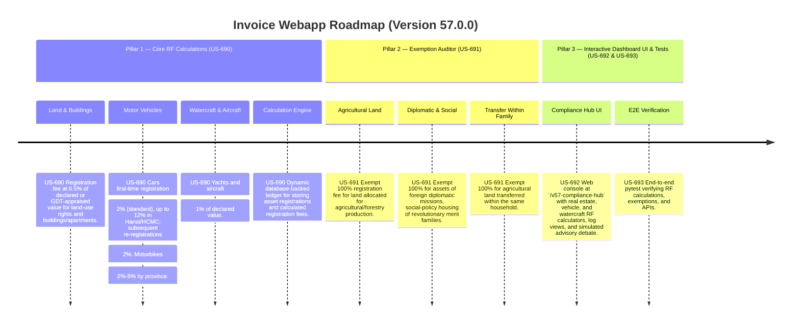

# Version 57.0.0 Product Roadmap — Registration Fee (RF) Compliance Engine

This document defines the official product roadmap and development specifications for **Version 57.0.0** of the GDT Invoice Hub. It implements the Registration Fee (Lệ phí trước bạ) compliance engine under **Nghị định 10/2022/NĐ-CP** and **Nghị định 20/2019/NĐ-CP**, providing tools to calculate registration fees for real estate, motor vehicles, motorcycles, yachts, and aircraft based on asset value and legislated rate schedules, and to audit for exemptions applicable to agriculture, diplomatic missions, and social-policy beneficiaries.

---

## 🗺️ Product Timeline & Core Pillars



---

## 📋 Story Specifications Mapping

| Story ID | Name | Core Business Objective | Target Output Format |
| :--- | :--- | :--- | :--- |
| **US-690** | Core Registration Fee Calculation Engine | Calculate registration fees for real estate (0.5%), motor vehicles (2%-12%), motorbikes (2%-5%), yachts/aircraft (1%) based on asset value and provincial rates. | RF calculation ledgers |
| **US-691** | RF Exemption Auditor | Verify exemptions for agricultural land, diplomatic assets, revolutionary merit family housing, and within-family agricultural transfers. | RF exemption audit ledgers |
| **US-692** | Interactive Version 57 Compliance Hub UI and API | Provide a web dashboard at `/v57-compliance-hub` containing RF calculators, logs, and REST JSON APIs. | HTML Dashboard UI & REST JSON APIs |
| **US-693** | End-to-End V57 Verification Test Suite | Verify RF rates, provincial surcharges, exemptions, dashboard routes, and database logs. | Pytest Suite (`tests/test_v57_features.py`) |

---

## ⚙️ Technical Constraints & Integration Guidelines

1. **Real Estate (US-690)**:
   - Land-use rights and buildings: **0.5%** of declared or GDT-appraised value.

2. **Motor Vehicles (US-690)**:
   - Cars — First-time registration (standard provinces): **2%** of GDT-appraised value.
   - Cars — First-time registration (Hanoi, HCMC): **12%** of GDT-appraised value.
   - Cars — Subsequent registrations: **2%** of GDT-appraised value.
   - Motorbikes — Cylinder capacity > 175cc: **5%** of value.
   - Motorbikes — Cylinder capacity ≤ 175cc: **2%** of value.

3. **Watercraft & Aircraft (US-690)**:
   - Yachts, motorboats, aircraft: **1%** of declared value.

4. **Exemptions (US-691)**:
   - Agricultural/forestry land allocated by the State → **100% exempt**.
   - Assets of foreign diplomatic missions/international organizations → **100% exempt**.
   - Social-policy housing for revolutionary merit families → **100% exempt**.
   - Agricultural land transferred within the same household → **100% exempt**.

---

## 🧪 Verification Plan

- Run validation wrapper:
   ```bash
   python scripts/harness_win.py validate --cmd "venv\Scripts\activate.bat && python -m pytest tests/test_v57_features.py"
   ```
