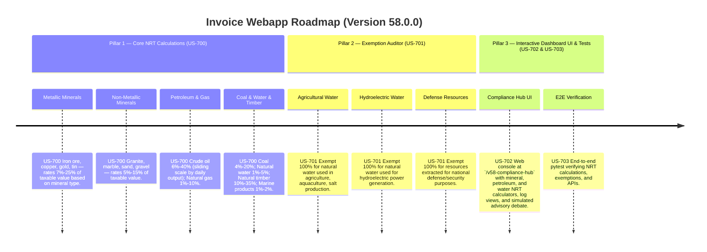

# Version 58.0.0 Product Roadmap — Natural Resources Tax (NRT) Compliance Engine

This document defines the official product roadmap and development specifications for **Version 58.0.0** of the GDT Invoice Hub. It implements the Natural Resources Tax (Thuế tài nguyên) compliance engine under **Luật Thuế tài nguyên số 45/2009/QH12** and **Nghị định 50/2010/NĐ-CP**, providing tools to calculate resource extraction taxes for metallic minerals, non-metallic minerals, crude oil, natural gas, coal, natural water, timber, and marine products, and to audit for exemptions applicable to agriculture, aquaculture, and national defense.

---

## 🗺️ Product Timeline & Core Pillars



---

## 📋 Story Specifications Mapping

| Story ID | Name | Core Business Objective | Target Output Format |
| :--- | :--- | :--- | :--- |
| **US-700** | Core Natural Resources Tax Calculation Engine | Calculate NRT for metallic minerals (7%-25%), non-metallic minerals (5%-15%), crude oil (6%-40%), natural gas (1%-10%), coal (4%-20%), water (1%-5%), timber (10%-35%), and marine products (1%-2%). | NRT calculation ledgers |
| **US-701** | NRT Exemption Auditor | Verify exemptions for agricultural/aquaculture water, hydroelectric water, and national defense resource extraction. | NRT exemption audit ledgers |
| **US-702** | Interactive Version 58 Compliance Hub UI and API | Provide a web dashboard at `/v58-compliance-hub` containing NRT calculators, logs, and REST JSON APIs. | HTML Dashboard UI & REST JSON APIs |
| **US-703** | End-to-End V58 Verification Test Suite | Verify NRT rates, resource categories, exemptions, dashboard routes, and database logs. | Pytest Suite (`tests/test_v58_features.py`) |

---

## ⚙️ Technical Constraints & Integration Guidelines

1. **Metallic Minerals (US-700)**:
   - Iron ore: **12%** of taxable resource value.
   - Copper ore: **13%** of taxable resource value.
   - Gold ore: **15%** of taxable resource value.
   - Tin ore: **10%** of taxable resource value.
   - Other metallic minerals: **10%** default.

2. **Non-Metallic Minerals (US-700)**:
   - Granite, marble: **10%** of taxable resource value.
   - Sand, gravel: **7%** of taxable resource value.
   - Other non-metallic: **8%** default.

3. **Petroleum & Gas (US-700)**:
   - Crude oil — Daily output ≤ 20,000 barrels: **6%**.
   - Crude oil — Daily output > 20,000 barrels: **10%**.
   - Natural gas: **2%** of taxable value.

4. **Coal, Water, Timber, Marine (US-700)**:
   - Coal (open-pit): **7%**; Coal (underground): **5%**.
   - Natural water (industrial use): **3%**.
   - Natural timber (hardwood): **25%**; Timber (softwood): **15%**.
   - Marine products (natural catch): **2%**.

5. **Exemptions (US-701)**:
   - Natural water for agriculture, aquaculture, salt production → **100% exempt**.
   - Natural water for hydroelectric power generation → **100% exempt**.
   - Resources extracted for national defense/security → **100% exempt**.

---

## 🧪 Verification Plan

- Run validation wrapper:
   ```bash
   python scripts/harness_win.py validate --cmd "venv\Scripts\activate.bat && python -m pytest tests/test_v58_features.py"
   ```
