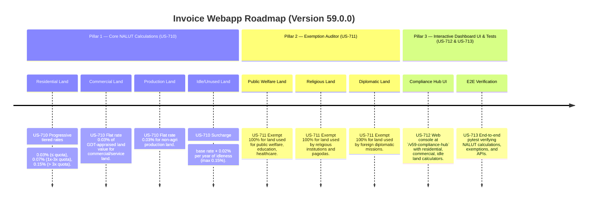

# Version 59.0.0 Product Roadmap — Non-Agricultural Land Use Tax (NALUT) Compliance Engine

This document defines the official product roadmap for **Version 59.0.0** of the GDT Invoice Hub. It implements the Non-Agricultural Land Use Tax (Thuế sử dụng đất phi nông nghiệp) compliance engine under **Luật số 48/2010/QH12** and **Nghị định 53/2011/NĐ-CP**, providing tools to calculate annual land use taxes for residential, commercial, and production land based on land value and tiered progressive rates.

---

## 🗺️ Product Timeline & Core Pillars



---

## 📋 Story Specifications Mapping

| Story ID | Name | Core Business Objective | Target Output Format |
| :--- | :--- | :--- | :--- |
| **US-710** | Core Non-Agricultural Land Use Tax Engine | Calculate NALUT for residential (tiered 0.03%-0.15%), commercial (0.03%), production (0.03%), and idle land (surcharge). | NALUT calculation ledgers |
| **US-711** | NALUT Exemption Auditor | Verify exemptions for public welfare, religious, and diplomatic land uses. | NALUT exemption audit ledgers |
| **US-712** | Interactive Version 59 Compliance Hub UI and API | Provide a web dashboard at `/v59-compliance-hub` with NALUT calculators and REST APIs. | HTML Dashboard UI & REST JSON APIs |
| **US-713** | End-to-End V59 Verification Test Suite | Verify NALUT tiered rates, idle surcharge, exemptions, and API endpoints. | Pytest Suite (`tests/test_v59_features.py`) |

---

## ⚙️ Technical Constraints & Integration Guidelines

1. **Residential Land (US-710)** — Progressive tiered:
   - Land area ≤ quota (hạn mức): **0.03%** of appraised land value.
   - Land area from 1x to 3x quota: **0.07%** of excess value.
   - Land area > 3x quota: **0.15%** of excess value.

2. **Commercial/Service Land (US-710)**: Flat **0.03%** of appraised value.

3. **Non-Agricultural Production Land (US-710)**: Flat **0.03%** of appraised value.

4. **Idle/Unused Land (US-710)**: Base rate + **0.02%** per year idle (capped at **0.15%** total).

5. **Exemptions (US-711)**:
   - Public welfare, education, healthcare land → **100% exempt**.
   - Religious institution and pagoda land → **100% exempt**.
   - Foreign diplomatic mission land → **100% exempt**.

---

## 🧪 Verification Plan

- Run validation wrapper:
   ```bash
   python scripts/harness_win.py validate --cmd "venv\Scripts\activate.bat && python -m pytest tests/test_v59_features.py"
   ```
