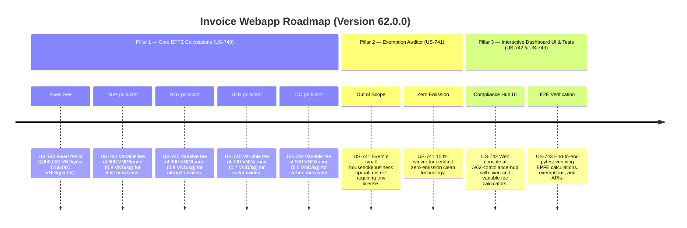

# Version 62.0.0 Product Roadmap — Environment Protection Fee for Emissions (EPFE) Compliance Engine

This document defines the official product roadmap for **Version 62.0.0** of the GDT Invoice Hub. It implements the Environment Protection Fee for Emissions (Phí bảo vệ môi trường đối với khí thải) compliance engine under **Decree No. 153/2024/NĐ-CP** (effective January 5, 2025), providing tools to calculate annual fixed fees and variable fees based on pollutant loads (dust, SOx, NOx, CO).

---

## 🗺️ Product Timeline & Core Pillars



---

## 📋 Story Specifications Mapping

| Story ID | Name | Core Business Objective | Target Output Format |
| :--- | :--- | :--- | :--- |
| **US-740** | Core Environment Protection Fee for Emissions Engine | Calculate EPFE fixed charges (3,000,000 VND/year) and variable loads for dust (0.8 VND/kg), SOx (0.7 VND/kg), NOx (0.8 VND/kg), and CO (0.5 VND/kg) under Decree 153/2024/NĐ-CP. | EPFE calculation ledgers |
| **US-741** | EPFE Exemption Auditor | Verify exemptions for out-of-scope small businesses and zero-emission certified operations. | EPFE exemption audit ledgers |
| **US-742** | Interactive Version 62 Compliance Hub UI and API | Provide a web dashboard at `/v62-compliance-hub` with EPFE calculators and REST APIs. | HTML Dashboard UI & REST JSON APIs |
| **US-743** | End-to-End V62 Verification Test Suite | Verify EPFE calculations, variable pollutant loads, exemptions, and API endpoints. | Pytest Suite (`tests/test_v62_features.py`) |

---

## ⚙️ Technical Constraints & Integration Guidelines

1. **Fixed Fee (US-740)**: 3,000,000 VND per year (equivalent to 750,000 VND per quarter).
2. **Variable Fee (US-740)**: Based on pollutant loads (kg) discharged during the period:
   - Dust (Bụi): **0.8 VND / kg** (800 VND / tonne).
   - NOx: **0.8 VND / kg** (800 VND / tonne).
   - SOx: **0.7 VND / kg** (700 VND / tonne).
   - CO: **0.5 VND / kg** (500 VND / tonne).
3. **Exemptions (US-741)**:
   - Facilities/activities out of scope (e.g. no environmental license required) → **100% exempt**.
   - Certified zero-emission clean technology systems → **100% exempt**.

---

## 🧪 Verification Plan

- Run validation wrapper:
   ```bash
   python scripts/harness_win.py validate --cmd "pytest tests/test_v62_features.py"
   ```
