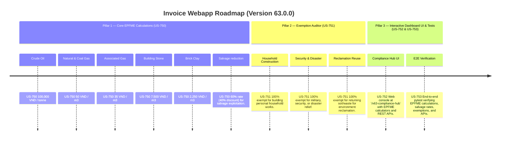

# Version 63.0.0 Product Roadmap — Environment Protection Fee for Mineral Extraction (EPFME) Compliance Engine

This document defines the official product roadmap for **Version 63.0.0** of the GDT Invoice Hub. It implements the Environment Protection Fee for Mineral Extraction (Phí bảo vệ môi trường đối với khai thác khoáng sản) compliance engine under **Decree No. 27/2023/NĐ-CP** (effective July 15, 2023), providing tools to calculate mineral extraction fees and apply salvage reductions and 100% exemptions.

---

## 🗺️ Product Timeline & Core Pillars



---

## 📋 Story Specifications Mapping

| Story ID | Name | Core Business Objective | Target Output Format |
| :--- | :--- | :--- | :--- |
| **US-750** | Core Environment Protection Fee for Mineral Extraction Engine | Calculate EPFME for crude oil, natural gas, associated gas, stone, and clay, and apply 60% salvage discount under Decree 27/2023/NĐ-CP. | EPFME calculation ledgers |
| **US-751** | EPFME Exemption Auditor | Verify exemptions for household building, security/disaster relief, and site reclamation. | EPFME exemption audit ledgers |
| **US-752** | Interactive Version 63 Compliance Hub UI and API | Provide a web dashboard at `/v63-compliance-hub` with EPFME calculators and REST APIs. | HTML Dashboard UI & REST JSON APIs |
| **US-753** | End-to-End V63 Verification Test Suite | Verify EPFME calculations, salvage rate adjustments, exemptions, and API endpoints. | Pytest Suite (`tests/test_v63_features.py`) |

---

## ⚙️ Technical Constraints & Integration Guidelines

1. **Mineral Fee Rates (US-750)**:
   - Crude Oil: **100,000 VND / tonne**
   - Natural Gas & Coal Gas: **50 VND / m3**
   - Associated Gas: **35 VND / m3**
   - Building Stone: **7,500 VND / m3**
   - Brick Clay: **2,250 VND / m3**
2. **Salvage Reduction (US-750)**:
   - Apply a **60%** rate (40% discount) if extraction is classified as salvage exploitation (khai thác tận thu).
3. **Exemptions (US-751)**:
   - Household construction materials within land-use rights → **100% exempt**.
   - Landfill/construction for military, security, or natural disaster relief → **100% exempt**.
   - Waste/soil returned for site reclamation and environmental restoration → **100% exempt**.

---

## 🧪 Verification Plan

- Run validation wrapper:
   ```bash
   python scripts/harness_win.py validate --cmd "pytest tests/test_v63_features.py"
   ```
