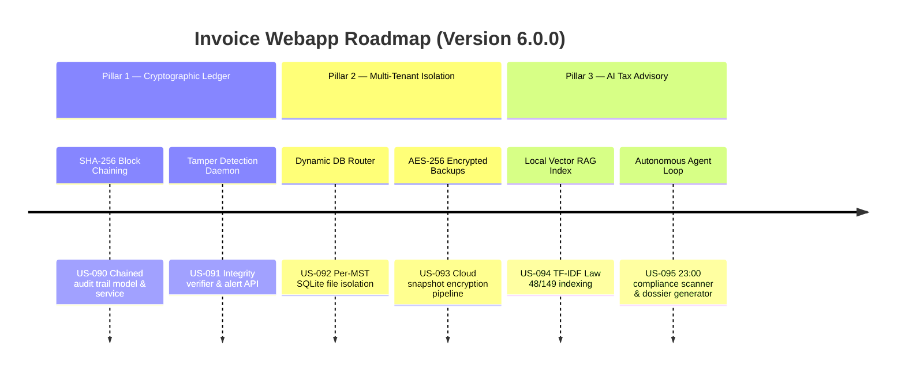

# Next-Gen Webapp XML: Version 6.0.0 Product Roadmap & Goals

This document outlines the three strategic pillars delivered in **Version 6.0.0 (Enterprise Financial Intelligence)** of the Webapp XML invoice auditing suite. It marks the platform's evolution into a cryptographically secured, multi-tenant, AI-autonomous tax compliance ecosystem.

---

## 🗺️ Product Roadmap Overview

---

## 🔒 Milestone 6.0.0 Pillar 1: Cryptographic Audit Trail (US-090, US-091)
*Focus: Absolute mathematical proof of non-repudiation and anti-tampering.*

### 🎯 Goal 6.0.1: Chained Hash Block Engine (US-090)
- **Problem**: Tax authorities can challenge whether invoice records or audit logs were retroactively modified.
- **Solution**: Every significant action (import, signature verification, ledger posting) generates a SHA-256 chained audit block.
- **Acceptance Criteria**:
  - Each block's hash is computed from `timestamp|action_type|mst|payload_hash|prev_block_hash`.
  - Blocks are cryptographically chained to their predecessors.
  - Mock RSA-2048 signatures are attached to each block.

### 🎯 Goal 6.0.2: Background Integrity Checker (US-091)
- **Problem**: Direct database modifications would go undetected without continuous verification.
- **Solution**: An integrity verifier walks the entire chain, recalculates hashes, and flags any break or corruption.
- **Acceptance Criteria**:
  - API endpoint `POST /api/audit/verify` runs full-chain validation.
  - Tampered payload hashes trigger `Integrity corruption` alerts.
  - Broken chain links trigger `Chaining break` alerts.

---

## 🗄️ Milestone 6.0.0 Pillar 2: Multi-Tenant Isolation (US-092, US-093)
*Focus: 100% database-level data isolation per taxpayer profile.*

### 🎯 Goal 6.0.3: Dynamic Database Router (US-092)
- **Problem**: Shared databases expose cross-tenant data leakage risk.
- **Solution**: Each taxpayer MST routes to a dedicated SQLite file (`data/tenant_{MST}.db`).
- **Acceptance Criteria**:
  - `bootstrap_tenant_db()` creates and seeds tenant schemas automatically.
  - Tenant A cannot query any records from Tenant B's database.
  - `list_tenant_databases()` enumerates all active tenants.

### 🎯 Goal 6.0.4: AES-256 Encrypted Cloud Snapshots (US-093)
- **Problem**: Unencrypted database backups are a compliance and security risk.
- **Solution**: Tenant databases are encrypted with AES-256-CBC before cloud upload.
- **Acceptance Criteria**:
  - Encrypt → decrypt roundtrip produces identical SQLite content.
  - Wrong decryption key yields garbage data.
  - Decrypted backups are valid SQLite databases with intact data.

---

## 🤖 Milestone 6.0.0 Pillar 3: AI Tax Advisory (US-094, US-095)
*Focus: Proactive AI-driven tax risk detection backed by local vector search.*

### 🎯 Goal 6.0.5: Local Vector RAG Index (US-094)
- **Problem**: The existing chatbot has no structured access to the latest tax regulation texts.
- **Solution**: A lightweight, zero-dependency TF-IDF vector store indexes Law 48/2024 and Law 149/2024.
- **Acceptance Criteria**:
  - Queries for "khấu trừ thuế GTGT" return Law 48 references.
  - Queries for "hóa đơn điện tử" return Law 149 references.
  - Vietnamese diacritics are handled correctly by the tokenizer.

### 🎯 Goal 6.0.6: Autonomous Tax Advisory Agent (US-095)
- **Problem**: Accountants manually review invoices for compliance risks.
- **Solution**: An autonomous agent scans invoices against compliance rules and generates advisory dossiers.
- **Acceptance Criteria**:
  - Flags cash payments ≥ 20M VND as non-deductible (CASH_PAYMENT_RISK).
  - Flags missing digital signatures (MISSING_SIGNATURE).
  - Flags T-Score < 60 as critical tax risk (LOW_TSCORE_ALERT).
  - Clean invoices are NOT flagged (zero false positives).
  - Dossiers include severity summaries and legal references.

---

## 📋 Epic & Story Mapping

| Epic ID | Epic Title | Story ID | Story Title | Status |
| :--- | :--- | :--- | :--- | :--- |
| **E52** | Cryptographic Ledger | **US-090** | Chained Hash Block Engine | ✅ Implemented |
| **E52** | Cryptographic Ledger | **US-091** | Background Integrity Checker | ✅ Implemented |
| **E53** | Multi-Tenant Isolation | **US-092** | Dynamic Database Router | ✅ Implemented |
| **E53** | Multi-Tenant Isolation | **US-093** | AES-256 Encrypted Backups | ✅ Implemented |
| **E54** | AI Tax Advisory | **US-094** | Local Vector RAG Index | ✅ Implemented |
| **E54** | AI Tax Advisory | **US-095** | Autonomous Tax Advisory Agent | ✅ Implemented |
