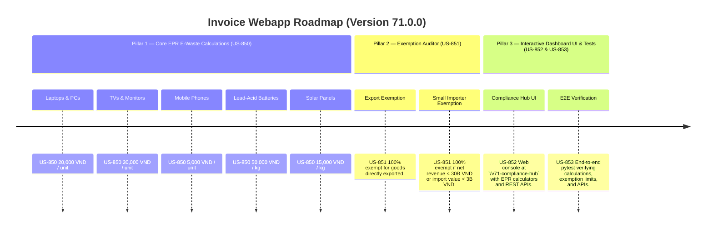

# Version 71.0.0 Product Roadmap — EPR E-Waste & Electronics Disposal Surcharge Compliance Engine

This document defines the official product roadmap for **Version 71.0.0** of the GDT Invoice Hub. It implements the E-Waste & Electronics Disposal EPR Surcharge (Phí xử lý chất thải điện tử) compliance engine under **Decree No. 08/2022/NĐ-CP**, providing tools to calculate product-specific recycling fees and apply export and small-scale importer exemptions.

---

## 🗺️ Product Timeline & Core Pillars



---

## 📋 Story Specifications Mapping

| Story ID | Name | Core Business Objective | Target Output Format |
| :--- | :--- | :--- | :--- |
| **US-850** | Core E-Waste Recycling & Disposal Fee Engine | Calculate product-specific recycling fees for electronics, batteries, and solar panels under Decree 08/2022/NĐ-CP. | EPR calculation ledgers |
| **US-851** | E-Waste Recycling Exemption & Small Importer Auditor | Verify EPR exemptions for exported electronic goods and small-scale importers with net revenue < 30B VND. | EPR exemption audit ledgers |
| **US-852** | Interactive Version 71 Compliance Hub UI and API | Provide a web dashboard at `/v71-compliance-hub` with E-Waste recycling fee calculators and REST APIs. | HTML Dashboard UI & REST JSON APIs |
| **US-853** | End-to-End V71 Verification Test Suite | Verify electronics recycling fee formulas, small-scale importer thresholds, export exemptions, and API routes. | Pytest Suite (`tests/test_v71_features.py`) |

---

## ⚙️ Technical Constraints & Integration Guidelines

1. **E-Waste Fee Rates (US-850)**:
   - Laptops & PCs: **20,000 VND / unit**
   - TVs & Monitors: **30,000 VND / unit**
   - Mobile Phones: **5,000 VND / unit**
   - Lead-Acid Batteries: **50,000 VND / kg**
   - Solar Panels: **15,000 VND / kg**
2. **Exemptions (US-851)**:
   - Goods directly exported or temporarily imported for re-export → **100% exempt**.
   - Small-scale manufacturers/importers: net revenue from preceding year **< 30,000,000,000 VND** or total import value **< 3,000,000,000 VND** → **100% exempt**.

---

## 🧪 Verification Plan

- Run validation wrapper:
   ```bash
   python scripts/harness_win.py validate --cmd "pytest tests/test_v71_features.py"
   ```
