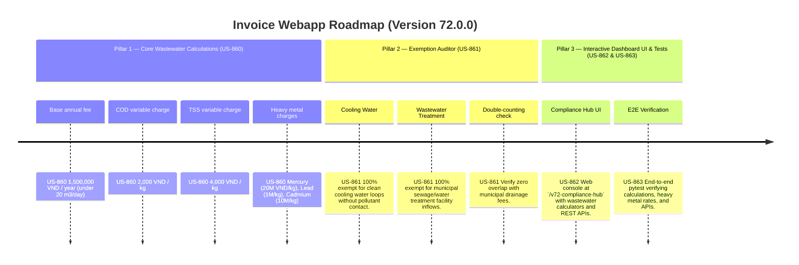

# Version 72.0.0 Product Roadmap — Industrial Wastewater Surcharge Compliance Engine

This document defines the official product roadmap for **Version 72.0.0** of the GDT Invoice Hub. It implements the Industrial Wastewater Treatment Surcharge (Phí bảo vệ môi trường đối với nước thải công nghiệp) compliance engine under **Decree No. 53/2020/NĐ-CP**, providing tools to calculate environmental protection fees based on wastewater volume and pollutant concentration, and apply statutory exemptions.

---

## 🗺️ Product Timeline & Core Pillars



---

## 📋 Story Specifications Mapping

| Story ID | Name | Core Business Objective | Target Output Format |
| :--- | :--- | :--- | :--- |
| **US-860** | Core Industrial Wastewater Surcharge Engine | Calculate environmental protection fees for industrial wastewater based on COD, TSS, and heavy metals under Decree 53/2020/NĐ-CP. | Wastewater calculation ledgers |
| **US-861** | Wastewater Exemption Auditor | Verify fee exemptions for cooling water loops, clean water treatment, and municipal sewage fee overlap. | Wastewater exemption audit ledgers |
| **US-862** | Interactive Version 72 Compliance Hub UI and API | Provide a web dashboard at `/v72-compliance-hub` with wastewater calculators and REST APIs. | HTML Dashboard UI & REST JSON APIs |
| **US-863** | End-to-End V72 Verification Test Suite | Verify pollutant loading calculations, cooling water exemptions, municipal fee deductions, and API endpoints. | Pytest Suite (`tests/test_v72_features.py`) |

---

## ⚙️ Technical Constraints & Integration Guidelines

1. **Wastewater Fee Tariffs (US-860)**:
   - Base Fee: **1,500,000 VND / year** (flat fee for facilities discharging under 20 m3/day).
   - COD (Chemical Oxygen Demand) charge: **2,000 VND / kg**.
   - TSS (Total Suspended Solids) charge: **4,000 VND / kg**.
   - Mercury (Hg) charge: **20,000,000 VND / kg**.
   - Lead (Pb) charge: **1,000,000 VND / kg**.
   - Cadmium (Cd) charge: **10,000,000 VND / kg**.
2. **Exemptions (US-861)**:
   - Cooling water loops that discharge back to the environment with no pollutant contact → **100% exempt**.
   - Water treatment and municipal sanitary facilities → **100% exempt**.
   - Prevent double-counting: deductions applied for municipal drainage charges already paid.

---

## 🧪 Verification Plan

- Run validation wrapper:
   ```bash
   python scripts/harness_win.py validate --cmd "pytest tests/test_v72_features.py"
   ```
