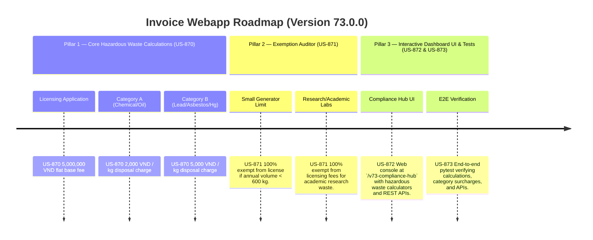

# Version 73.0.0 Product Roadmap — Hazardous Waste Management & Licensing Compliance Engine

This document defines the official product roadmap for **Version 73.0.0** of the GDT Invoice Hub. It implements the Hazardous Waste Management & Disposal Licensing (Quản lý chất thải nguy hại và phí cấp phép) compliance engine under **Decree No. 08/2022/NĐ-CP** and **Circular No. 02/2022/TT-BTNMT**, providing tools to calculate hazardous waste licensing fees, volume-based disposal surcharges, and apply small generator registration exemptions.

---

## 🗺️ Product Timeline & Core Pillars



---

## 📋 Story Specifications Mapping

| Story ID | Name | Core Business Objective | Target Output Format |
| :--- | :--- | :--- | :--- |
| **US-870** | Core Hazardous Waste Disposal & Licensing Engine | Calculate hazardous waste licensing fees and volume-based disposal surcharges under Decree 08/2022/NĐ-CP. | Hazardous waste ledgers |
| **US-871** | Hazardous Waste Exemption & Small Generator Auditor | Verify licensing exemptions for small-scale generators producing less than 600 kg of hazardous waste per year. | Waste exemption audit logs |
| **US-872** | Interactive Version 73 Compliance Hub UI and API | Provide a web dashboard at `/v73-compliance-hub` with hazardous waste calculators and REST APIs. | HTML Dashboard UI & REST JSON APIs |
| **US-873** | End-to-End V73 Verification Test Suite | Verify hazardous waste categories, licensing fees, small generator registration exemptions, and API endpoints. | Pytest Suite (`tests/test_v73_features.py`) |

---

## ⚙️ Technical Constraints & Integration Guidelines

1. **Hazardous Waste Rates (US-870)**:
   - Base licensing application fee: **5,000,000 VND**
   - Category A (standard chemical, organic waste, oily residues): **2,000 VND / kg**
   - Category B (heavy metal contaminated waste, asbestos, mercury, clinical/infectious waste): **5,000 VND / kg**
2. **Exemptions (US-871)**:
   - Facilities generating less than **600 kg** of hazardous waste per calendar year are exempt from formal licensing requirements (only require small generator registration) → **100% exempt** from the 5,000,000 VND base licensing fee.
   - Non-profit academic/research laboratories waste directly related to educational research → **100% exempt** from licensing application charges.

---

## 🧪 Verification Plan

- Run validation wrapper:
   ```bash
   python scripts/harness_win.py validate --cmd "pytest tests/test_v73_features.py"
   ```
